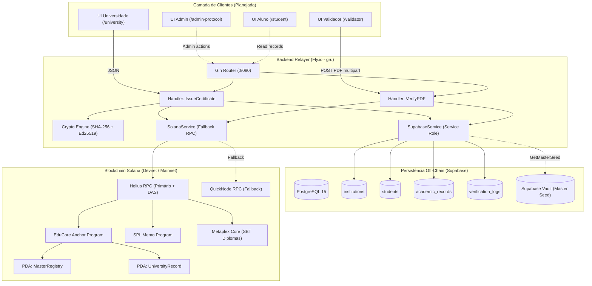
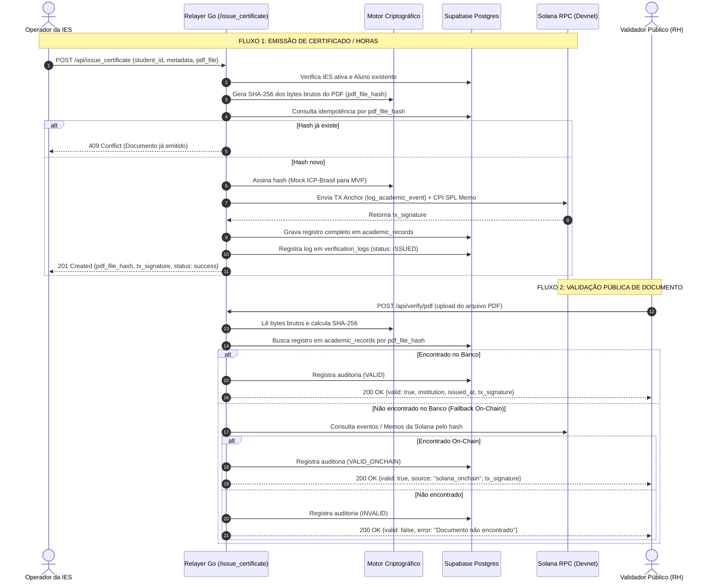
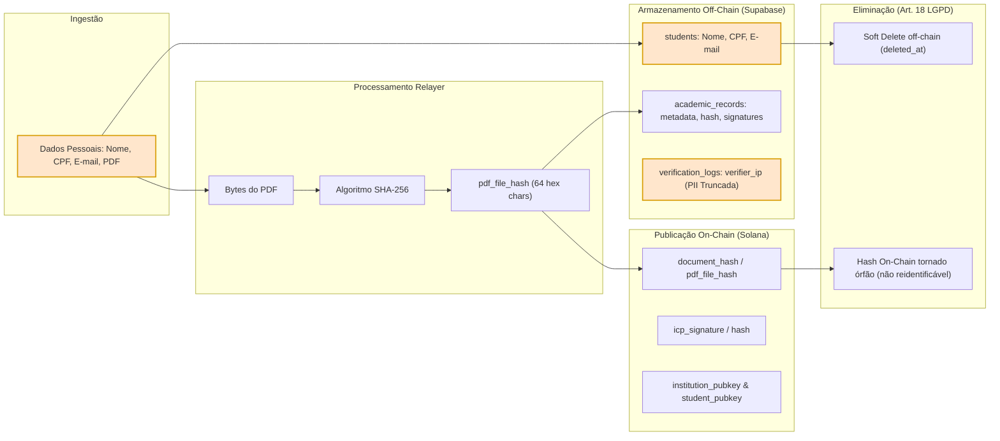
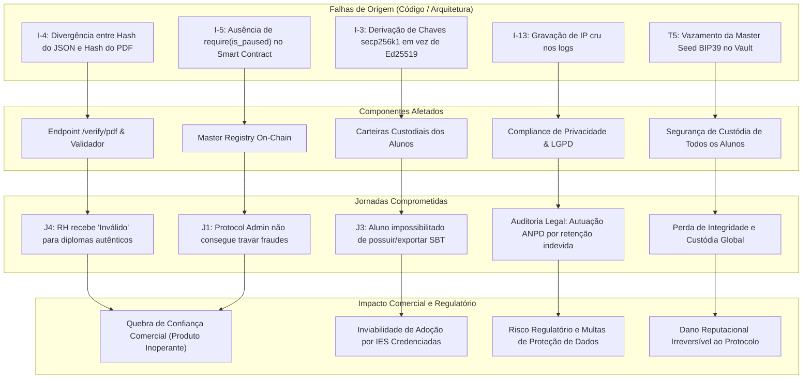
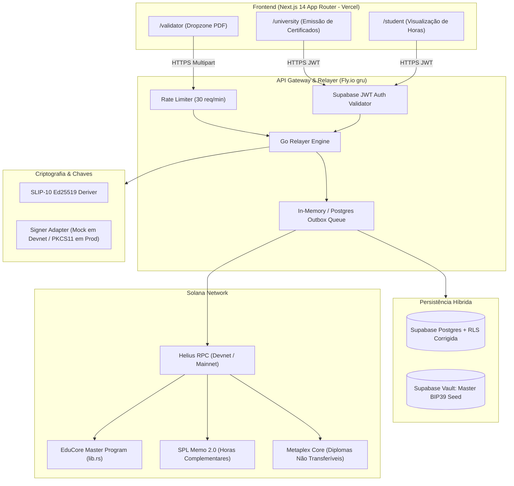
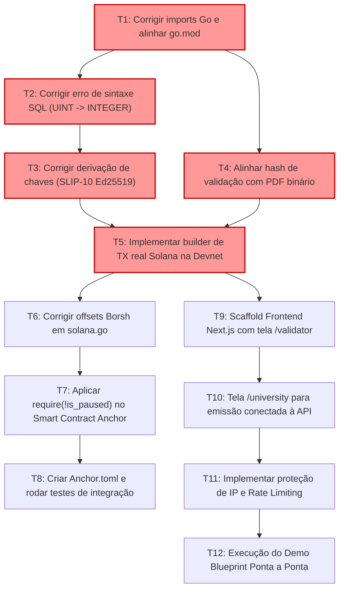

# Relatório de Due Diligence Executiva, Técnica, Segurança, Produto e Compliance

## EduCore Protocol / LattesChain

---

# 1. Executive Summary

- **Estado Real do Repositório**: O projeto encontra-se em estágio de **Scaffold / Protótipo Inicial Incompleto**. Nenhum componente opera de ponta a ponta sem intervenção manual e mocks simulados.
- **Frontend Ausente**: Inexistente no código (`src/` ou `package.json` não existem no repositório); apenas especificado em markdown ([docs/05_frontend_spec.md](docs/05_frontend_spec.md)).
- **Backend Quebrado na Raiz**: O pacote Go não compila devido a imports internos divergentes do módulo ([api/internal/services/supabase.go](api/internal/services/supabase.go#L10-L12) e [api/internal/services/solana.go](api/internal/services/solana.go#L14-L15) usam `educore-api/internal` enquanto [api/go.mod](api/go.mod#L1) declara `github.com/educore-latteschain/api`) e versões upstream inexistentes (`solana-go v0.1.0`, `supabase-go v0.6.0`).
- **Migrations Quebradas**: [supabase/migrations/001_initial_schema.sql:51](supabase/migrations/001_initial_schema.sql#L51) usa o tipo de dados `UINT DEFAULT 0`, inexistente no PostgreSQL padrão.
- **Inconsistência Criptográfica Fatal no Validador**: A emissão hasheia o JSON canônico de metadados ([api/internal/handlers/handlers.go:77](api/internal/handlers/handlers.go#L77)), enquanto a verificação `/verify/pdf` hasheia os bytes brutos do PDF ([api/internal/handlers/handlers.go:202](api/internal/handlers/handlers.go#L202)). Os hashes **nunca** coincidem; a validação pública é inoperante.
- **Derivação de Chave Incompatível com Solana**: [api/internal/utils/crypto.go:36-98](api/internal/utils/crypto.go#L36-L98) deriva chaves na curva Bitcoin `secp256k1` e exporta hex comprimido, enquanto Solana exige estritamente `Ed25519` e codificação Base58 (SLIP-10). As carteiras de alunos derivadas são inválidas on-chain.
- **Transação Solana Inexistente no Backend**: [api/internal/handlers/handlers.go:297-307](api/internal/handlers/handlers.go#L297-L307) retorna uma string fixa mock (`MOCK_TX_SIGNATURE_...`); nenhuma transação real é transmitida para a rede Solana.
- **Smart Contract Anchor Incompleto**: O contrato [educore_contracts/programs/educore_contracts/src/lib.rs](educore_contracts/programs/educore_contracts/src/lib.rs) compila uma estrutura básica, mas não possui `Anchor.toml`, não possui testes automatizados e o circuito de emergência `is_paused` não é checado nas instruções críticas ([lib.rs:87](educore_contracts/programs/educore_contracts/src/lib.rs#L87)).
- **Desserialização com Offsets Inválidos**: [api/internal/services/solana.go:134-142](api/internal/services/solana.go#L134-L142) fatia manualmente bytes ignorando prefixos de tamanho (Borsh length prefix de 4 bytes para `Vec<u8>` e `String`), corrompendo a leitura de dados da conta on-chain.
- **Assinatura Jurídica ICP-Brasil**: 100% simulada por string estática ([handlers.go:98](api/internal/handlers/handlers.go#L98)), sem valor legal.
- **Custódia Vault Inoperante**: [api/internal/services/supabase.go:43](api/internal/services/supabase.go#L43) retorna erro explícito (`not implemented - requires Supabase Vault integration`), quebrando o fluxo de emissão para alunos novos.
- **Risco LGPD & ANPD**: Logs registram IP cru de requisitantes ([api/cmd/main.go:125](api/cmd/main.go#L125) e tabela [verification_logs.verifier_ip](supabase/migrations/001_initial_schema.sql#L105)), caracterizando dado pessoal não minimizado.
- **Maior Oportunidade**: A separação de arquitetura documentada (Dual-track: SPL Memo para horas e Metaplex Core para diplomas) possui viabilidade econômica excepcional (~R$ 0,003 por registro de hora).
- **Blocker Principal da Demo**: Correção do hash de validação (gravação de `pdf_file_hash` na emissão) e implementação de transmissão real via RPC Devnet.
- **Veredito Executivo**: **CONDITIONAL GO PARA MVP DEMO (4 Semanas de Refatoração Crítica)** / **NO-GO ABSOLUTO PARA PRODUÇÃO**.

---

# 2. Evidence Confidence Summary

| Área | Score (0-10) | Confiança | Evidências Principais | Unknowns |
|---|---:|---|---|---|
| **Smart Contracts** | 4.0 | ALTA | `lib.rs` inspecionado integralmente (496 linhas); ausência de `Anchor.toml` e testes confirmada. | Comportamento de execução no `solana-test-validator` local. |
| **Backend / Relayer** | 2.5 | ALTA | `api/cmd/main.go`, `handlers.go`, `services` inspecionados; bugs de importação e mock comprovados. | Desempenho do Helius fallback sob estresse de rede. |
| **Persistência / SQL** | 3.5 | ALTA | `001_initial_schema.sql` e `002_rls_policies.sql` analisados linha a linha; erro de tipo `UINT` comprovado. | Performance do PostgREST sob alto volume de inserts com jsonb. |
| **Frontend** | 0.0 | TOTAL | Inexistência física de diretório `src/`, `pages/`, `app/` ou `package.json` no repositório. | Framework de UI final a ser adotado pelo time. |
| **Criptografia & Chaves** | 2.0 | ALTA | `crypto.go` analisado; uso de curva Bitcoin `btcec` secp256k1 e DER incompleto comprovados. | Política de gestão de chaves da cerimônia de seed real. |
| **Segurança & RLS** | 3.0 | ALTA | Falha na política RLS `Public verify by hash` comprovada; armazenamento de IPs auditado. | Regras de firewall e mTLS do provedor de hosting (Fly.io). |
| **Compliance & LGPD** | 5.0 | MÉDIA | Ausência de PII on-chain confirmada; risco de IP cru em logs comprovado. | Posicionamento jurisprudencial da ANPD sobre hashes de diplomas. |
| **Unit Economics** | 7.5 | MÉDIA | Cálculos baseados no rent-exempt de contas Solana e fees padrão de transação (5.000 lamports). | Preço de mercado spot do SOL e cotação de serviços remotos HSM. |

---

# 3. Repository Reality Map

| Componente | Path | Stack | Entry Point | Dependências | Estado | Evidência |
|---|---|---|---|---|---|---|
| **Smart Contract** | `educore_contracts/` | Rust, Anchor 0.29 | `lib.rs:12` | anchor-lang, anchor-spl, solana-program | `BROKEN / SCAFFOLD` | Sem `Anchor.toml`, sem suíte de testes; `is_paused` inoperante. |
| **Relayer HTTP API** | `api/` | Go 1.22, Gin | `cmd/main.go:20` | gin, zerolog, viper, solana-go, supabase-go | `BROKEN` | Erro de import nos serviços (`educore-api/internal`), versões inexistentes no `go.mod`. |
| **Solana Client Service** | `api/internal/services/solana.go` | Go | `solana.go:27` | solana-go, solana-go/rpc | `PARTIAL` | Fallback RPC estruturado; Desserialização PDA corrompida; envio de TX e mint SBT retornam erro. |
| **Supabase Client Service**| `api/internal/services/supabase.go` | Go | `supabase.go:22` | supabase-go | `PARTIAL` | CRUD de registros estruturado; `GetMasterSeed` retorna erro não implementado. |
| **Motor Criptográfico** | `api/internal/utils/crypto.go` | Go | `crypto.go:26` | btcec, bip39 | `BROKEN` | Curva errada (`secp256k1`), `hmacSHA512` roda SHA-256, DER truncado, pubkey hex em vez de Base58. |
| **Database Migrations** | `supabase/migrations/` | SQL (PostgreSQL 15) | `001_initial_schema.sql` | pgcrypto, uuid-ossp | `BROKEN` | `bip44_index UINT` falha no Postgres. RLS para anon impossibilitada por JWT claims nulos. |
| **Frontend Web** | `src/` (planejado) | Next.js 14 App Router | — | — | `DOCUMENTATION_ONLY` | Nenhum arquivo físico existe no repositório. Apenas especificado nos docs. |
| **Infraestrutura Cloud**| `api/fly.toml` | TOML (Fly.io) | `fly.toml:1` | paketobuildpacks | `WORKING` | Configurado para região `gru`, scale-to-zero, porta 8080 e health check. |

---

# 4. Initial Hypotheses Validation

| Hipótese | Status | Evidência no Repositório | Impacto | Ação Recomendada |
|---|---|---|---|---|
| **I-1 / I-1b: Imports ou módulos Go inconsistentes** | `CONFIRMED` | `api/internal/services/supabase.go:10-12` e `solana.go:14-15` importam `educore-api/internal`, enquanto `api/go.mod:1` define `github.com/educore-latteschain/api`. Além disso, `go.mod` possui versões fantasmas (`solana-go v0.1.0`, `supabase-go v0.6.0`). | Falha total de compilação do backend (`go build` falha). | Corrigir o caminho dos imports para `github.com/educore-latteschain/api/internal/...`, atualizar dependências no `go.mod` e executar `go mod tidy`. |
| **I-2: Tipos SQL inválidos ou migrations incompatíveis** | `CONFIRMED` | `supabase/migrations/001_initial_schema.sql:51`: `bip44_index UINT DEFAULT 0`. O tipo `UINT` não existe no PostgreSQL. | Migrations abortam no banco de dados limpo com erro fatal de sintaxe. | Alterar coluna para `INTEGER DEFAULT 0` ou `BIGINT DEFAULT 0`. |
| **I-3: Derivação criptográfica incompatível com Solana** | `CONFIRMED` | `api/internal/utils/crypto.go:14` e `crypto.go:84` utilizam `btcec.S256()` (secp256k1) e serialização comprimida em hex. | Chaves derivadas de alunos não funcionam na rede Solana (que exige curva Ed25519 e Base58). | Substituir derivação por SLIP-10 Ed25519 utilizando a biblioteca `solana-go/pkg/hd` ou biblioteca nativa ed25519. |
| **I-4: Inconsistência entre hash emitido e hash validado** | `CONFIRMED` | Emissão computa `utils.ComputeDocumentHash(req.DocumentMetadata)` (`handlers.go:77`), que é SHA-256 de JSON ordenado. Validação faz `sha256.Sum256(fileBytes)` (`handlers.go:202`) dos bytes do arquivo PDF. | O validador `/verify/pdf` sempre retorna falso/inválido para qualquer PDF emitido pelo próprio sistema. | Adicionar coluna `pdf_file_hash` em `academic_records`, aceitar o arquivo PDF ou seu hash binário direto na rota de emissão. |
| **I-5: `is_paused` não aplicado em instruções críticas** | `CONFIRMED` | `educore_contracts/programs/educore_contracts/src/lib.rs:87` e `lib.rs:143` não possuem verificação do booleano `master_registry.is_paused`. | O circuit breaker on-chain não interrompe a emissão de registros em caso de ataque ou emergência. | Incluir `require!(!ctx.accounts.master_registry.is_paused, ErrorCode::ProgramPaused);` nas instruções. |
| **I-7: Problemas de offsets / serialização / desserialização** | `CONFIRMED` | `api/internal/services/solana.go:137-140` fatia bytes brutos fixos: `CNPJ: string(data[40:54])`, ignorando o prefixo de 4 bytes de tamanho de `Vec<u8>` e `String` da serialização Borsh do Anchor. | Leitura de instituições on-chain retorna CNPJ corrompido, status ativo invertido e bump incorreto. | Utilizar decodificação Borsh estruturada ou corrigir o mapa de offsets considerando `[4+len]` bytes para campos dinâmicos. |
| **I-9: Políticas RLS potencialmente permissivas ou inócuas** | `CONFIRMED` | `002_rls_policies.sql:82-89`: policy para `anon` requer `current_setting('request.jwt.claims', true)::json->>'document_hash'`, o qual é sempre nulo em tokens anônimos públicos. | Acesso público direto via cliente Supabase é totalmente bloqueado (forçando bypass total via service role no backend). | Reestruturar a consulta pública para permitir `SELECT` público restrito a colunas não-sensíveis ou criar RPC Postgres segura. |
| **I-10: Integração Vault incompleta** | `CONFIRMED` | `api/internal/services/supabase.go:43` possui `return nil, fmt.Errorf("not implemented - requires Supabase Vault integration")`. | Bloqueia a criação automática de carteiras para alunos sem carteira prévia no endpoint de emissão. | Conectar ao Supabase Vault via extensão `vault` (PostgreSQL RPC) ou gerenciar o segredo com KMS/ambiente seguro. |
| **I-13: Armazenamento indevido de IP ou PII** | `CONFIRMED` | `api/cmd/main.go:125` loga `clientIP` em todas as requisições; `001_initial_schema.sql:105` grava `verifier_ip INET` sem anonimização. | Não conformidade com o princípio de minimização de dados da LGPD (Art. 6º, III). | Aplicar pseudonimização com hash + salt rotativo no IP ou mascaramento de sub-rede `/24` com expiração de 90 dias. |
| **ADR-006: Assinatura ICP-Brasil simulada** | `CONFIRMED` | `api/internal/handlers/handlers.go:98` gera string fixa prefixada com `MOCK_ICP_BRASIL_SIGNATURE_`. | O sistema não confere validade jurídica formal segundo as normas do MEC / ICP-Brasil no estado atual. | Explicitar na interface que é ambiente de teste; planejar integração com CloudHSM ou serviço PKI e-CNPJ na fase de produção. |

---

# 5. Architecture Graph



---

# 6. Runtime Graph



---

# 7. Trust & Security Graph

```mermaid
graph TD
    subgraph Trust_Boundary_Untrusted ["Zona Não Confiável (Pública)"]
        Anon_User["Usuário / Validador Anônimo"]
        Attacker["Agente Malicioso (Tampering / DoS)"]
    end

    subgraph Trust_Boundary_DMZ ["DMZ / Borda da Aplicação"]
        Fly_Edge["Fly.io Edge Proxy (SSL Termination)"]
        Rate_Limiter["Rate Limiter (Pendente)"]
    end

    subgraph Trust_Boundary_App ["Zona Confiável da Aplicação (Backend)"]
        Go_API["Backend Relayer Go"]
        Relayer_Wallet["Chave Privada Relayer (Custódia Hot / Fly Secret)"]
        Vault_Client["Vault Client"]
    end

    subgraph Trust_Boundary_Data ["Zona de Dados Críticos (Supabase)"]
        Postgres_DB[("PostgreSQL (RLS habilitado)")]
        Service_Role["Service Role Key (Acesso Irrestrito)"]
        Vault_Seed[("Supabase Vault: Master Seed BIP39")]
    end

    subgraph Trust_Boundary_Blockchain ["Zona Pública Verificável (Solana)"]
        Anchor_Contract["Anchor MasterRegistry (Owner: Super Admin)"]
        Ledger_Memo["SPL Memo / Core Assets (Imutável)"]
    end

    Anon_User -->|Upload PDF ilimitado (Risco T6)| Fly_Edge
    Attacker -.->|Tentativa de Bypass RLS| Postgres_DB
    Fly_Edge --> Rate_Limiter
    Rate_Limiter --> Go_API

    Go_API -->|Usa Service Role Key (Risco Alto)| Postgres_DB
    Go_API -->|Lê Seed do Aluno| Vault_Seed
    Go_API -->|Assina TX como Relayer| Anchor_Contract
    
    Service_Role --> Postgres_DB
    Relayer_Wallet -->|Broadcast TX| Ledger_Memo

    classDef risk fill:#ffcccc,stroke:#ff0000,stroke-width:2px;
    class Attacker,Relayer_Wallet,Service_Role risk;
```

---

# 8. Data Lineage Graph (LGPD & PII)



---

# 9. Product Journey Graph

```mermaid
graph TD
    subgraph J1_Protocol_Admin ["J1: Protocol Super Admin"]
        A1["Login Admin"] --> A2["Inicializar MasterRegistry"]
        A2 --> A3["Credenciar Nova IES (CNPJ + Pubkey)"]
        A3 --> A4["Monitorar Contadores Globais"]
        A4 --> A5{"Emergência?"}
        A5 -- Sim --> A6["Acionar set_pause_status(true)"]
        A5 -- Não --> A7["Operação Normal"]
    end

    subgraph J2_University ["J2: Universidade (IES)"]
        U1["Autenticação Institucional"] --> U2["Upload do Documento Oficial (PDF)"]
        U2 --> U3["Inserir Dados do Aluno (CPF, Nome)"]
        U3 --> U4["Disparar Emissão"]
        U4 --> U5{"Sucesso?"}
        U5 -- Não (409) --> U6["Visualizar Certificado Existente"]
        U5 -- Sim --> U7["Receber Hash + Tx Signature + QR Code"]
    end

    subgraph J3_Student ["J3: Aluno (Experiência Walletless)"]
        S1["Login com E-mail / CPF"] --> S2["Visualizar Painel de Conquistas"]
        S2 --> S3["Consultar Total de Horas Complementares"]
        S3 --> S4["Acessar Diplomas / Certificados (SBT)"]
        S4 --> S5["Compartilhar Link ou QR Code com RH"]
    end

    subgraph J4_Validator ["J4: Validador Público (RH / Recrutador)"]
        V1["Acessar /validator"] --> V2["Arrastar PDF do Certificado"]
        V2 --> V3["Validação Criptográfica Instantânea"]
        V3 --> V4{"Válido?"}
        V4 -- Sim --> V5["Exibir Selo Verde + IES + Timestamp + Link Solana"]
        V4 -- Não --> V6["Exibir Selo Vermelho (Não Encontrado)"]
    end
```



---

# 10. Risk Propagation Graph



---

# 11. Executive Scorecard

| Dimensão | Score (0-10) | Evidência Observada | Gap Crítico | Condição para subir 2 pontos |
|---|---:|---|---|---|
| **Architecture** | **5.0** | Topologia híbrida bem concebida nos documentos ([docs/01_architecture_overview.md](docs/01_architecture_overview.md)). | Código físico não espelha a especificação; transação Solana é mock no Go. | Unificar módulo Go, implementar envio de transação real na Devnet e sincronizar Program ID. |
| **Security** | **3.5** | Estruturação teórica de threat model ([docs/09_threat_model.md](docs/09_threat_model.md)). | Chaves em env vars, RLS inoperante para clientes anon, seed BIP39 centralizada sem KMS. | Implementar restrição de colunas no RLS, remover IP cru dos logs e sanear chave relayer. |
| **Product / UX** | **2.0** | Jornadas de usuário bem detalhadas na especificação ([docs/05_frontend_spec.md](docs/05_frontend_spec.md)). | Frontend completamente ausente no repositório (`0% de código`). | Inicializar o projeto Next.js com Tailwind e telas `/validator` e `/university` funcionais. |
| **Reliability** | **3.0** | Implementado padrão de fallback no cliente RPC ([api/internal/services/solana.go:69](api/internal/services/solana.go#L69)). | Falta de reconciliação/outbox; transações órfãs se o banco falhar após envio on-chain. | Implementar persistência de intenção pré-transação e health check com ping ativo. |
| **Observability** | **4.0** | Uso de zerolog estruturado ([api/cmd/main.go:21](api/cmd/main.go#L21)) e porta Prometheus no Fly.io. | Health check estático; ausência de métricas de negócio e tracing distribuído. | Integrar métricas de emissões com Prometheus e health check validando banco e RPC. |
| **Testability** | **1.0** | `anchor-test` e `pgx` listados nos manifestos. | **Zero** testes unitários, de integração ou e2e no repositório Go e Anchor. | Criar suite de testes para `crypto.go`, handlers Go e teste de integração no contrato Anchor. |
| **DevEx** | **3.0** | Presença de scripts e fly.toml bem parametrizado. | Ambiente de desenvolvimento quebrado; `go build` falha imediatamente por imports errados. | Corrigir `go.mod` com `go mod tidy`, documentar setup local com `docker-compose` para Supabase. |
| **Deployment Readiness** | **3.5** | `fly.toml` configurado para região São Paulo (`gru`). | Não compila no builder; ausência de pipeline de CI/CD (GitHub Actions) configurado. | Criar workflow de CI automatizado validando linter, build e testes em cada push. |
| **Commercial Readiness** | **2.5** | Proposta de valor clara contra fraudes acadêmicas e custos baixos. | Produto sem demonstração funcional; impossível assinar MOU sem validador ativo. | Corrigir o validador para aceitar PDF e demonstrar o selo verde ao vivo para prospects. |
| **Compliance Readiness** | **4.5** | Minimização de dados on-chain respeitada no design ([docs/06_security_lgpd_icp.md](docs/06_security_lgpd_icp.md)). | Armazenamento de IP cru nos logs; assinatura ICP-Brasil ainda simulada. | Truncar/hashear IPs no banco e emitir parecer/termo claro sobre caráter complementar ao MEC. |

---

# 12. Technical Findings

| ID | Finding | Evidence | Status | Severity | Blast Radius | Dependency | Recommendation |
|---|---|---|---|---|---|---|---|
| **F-01** | Imports de módulo Go inconsistentes quebram compilação | [supabase.go:10-12](api/internal/services/supabase.go#L10-L12), [solana.go:14-15](api/internal/services/solana.go#L14-L15) | `CONFIRMED` | **P0** | Global (Backend) | Nenhuma | Substituir referências `educore-api/internal` pelo caminho declarado `github.com/educore-latteschain/api/internal`. |
| **F-02** | Dependências fantasmas no `go.mod` | [api/go.mod:8-14](api/go.mod#L8-L14) | `CONFIRMED` | **P0** | Global (Backend) | F-01 | Fixar `solana-go` em versão estável (>= v1.20.0), remover submódulo `rpc` e fixar `supabase-go` ou usar `postgrest-go`. |
| **F-03** | Erro de sintaxe na migration inicial do PostgreSQL | [001_initial_schema.sql:51](supabase/migrations/001_initial_schema.sql#L51) | `CONFIRMED` | **P0** | Banco de Dados | Nenhuma | Modificar o tipo de `bip44_index` de `UINT` para `INTEGER` ou `BIGINT`. |
| **F-04** | Derivação BIP44 usando curva secp256k1 em vez de Ed25519 | [crypto.go:14](api/internal/utils/crypto.go#L14), [crypto.go:84](api/internal/utils/crypto.go#L84) | `CONFIRMED` | **P0** | Carteiras Alunos | Nenhuma | Refatorar para SLIP-10 Ed25519 nativo da Solana (`solana-go/pkg/hd`). |
| **F-05** | Divergência de algoritmo de hash entre emissão e validação | [handlers.go:77](api/internal/handlers/handlers.go#L77) vs [handlers.go:202](api/internal/handlers/handlers.go#L202) | `CONFIRMED` | **P0** | Validador / Core | F-03 | Armazenar o SHA-256 do arquivo binário (`pdf_file_hash`) na tabela `academic_records`. |
| **F-06** | Envio de transação Solana é mock estático | [handlers.go:306](api/internal/handlers/handlers.go#L306) | `CONFIRMED` | **P0** | Integração Web3 | F-01, F-02 | Implementar construção real de transação Anchor/SPL Memo e assinatura com chave do relayer. |
| **F-07** | Fatiamento de bytes incorreto na leitura de PDAs Anchor | [solana.go:134-142](api/internal/services/solana.go#L134-L142) | `CONFIRMED` | **P1** | Leitura On-Chain | F-01 | Considerar prefixos de tamanho Borsh de 4 bytes antes de strings/vetores dinâmicos. |
| **F-08** | Inexistência de workspace e arquivos de configuração Anchor | Ausência de `Anchor.toml` | `CONFIRMED` | **P1** | Smart Contracts | Nenhuma | Criar `Anchor.toml` padronizado apontando para Devnet e programas locais. |
| **F-09** | Ausência total do código-fonte do Frontend | Ausência de diretório `src/` | `CONFIRMED` | **P1** | Produto / UI | F-01, F-05 | Inicializar projeto Next.js 14 com rotas `/validator`, `/university`, `/student`. |
| **F-10** | Ausência de checagem do estado `is_paused` no contrato | [lib.rs:87](educore_contracts/programs/educore_contracts/src/lib.rs#L87), [lib.rs:143](educore_contracts/programs/educore_contracts/src/lib.rs#L143) | `CONFIRMED` | **P1** | Governança | F-08 | Inserir validação `require!(!is_paused)` nas instruções de log de eventos. |

---

# 13. Security Findings & Threat Model

| ID | Risco | Evidência | Sev (1-5) | Prob (1-5) | Blast (1-5) | Conf (0-1) | Risk Priority | Mitigação | Teste de Aceite |
|---|---|---|---:|---:|---:|---:|---:|---|---|
| **SEC-01** | **Chave Privada Relayer em Texto Claro** | [config.go:84](api/internal/config/config.go#L84), [fly.toml:16-25](api/fly.toml#L16-L25) | 5 | 4 | 5 | 1.0 | **100.0** | Para produção, usar AWS KMS / CloudHSM; para MVP, garantir injeção estrita via Fly Secrets sem log. | Inspecionar logs de inicialização garantindo zero vazamento de Base58 da chave. |
| **SEC-02** | **Comprometimento da Master Seed dos Alunos** | [supabase.go:43](api/internal/services/supabase.go#L43), [docs/08_key_management.md](docs/08_key_management.md) | 5 | 3 | 5 | 0.9 | **67.5** | Armazenar em Supabase Vault com permissões restritas e rotação de credenciais; isolar processo. | Testar derivação sem persistir seed em disco ou expor via endpoint REST. |
| **SEC-03** | **Coleta e Exposição Indevida de IP (LGPD)** | [cmd/main.go:125](api/cmd/main.go#L125), [001_initial_schema.sql:105](supabase/migrations/001_initial_schema.sql#L105) | 3 | 5 | 3 | 1.0 | **45.0** | Anonimizar com hash SHA-256 + salt diário ou truncar máscara de rede `/24` no log. | Verificar registros da tabela `verification_logs` confirmando IP anonimizado. |
| **SEC-04** | **DoS por Upload de Arquivos Grandes em `/verify/pdf`** | [handlers.go:183](api/internal/handlers/handlers.go#L183) | 4 | 4 | 3 | 0.9 | **43.2** | Adicionar middleware de rate limit (ex: 30 req/min por IP) e limitar buffer de upload para 10 MB. | Enviar payload multipart de 50 MB e verificar rejeição com HTTP 413 Payload Too Large. |
| **SEC-05** | **Inoperância do Circuit Breaker on-chain (`is_paused`)** | [lib.rs:87](educore_contracts/programs/educore_contracts/src/lib.rs#L87) | 4 | 3 | 4 | 1.0 | **48.0** | Adicionar checagem formal de `is_paused` nas instruções mutáveis do contrato. | Pausar contrato e tentar emitir evento; validar retorno do erro `ProgramPaused`. |
| **SEC-06** | **Falha de Políticas RLS para Clientes Anon** | [002_rls_policies.sql:82-89](supabase/migrations/002_rls_policies.sql#L82-L89) | 3 | 5 | 3 | 0.9 | **40.5** | Criar função Postgres com `SECURITY DEFINER` para validação por hash ou abrir policy específica. | Consulta pública de anon por hash deve retornar dados sem erro de permissão. |

---

# 14. Product Gap Analysis

| Funcionalidade | Existe no Repositório | Falta Implementar | Impacto no Usuário | Requisito de Produto | Critério de Aceite |
|---|---|---|---|---|---|
| **Validador Público** | Endpoint Go `/api/verify/pdf` com mock. | Interface gráfica web com drag-and-drop e suporte ao hash do arquivo PDF. | RH não possui interface visual para arrastar documentos e validar diplomas. | Tela pública `/validator` intuitiva sem termos técnicos criptográficos. | Arrastar um PDF emitido pelo sistema e receber status verde "Documento Autêntico" em < 2s. |
| **Emissão Institucional** | Endpoint Go `/api/issue_certificate` com mock. | Painel web IES `/university`, suporte a upload de arquivo PDF e emissão em lote. | Operadores da faculdade não conseguem emitir certificados sem ferramentas como Postman/cURL. | Painel autenticado com formulário de emissão individual e upload de lista CSV. | Emitir certificado, salvar PDF e visualizar link do Solana Explorer da transação. |
| **Portal do Aluno** | Especificação teórica em markdown. | Telas `/student`, integração com Supabase Auth e listagem de certificados e horas. | Alunos não conseguem visualizar horas complementares nem exportar QR Code de validação. | Dashboard responsivo com soma de horas e visualização de credenciais. | Aluno loga com e-mail e visualiza todas as horas validadas com deep link para o validador. |
| **Painel de Governança** | Métodos no smart contract. | Rotas backend `/admin-protocol` e interface de gestão de IES (whitelist/pause). | Administrador do protocolo depende de comandos CLI manuais de Anchor para gerenciar IES. | Painel master com botões de ativação, suspensão e acionamento de pause de emergência. | Super admin clica em "Pausar" e todo o ecossistema bloqueia novas emissões em tempo real. |

---

# 15. Mock vs Real Matrix

| Capacidade | Estado Atual (Código) | Alvo para MVP Demonstrável | Estado Final (Produção) | Caminho de Substituição |
|---|---|---|---|---|
| **Transações Solana** | `MOCK` ([handlers.go:306](api/internal/handlers/handlers.go#L306)) | `REAL (Devnet)` | `REAL (Mainnet-Beta)` | Implementar construtor de instruções `solana-go` assinando com keypair real na Devnet. |
| **Assinatura ICP-Brasil** | `MOCK` ([handlers.go:98](api/internal/handlers/handlers.go#L98)) | `MOCK (Visual transparente)` | `REAL (CloudHSM / e-CNPJ A1)` | Criar adapter interface `SignerInterface`; conectar Lambda signer via mTLS com CloudHSM. |
| **Mint Metaplex Core** | `NOT_IMPLEMENTED` | `MOCK / FAKE STUB` | `REAL (Metaplex Core SDK)` | Integrar instrução de criação de asset Metaplex Core via builder Go para diplomas. |
| **Derivação de Carteira** | `BROKEN (secp256k1)` | `REAL (SLIP-10 Ed25519 local)`| `REAL (Vault KMS-backed)` | Trocar motor de derivação para Ed25519; conectar leitura da master seed via Supabase Vault RPC. |
| **Consulta On-Chain Fallback** | `NOT_IMPLEMENTED` | `REAL (Helius Memo API)` | `REAL (DAS Indexer Dedicado)` | Implementar busca de transações SPL Memo filtradas pelo hash no serviço Solana do Go. |
| **Persistência Off-Chain** | `WORKING (estrutura)` | `REAL (Supabase Dev)` | `REAL (Supabase Enterprise)` | Corrigir o tipo `UINT` da migration e rodar o schema no banco PostgreSQL. |

---

# 16. Blockchain Necessity Matrix

| Caso de Uso | Necessidade Real | Classificação | Justificativa Técnica / Negócio | Alternativa Sem Blockchain |
|---|---|---|---|---|
| **Registro de Horas Complementares** | Média | `VALUE_ADD` | Imutabilidade e prova temporal independente da existência futura da IES (caso de falência). Custo residual (~R$ 0,003 via SPL Memo). | Banco de dados relacional distribuído com log auditável append-only (ex: QLDB ou PostgreSQL assinado). |
| **Emissão de Diplomas (SBT)** | Alta | `ESSENTIAL` | O diploma deve ser um ativo portável na posse do aluno, descentralizado e infalsificável, suportando verificação externa sem login. | Portal centralizado MEC/RND com dependência de disponibilidade do órgão público. |
| **Whitelist de Instituições Credenciadas** | Alta | `ESSENTIAL` | Registro mestre descentralizado de IES autorizadas a assinar registros no ecossistema, eliminando autoridade central do relayer. | Tabela tradicional com chaves em banco de dados interno gerenciado por cloud provider. |
| **Armazenamento de Metadados / Histórico** | Baixa | `HARMFUL_COMPLEXITY` | Gravar grades curriculares ou histórico escolar completo on-chain viola LGPD e onera custos de rent em Solana. | Armazenamento de metadados em Supabase Storage / AWS S3 criptografado, gravando apenas o hash on-chain. |

---

# 17. Compliance, Privacidade e LGPD

### Fatos Técnicos vs Interpretações Jurídicas
- **Fato Técnico Observado**: O repositório armazena PII (nome, CPF, e-mail) exclusivamente no banco PostgreSQL off-chain. Na Solana, apenas o hash SHA-256 e chaves públicas são propagados.
- **Fato Técnico Negativo**: O endereço IP do validador é gravado sem hash no banco de dados e nos logs estruturados do servidor HTTP.
- **Interpretação Jurídica (Requer Validação de Especialista)**: O hash do documento combinado com a chave pública da IES e a data pode ser classificado pela ANPD como **dado pessoal pseudonimizado** (pois quem detém o PDF original consegue reidentificar o titular).

### Respostas aos Critérios Obrigatórios de Dados On-Chain
1. **O dado publicado permite reidentificação direta?** Não. Hashes SHA-256 e chaves públicas Solana não contêm texto legível de PII.
2. **Permite reidentificação indireta?** Sim, com esforço razoável: qualquer pessoa em posse do PDF oficial pode computar o SHA-256 e correlacionar com a transação pública na blockchain.
3. **O hash é de baixa entropia?** Não. O hash é calculado sobre o arquivo binário completo do PDF ou metadados complexos, garantindo alta entropia contra ataques de rainbow table.
4. **Há salt?** Não há salt adicionado explicitamente ao hash do documento no código atual.
5. **Há vínculo público com identidade?** Apenas com a identidade da IES (CNPJ na PDA). A identidade do aluno fica em carteira pseudônima, sem nome on-chain.
6. **É possível revogar associação off-chain?** Sim. Ao executar soft delete ou anonimização da linha na tabela `students` no Supabase, a ligação entre o indivíduo e a carteira/hash torna-se inacessível.
7. **A integridade histórica continua verificável após exclusão da PII off-chain?** Sim. O PDF continuará tendo o mesmo hash SHA-256 e continuará batendo com a transação imutável da Solana.

---

# 18. Unit Economics & Sustentabilidade Financeira

### Variáveis Parametrizadas
- $C_{RPC}$: Provedor Helius (Plano Developer: US$ 49/mês $\approx$ R$ 270/mês).
- $C_{TX}$: Taxa de transação Solana = 5.000 lamports $\approx$ 0.000005 SOL ($\approx$ R$ 0,003 por tx a SOL = R$ 600).
- $C_{RENT}$: Rent-exempt de Metaplex Core Asset = ~0.0012 SOL ($\approx$ R$ 0,72 por diploma).
- $C_{DB}$: Supabase Pro = US$ 25/mês $\approx$ R$ 140/mês.
- $C_{COMPUTE}$: Fly.io 2 instâncias shared-cpu-1x (512MB) $\approx$ US$ 10/mês $\approx$ R$ 55/mês.
- $C_{SIGNER}$ (Produção): CloudHSM + Lambda $\approx$ US$ 1.450/mês $\approx$ R$ 8.000/mês (Substituível no MVP por serviço em nuvem por assinatura: ~R$ 1,50 por assinatura ICP).

### Cenários de Escala e Custos Variáveis

| Volume Anual | Custo Tx Solana (Memo) | Custo Rent (Core SBT - 20%) | Custo Infra Fixa Anual | Custo Total Anual | Custo Médio Unitário |
|---|---:|---:|---:|---:|---:|
| **1.000 emissões** | R$ 3,00 | R$ 144,00 | R$ 5.580,00 | R$ 5.727,00 | **R$ 5,72** |
| **10.000 emissões** | R$ 30,00 | R$ 1.440,00 | R$ 5.580,00 | R$ 7.050,00 | **R$ 0,70** |
| **100.000 emissões** | R$ 300,00 | R$ 14.400,00 | R$ 9.200,00 | R$ 23.900,00 | **R$ 0,24** |
| **1.000.000 emissões** | R$ 3.000,00 | R$ 144.000,00 | R$ 18.400,00 | R$ 165.400,00 | **R$ 0,16** |

### Modelo de Pricing Recomendado (B2B SaaS para IES)
- **Taxa de Setup**: R$ 10.000,00 (implantação, credenciamento on-chain, treinamento).
- **Assinatura Mensal**: R$ 1.500,00 / mês (inclui até 2.000 emissões de horas e suporte).
- **Taxa de Emissão Excedente**: R$ 0,50 por registro de horas / R$ 2,50 por diploma com SBT.
- **Margem Bruta Projetada**: > 85% em volumes acima de 50.000 emissões anuais.

---

# 19. Target Architecture (Pragmática)



---

# 20. Delivery Dependency DAG



---

# 21. Critical Path

O caminho crítico do projeto compreende exatamente **7 etapas sequenciais** que bloqueiam todas as demais:

$$\mathbf{T1} \longrightarrow \mathbf{T2} \longrightarrow \mathbf{T4} \longrightarrow \mathbf{T3} \longrightarrow \mathbf{T5} \longrightarrow \mathbf{T9} \longrightarrow \mathbf{T12}$$

1. **T1: Desbloquear Compilação Go** (`api/internal/services` e `api/go.mod`).
2. **T2: Sanear Migrations do PostgreSQL** (`supabase/migrations/001_initial_schema.sql:51`).
3. **T4: Unificar Canonização de Hash** (persistir `pdf_file_hash` em `academic_records` e consumi-lo em `handlers.go`).
4. **T3: Corrigir Derivação Criptográfica** para curva `Ed25519` em `crypto.go`.
5. **T5: Implementar Envio Real de Transação Solana Devnet** em `solana.go`.
6. **T9: Construir Interface de Validação `/validator`** em Next.js.
7. **T12: Validação Integrada do Fluxo Demonstrável**.

---

# 22. Backlog Priorizado

| ID | Tarefa | Prioridade | Dependência | Esforço | Critério de Aceite |
|---|---|---|---|---|---|
| **TSK-01** | Corrigir imports Go e executar `go mod tidy` | `P0` | Nenhuma | **XS** | `go build ./...` executa com sucesso sem erros de compilação. |
| **TSK-02** | Corrigir tipo `UINT` na migration inicial do Supabase | `P0` | Nenhuma | **XS** | `supabase db push` ou execução do SQL no Postgres ocorre sem erros. |
| **TSK-03** | Adicionar coluna `pdf_file_hash` e ajustar rotas no Go | `P0` | TSK-01, TSK-02 | **S** | Upload de PDF na rota `/verify/pdf` valida com sucesso documento emitido. |
| **TSK-04** | Migrar derivação de chave de secp256k1 para SLIP-10 Ed25519 | `P0` | TSK-01 | **M** | Endereço gerado para o aluno é uma chave pública válida da Solana em Base58. |
| **TSK-05** | Substituir mock de `submitToSolana` por envio real Devnet | `P0` | TSK-01, TSK-04 | **M** | Transação confirmada na Devnet com assinatura retornada e visível no Solana Explorer. |
| **TSK-06** | Adicionar `require!(!is_paused)` no contrato Anchor | `P1` | Nenhuma | **XS** | Tentativa de emissão com contrato pausado falha com `ErrorCode::ProgramPaused`. |
| **TSK-07** | Criar `Anchor.toml` e configurar testes locais | `P1` | TSK-06 | **M** | `anchor test` roda suíte local contra o solana-test-validator. |
| **TSK-08** | Inicializar Next.js e criar rota pública `/validator` | `P1` | TSK-03 | **M** | Usuário faz upload de PDF e vê selo verde ou vermelho em tela renderizada. |
| **TSK-09** | Criar tela institucional `/university` para emissão | `P1` | TSK-05, TSK-08 | **M** | Formulário web envia dados para a API e emite certificado gerando PDF com QR Code. |
| **TSK-10** | Implementar mascaramento de IP e rate limiting | `P2` | TSK-01 | **S** | IPs gravados em `verification_logs` têm o último octeto zerado; requisições limitadas a 30/min. |
| **TSK-11** | Corrigir offsets de leitura das contas PDA em `solana.go` | `P2` | TSK-01 | **S** | `GetUniversityRecord` retorna CNPJ e status ativo corretos lidos da blockchain. |

---

# 23. Sprint Plan (4 Sprints Orientadas a Dependências)

### Sprint 1: Fundação & Desbloqueio do Core (Semana 1)
- **Foco**: Desbloquear compilação, banco de dados e criptografia.
- **Tarefas**: TSK-01, TSK-02, TSK-03, TSK-04.
- **Entregável**: Backend Go compilando e executando localmente; migrations aplicadas; derivação Ed25519 e hash binário de PDF funcionando.

### Sprint 2: Integração Blockchain Real (Semana 2)
- **Foco**: Substituição dos mocks de blockchain por transações Devnet reais e hardening do contrato.
- **Tarefas**: TSK-05, TSK-06, TSK-07, TSK-11.
- **Entregável**: Smart contract testado e deployado na Solana Devnet; API Go registrando eventos on-chain reais e lendo PDAs sem corrupção.

### Sprint 3: Interface do Produto & Validador (Semana 3)
- **Foco**: Criação do frontend Next.js e jornada pública de validação.
- **Tarefas**: TSK-08, TSK-09, TSK-10.
- **Entregável**: Aplicação web com rotas `/validator` (drag-and-drop de PDF) e `/university` (emissão com feedback imediato de tx hash).

### Sprint 4: Demonstração Integrada & Hardening (Semana 4)
- **Foco**: Prova de conceito ponta a ponta, tratamento de falhas e observabilidade.
- **Tarefas**: Implementação do Demo Blueprint, testes de carga básicos, sanitização de logs e ensaio da apresentação.
- **Entregável**: Demonstração ao vivo completa sem simulações ocultas, pronta para banca de investidores/hackathon.

---

# 24. Demo Blueprint (Passo a Passo da Apresentação)

1. **Credenciamento**: No terminal ou painel admin, mostrar a transação on-chain que registra uma nova IES no `MasterRegistry` da Solana Devnet com seu CNPJ.
2. **Emissão de Certificado**: Na interface `/university`, o operador preenche os dados do aluno e anexa o arquivo PDF oficial do certificado.
3. **Assinatura & Registro**: O sistema calcula o SHA-256 do arquivo, simula a assinatura ICP-Brasil visualmente identificada como sandbox e dispara a transação na Solana.
4. **Confirmação On-Chain**: O operador clica no link do Solana Explorer gerado e visualiza a transação gravada no SPL Memo Program contendo o hash do documento.
5. **Geração do Documento com QR Code**: O PDF gerado recebe um carimbo com o QR Code apontando para a rota de validação.
6. **Validação Pública com Sucesso**: Um usuário externo (RH) entra em `/validator` em aba anônima e solta o arquivo PDF original. O sistema calcula o hash e retorna instantaneamente: **Selo Verde: "Documento Válido e Autêntico"**, informando a IES emissora e data.
7. **Simulação de Fraude (Tampering)**: O apresentador altera 1 único caractere do PDF (ex: nota ou nome do aluno) e faz upload do arquivo adulterado.
8. **Rejeição Criptográfica**: O validador rejeita instantaneamente: **Selo Vermelho: "Documento Não Reconhecido ou Adulterado"**.
9. **Simulação de Circuit Breaker**: O admin aciona a pausa de emergência on-chain; uma tentativa de emissão subsequente é bloqueada pelo smart contract com erro `ProgramPaused`.

---

# 25. Production Readiness Gap

Itens mandatórios que impedem o lançamento em ambiente produtivo mesmo após o MVP:
1. **Assinatura ICP-Brasil Real**: Substituição do mock por integração com AWS CloudHSM ou serviço de assinatura remota (e-CNPJ A1 com certificado em nuvem compatível com Portaria MEC 554/2019).
2. **Multisig de Governança**: Substituição da autoridade individual do contrato por uma carteira multisig Squads (mínimo 3/5 assinaturas) para o `MasterRegistry`.
3. **Custódia Segura da Master Seed**: Migração do Supabase Vault simples para custódia com AWS KMS / HSM dedicado com auditoria CloudTrail e controle de acesso estrito.
4. **Auditoria Externa de Smart Contracts**: Realização de auditoria de segurança formal nos contratos Anchor por firma independente especializada em Solana.
5. **Parecer Jurídico Formal sobre LGPD**: Elaboração e assinatura de DPIA (Relatório de Impacto à Proteção de Dados) confirmando que a estratégia de dados atende às exigências da ANPD.
6. **SLA e Monitoramento 24/7**: Configuração de stack de observabilidade (Sentry + Datadog/Grafana) com alertas de indisponibilidade de RPC e health check ativo.

---

# 26. Decision Log (ADRs Recomendadas)

| ADR | Decisão | Contexto | Alternativas | Recomendação | Consequência | Status |
|---|---|---|---|---|---|---|
| **ADR-008** | **Padronização de Hash Binário do PDF** | Discrepância impedia validação de PDFs físicos. | Hashear texto extraído ou hashear metadados JSON. | Adotar SHA-256 dos bytes brutos do arquivo PDF na emissão e na validação. | Exige upload do PDF na emissão ou computação prévia do hash pela IES. | `RECOMENDADO` |
| **ADR-009** | **SLIP-10 Ed25519 para Carteiras Custodiais** | Derivação secp256k1 gerava chaves inválidas na Solana. | Carteiras aleatórias em banco ou integração WaaS externa. | Implementar derivação hierárquica determinística SLIP-10 na curva Ed25519. | Carteiras tornam-se 100% utilizáveis na Solana sem custo de terceiros. | `RECOMENDADO` |
| **ADR-010** | **Proteção de Privacidade em Logs de Auditoria** | Gravação de IP cru violava minimização da LGPD. | Não logar acessos ou manter retenção indefinida. | Truncar último octeto (`/24`) e expirar registros em 90 dias. | Preserva capacidade de detecção de abusos sem expor PII sensível. | `RECOMENDADO` |
| **ADR-011** | **Outbox Pattern para Persistência Resiliente** | Falha no banco após envio on-chain causava órfãos. | Transação distribuída de duas fases (impossível com blockchain). | Gravar intenção com status `PENDING` antes do broadcast e reconciliar via webhook. | Garante consistência eventual robusta entre banco e blockchain. | `RECOMENDADO` |

---

# 27. Open Questions

1. **Assinatura Institucional da IES**: As faculdades parceiras do projeto piloto aceitarão delegar a chave e-CNPJ A1 para custódia em HSM remoto do protocolo ou exigirão integração via webhook com seus próprios servidores internos de assinatura?
2. **Política de Armazenamento do Arquivo PDF**: O protocolo armazenará a cópia integral dos arquivos PDF (onerando custos de storage e compliance LGPD) ou armazenará estritamente os hashes e metadados, transferindo a responsabilidade da custódia do arquivo para o aluno e para a instituição?

---

# 28. Final Verdict

```text
VERDICT: CONDITIONAL GO (MVP DEMO) | NO-GO (PRODUCTION)

MVP DEMO READINESS: 3.5/10
PRODUCTION READINESS: 1.5/10
SECURITY READINESS: 3.0/10
COMMERCIAL READINESS: 2.5/10

TOP 3 BLOCKERS:
1. Compilação quebrada do backend Go (imports inválidos e versões fantasmas no go.mod).
2. Quebra de validação por divergência de hash (JSON canônico na emissão vs bytes brutos no validador).
3. Inexistência de implementação do Frontend (repositório não possui nenhum código de UI).

TOP 3 NEXT ACTIONS:
1. Executar TSK-01 e TSK-02: corrigir caminhos de imports, alinhar dependências do go.mod e ajustar a migration SQL para compilar o backend e subir o banco.
2. Executar TSK-03 e TSK-05: alinhar a persistência do hash do PDF e implementar a chamada RPC real de envio de transação na Solana Devnet.
3. Executar TSK-08: inicializar a aplicação Next.js e construir a tela /validator para viabilizar a validação visual do fluxo de demonstração.
```
