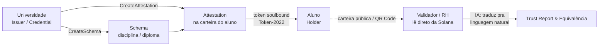

# LattesChain — Passaporte Acadêmico Global Descentralizado 🎓⛓️

[](https://solana.com)
[](https://attest.solana.com)
[](https://opensource.org)
[](https://uni.superteam.com.br/)

> **Projeto submetido ao [Hackathon Universitário Superteam Brasil](https://uni.superteam.com.br/)**  
> Listagem oficial no Superteam Earn: [Hackathon Universitária Superteam Brasil](https://superteam.fun/earn/listing/hackathon-universitaria-superteam-brasil-1)  
> **Missão**: Transformar credenciais, diplomas e históricos acadêmicos em atestações soberanas, imutáveis e verificáveis globalmente na **Solana**.

---

## 📑 Documentação e Recursos Principais

- 🎙️ **[Roteiro de Pitch (5 Minutos)](docs/PITCH_DECK.md)**: Minutagem, slides e script de fala guiada para gravação do vídeo de submissão.
- 📊 **[Plano de Negócios & GTM](docs/BUSINESS_PLAN.md)**: Modelagem B2B2C freemium, unit economics, personas e estratégia beachhead.
- 🎬 **[Demo Runbook](demo/RUNBOOK.md)**: Passo a passo de execução da demo ao vivo on-chain e IA.
- 🏗️ **[Visão Geral de Arquitetura](docs/01_architecture_overview.md)**: Topologia, privacidade LGPD e stack open-source.

---

## 1. O Problema (A Dor Real)

Hoje, o histórico educacional do estudante é **refém das instituições de ensino**:
- **Lentidão & Burocracia**: Solicitações de histórico, validação de horas complementares e transferências de cursos demoram semanas em secretarias acadêmicas e frequentemente envolvem cobrança de taxas.
- **Fraude Endêmica**: Mais de 10% dos certificados e diplomas apresentados em processos seletivos contêm adulterações em PDF.
- **Custo para Recrutadores & Universidades**: RHs e faculdades perdem tempo e dinheiro ligando ou enviando e-mails para checar autenticidade de documentos.

---

## 2. A Solução: Passaporte Acadêmico Soberano

O **LattesChain** cria uma ponte direta entre universidades, estudantes e validadores:



1. **Emissão Soberana**: A universidade emite uma atestação oficial para a carteira do estudante (onboarding transparente e zero-crypto).
2. **Propriedade Real**: Cada disciplina, curso livre e diploma torna-se uma credencial imutável na posse do aluno.
3. **Verificação Instantânea**: Qualquer empresa ou instituição no mundo valida a credencial em 1 segundo direto da blockchain, sem intermediários.
4. **Camada de IA Inteligente**: A IA processa as ementas emitidas, calcula o grau de equivalência curricular entre instituições e gera relatórios de confiança para recrutadores.

---

## 3. Por que Solana & Ecossistema?

A Solana é a infraestrutura ideal para certificações educacionais em escala global:

- **Solana Attestation Service (SAS)**: Em vez de contratos proprietários opacos, usamos o padrão aberto da Solana (`22zoJMtdu4tQc2PzL74ZUT7FrwgB1Udec8DdW4yw4BdG`), interoperável com Solana ID e Civic.
- **Token-2022 Soulbound & Revogável**:
  - `NonTransferable`: Garante que o diploma ou certificado nunca possa ser vendido ou transferido.
  - `PermanentDelegate`: Permite que a instituição revogue a atestação on-chain em caso de fraude ou erro, sem depender da autorização do aluno.
- **Custo de Sub-Centavo**: Emissões em massa custam frações de centavo (< R$ 0,01), viabilizando milhões de atestações por semestre.
- **Privacidade & LGPD por Design**: Nenhum dado sensível (nome, CPF, dados do aluno) vai para a rede. Apenas o hash SHA-256 do documento canônico é ancorado on-chain.

---

## 4. Stack Tecnológica 100% Free, Open-Source & Self-Hosted

Toda a arquitetura foi desenhada para operar a **custo zero de infraestrutura** no MVP:

| Camada | Tecnologia | Licença / Modalidade | Custo |
| :--- | :--- | :--- | :---: |
| **Blockchain** | Solana (SAS + Token-2022) | Open Source / Permissionless | Sub-cent (< R$ 0,01) |
| **Backend / Relayer** | Go (Golang) + Python SAS SDK | Open Source (BSD / MIT) | R$ 0,00 |
| **Database & Auth** | Supabase (PostgreSQL + RLS) | Open Source / Free Tier | R$ 0,00 |
| **Frontend** | Next.js + Tailwind CSS | Open Source / Cloudflare Pages / Vercel Free | R$ 0,00 |
| **Camada de IA** | Ollama / Groq / Google Gemini Free | Open Source / Free Tier API | R$ 0,00 |

---

## 5. Estrutura do Repositório

```
LattesChain/
├── README.md                 # Este documento — planejamento e visão consolidada
├── docs/                     # Especificações detalhadas e documentação técnica
│   ├── PITCH_DECK.md         # Roteiro de pitch de 5 minutos para submissão
│   ├── BUSINESS_PLAN.md      # Modelagem de negócios B2B2C e estratégia GTM
│   ├── 00_index.md           # Índice de documentação técnica
│   ├── 01_architecture_overview.md # Arquitetura geral do sistema
│   └── adr/                  # Architecture Decision Records (ADR 001-007)
├── sas/                      # Pipeline executável do Solana Attestation Service
│   ├── sas_core.py           # Core: constantes, codecs, PDAs e decoders
│   ├── sas_client.py         # Builders de instruções e envio de transações
│   ├── 00_setup_wallets.py   # Criação/carregamento de keypairs locais
│   ├── 01_create_credential.py # Registro da universidade como emissor
│   ├── 02_create_schema.py   # Registro dos schemas (disciplina e diploma)
│   ├── 03_issue_attestation.py # Emissão de atestação on-chain
│   ├── 04_issue_soulbound.py # Emissão com Token-2022 Soulbound
│   ├── 05_verify.py          # Verificação de atestações direto da rede
│   ├── 06_revoke.py          # Demonstração de revogação nativa
│   └── README.md             # Instruções de setup do módulo SAS
├── ai/                       # Camada de IA (Equivalência e Relatórios)
│   ├── equivalence_check.py  # Análise semântica de equivalência de ementas
│   ├── trust_report.py       # Geração de Trust Report para RH
│   └── requirements.txt      # Dependências da camada de IA
├── api/                      # Backend Go Relayer (Open-Source REST API)
├── supabase/                 # Schemas SQL e Políticas RLS (PostgreSQL)
└── demo/
    └── RUNBOOK.md            # Roteiro passo a passo da demo ao vivo
```

---

## 6. Como Executar a Demonstração On-Chain

### 6.1 Pré-requisitos
- Python 3.10+ instalado
- `uv` ou ambiente virtual Python

### 6.2 Execução do Pipeline SAS (Solana Devnet)
```bash
# 1. Configurar dependências
cd sas
pip install -r requirements.txt

# 2. Configurar carteiras e fundos de teste
python 00_setup_wallets.py

# 3. Registrar universidade e schemas
python 01_create_credential.py
python 02_create_schema.py

# 4. Emitir atestação e mint soulbound
python 03_issue_attestation.py
python 04_issue_soulbound.py

# 5. Verificar atestação on-chain
python 05_verify.py disciplina

# 6. Demonstrar revogação de credencial
python 06_revoke.py
```

### 6.3 Executar a Camada de IA
```bash
# Ambiente com uv
uv venv .venv
.venv\Scripts\activate
uv pip install -r ai/requirements.txt

# Gerar Trust Report para o RH
python ai/trust_report.py

# Executar checagem de equivalência curricular
python ai/equivalence_check.py
```

### 6.4 Executar a Aplicação Web Full-Stack (Next.js 14)
```bash
# Instalar dependências
npm install

# Rodar servidor de desenvolvimento
npm run dev
# Acesse em http://localhost:3000
```

#### Rotas Principais da Aplicação:
- `/`: Landing page com proposta de valor e métricas.
- `/validator`: Validador público de documentos (PDF/Hash) e Motor de Equivalência Curricular por IA.
- `/student`: Passaporte acadêmico soberano do estudante com horas complementares e QR code.
- `/university`: Portal de emissão da universidade integrado com Supabase e Solana Devnet.
- `/admin-protocol`: Master Registry e governança descentralizada do ecossistema.

### 6.5 Branches do Repositório: Produção Real vs Demonstração

- **Branch `dev-alex` (Ambiente Real / Zero Mock)**:
  Contém o código de produção limpo, sem componentes ou dados sintéticos. Todas as operações de emissão, cadastro de IES, validação de passaporte de aluno e auditoria de documentos consultam e persistem diretamente no Supabase e na rede Solana Devnet via Serverless Functions.

- **Branch `demo/mock-showcase` (Ambiente de Demonstração & Pitch)**:
  Branch isolada contendo dados canônicos pré-configurados (UFMG, USP, PUC Minas, estudante com histórico e diplomas Soulbound) e motor de equivalência curricular determinístico resiliente a falhas de rede, ideal para gravação de vídeos e apresentação no Hackathon Universitário Superteam Brasil.
```bash
# Para rodar o ambiente de demonstração com mock canônico:
git checkout demo/mock-showcase
npm run dev
```

