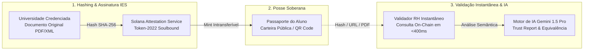

<div align="center">
  
  <br /><br />
 
  <br /><br />
</div>

# LattesChain — Passaporte Acadêmico Global Descentralizado 🎓⛓️

[](https://solana.com)
[](https://attest.solana.com)
[](https://spl.solana.com/token-2022)
[](https://opensource.org)
[](https://uni.superteam.com.br/)

> **Projeto submetido ao [Hackathon Universitário Superteam Brasil](https://uni.superteam.com.br/)**  
> Listagem oficial no Superteam Earn: [Hackathon Universitária Superteam Brasil](https://superteam.fun/earn/listing/hackathon-universitaria-superteam-brasil-1)  
> **Missão**: Transformar credenciais, diplomas e históricos acadêmicos em atestações soberanas, imutáveis e verificáveis globalmente na **Solana**.

---

## 📑 Sumário Executivo de Documentação

- 🎙️ **[Roteiro de Pitch (5 Minutos)](docs/PITCH_DECK.md)**: Minutagem, slides e script de fala guiada para gravação do vídeo de submissão.
- 🎨 **[Manual de Identidade Visual & Design System](Design/BRAND_GUIDELINES.md)**: Tokens de cor, família de logotipos SVG, badges Soulbound e mídias em alta resolução publicados em `/public/brand/` e documentados em `/Design`.
- 🔬 **[Validação Criptográfica de Documentos](doc/VALIDACAO_DOCUMENTOS_ACADEMICOS.md)**: Especificação técnica detalhada do que fazemos e do pipeline em 4 etapas (SHA-256, SAS on-chain, checagem em <400ms e IA curricular).
- 🖥️ **[Pitch Deck Interativo & Modo Gravação](doc/PITCH_SPEAKER_RECORDING_MODE.md)**: Apresentação em tela limpa 16:9 (`/pitch`) com Teleprompter e notas do orador desacopladas em 2ª janela (`/pitch/speaker`) via `BroadcastChannel`, ajuste dinâmico de fonte com 7 níveis (`2xs` a `2xl`), sincronização em tempo real e supressão automática de contadores temporais, atalhos e botões de ação na tela do slide durante gravação.
- 🏢 **[Arquitetura Multi-Tenant & RBAC](doc/ARCHITECTURE_MULTITENANT_RBAC.md)**: Governança institucional, multi-campus, matriz de autorização e fluxos LGPD.
- 🏛️ **[Arquitetura Tripartite & Modelo de Negócios](docs/12_tripartite_and_business_architecture.md)**: Ciclo Estudante ⇄ IES ⇄ RH, compliance de estágios, validade universal e produto Jovian Tech.
- 📊 **[Plano de Negócios & GTM](docs/BUSINESS_PLAN.md)**: Modelagem B2B2C freemium, unit economics, personas e estratégia beachhead.
- 💰 **[Modelo Financeiro & Custos de Infra](docs/17_financial_model_infrastructure_costs_and_pricing.md)**: Custos de Mainnet, cálculo de gás, margem de 94% e precificação de planos IES/RH.
- 🔌 **[Manual de APIs & ERPs Legados](docs/18_external_api_and_erp_integration_guide.md)**: Chaves de API, emissão/verificação REST, integração com TOTVS RM e ATS de RH.
- 📋 **[Relatório de Maturidade & Auditoria](docs/19_project_maturity_and_audit_readiness_report.md)**: Diagnóstico de entregáveis 100% prontos, componentes parciais e ativação Mainnet.
- 🚀 **[Especificação de Migração Mainnet](docs/16_mainnet_migration_and_gasless_relayer_spec.md)**: State Compression (Bubblegum), nós RPC Helius e arquitetura gasless.
- 🛡️ **[Relatório de Auditoria & Due Diligence](DUE_DILIGENCE_AUDIT.md)**: Auditoria técnica independente de 52KB cobrindo contratos Anchor, segurança e LGPD.
- 🎬 **[Demo Runbook](demo/RUNBOOK.md)**: Passo a passo para execução da demonstração ao vivo on-chain e IA.
- 🏗️ **[Visão Geral de Arquitetura](docs/01_architecture_overview.md)**: Topologia, privacidade LGPD e stack open-source.
- 🧪 **[Guia do Validador & Testes Locais](docs/VALIDATOR_TESTING_GUIDE.md)**: Setup do `solana-test-validator` com programas clonados e templates de teste.

---

## 1. O Problema: Burocracia, Fraudes e Atrito no Ensino Superior

Hoje, o ecossistema educacional e o mercado corporativo enfrentam custos bilionários e paralisia operacional com a validação manual de documentos em papel ou PDFs editáveis:

1. **Epidemia de Fraudes e Discrepâncias em Títulos (HireRight Benchmark)**: Segundo o *HireRight Global Employment Screening Benchmark Report*, discrepâncias e adulterações em históricos acadêmicos e diplomas constituem a **inconsistência número #1** detectada em triagens corporativas no mundo todo — com até **85% dos empregadores** flagrando currículos forjados ou cursos incompletos alegados como concluídos.
2. **Barreiras para 6,3 Milhões de Estudantes (UNESCO & EHEA)**: De acordo com a *UNESCO Global Convention on the Recognition of Qualifications*, mais de 6,3 milhões de estudantes transfronteiriços enfrentam entraves de mobilidade internacional, perdendo bolsas de estudo, intercâmbios e contratações urgentes devido a semanas de lentidão em legalizações consulares e carência de padronização interoperável.
3. **Sobrecarga Crônica nas Secretarias Acadêmicas**: Equipes administrativas de IES gastam até **30% da sua jornada de trabalho** respondendo chamados repetitivos por telefone e e-mail para atestar a veracidade de certidões, enquanto veem o prestígio da instituição exposto a fraudes de PDFs adulterados que circulam livremente.
4. **Incerteza e Custo para Empresas e RHs**: Organizações despendem de 10 a 20 dias úteis e orçamentos elevados em auditorias terceirizadas de *background check*, sem garantia criptográfica contra documentos forjados digitalmente.

---

## 2. A Solução LattesChain: O Que Fazemos & Como Fazemos

O **LattesChain** é um protocolo de **validação criptográfica e análise curricular de documentos acadêmicos** (diplomas, históricos escolares, certificados de extensão e ementas) ancorado na rede de alto desempenho **Solana**:



<p align="center">
  
</p>

### O Que Fazemos:
- **Autenticação Inviolável de Títulos**: Garantimos se um diploma ou histórico escolar é genuíno sem precisar ligar para a universidade emissora.
- **Custódia Soberana pelo Estudante**: O aluno carrega suas conquistas formativas em uma carteira digital segura e as compartilha em 1 clique via QR Code ou link.
- **Equivalência Curricular Automatizada**: Cruzamos ementas e disciplinas de diferentes instituições para dispensas acadêmicas e mobilidade internacional instantânea.

### Como Fazemos (O Pipeline em 4 Etapas):
1. **Hash Criptográfico SHA-256 (Local no Browser)**: O PDF ou XML oficial do documento gera uma impressão digital imutável de 256 bits. Qualquer caractere ou nota alterada adultera o hash completamente.
2. **Assinatura da IES na Solana (SAS + Token-2022)**: A universidade credenciada assina o hash via *Solana Attestation Service* e emite um token Soulbound (`NonTransferable`) com autoridade de revogação auditada (`PermanentDelegate`). Nenhum dado pessoal sensível é exposto on-chain (100% LGPD/GDPR).
3. **Auditoria em Menos de 400ms (`/validator`)**: O recrutador ou IES receptora arrasta o PDF ou digita a chave da credencial. A RPC da Solana audita instantaneamente a integridade do hash, a autoridade da assinatura institucional e se o documento está ativo ou revogado.
4. **Camada de IA Curricular (Gemini 1.5 Pro)**: Uma vez atestada a autenticidade criptográfica, a IA lê as ementas das matérias, calcula o percentual de equivalência curricular entre grades acadêmicas (MEC/ECTS) e gera o *Trust Report* executivo.

---

## 3. Principais Features do Sistema

### 3.1 Passaporte Acadêmico do Estudante (`/student`)

<p align="center">
  
</p>

- **Visualização Unificada de Conquistas**: Histórico completo de disciplinas cursadas, cursos de extensão e diplomas oficiais.
- **Token-2022 Soulbound**: Credenciais intransferíveis (`NonTransferable`) com capacidade de revogação auditada (`PermanentDelegate`).
- **Barra de Progresso de Horas Complementares**: Acompanhamento visual da carga horária concluída vs. exigida pelo MEC.
- **Compartilhamento Descomplicado**: Geração de link público e QR Code para inserção em currículos, perfis do LinkedIn ou envio direto ao RH.
- **Ação Rápida "Validar no RH"**: Botão direto em cada certificado para conferência pública em 1 clique.
- **Fila de Solicitações Tripartite**: Envio de solicitações de validação de cursos extracurriculares diretamente para a secretaria da IES.

### 3.2 Validador RH Instantâneo (`/validator`)
- **Consulta Criptográfica em Tempo Real**: Verificação em menos de 400ms na Solana Devnet/Mainnet por hash SHA-256 ou transação.
- **Validação Local de PDFs (LGPD Native)**: O hash do arquivo PDF é computado no navegador do usuário (`crypto.subtle`); nenhum dado sensível ou documento trafega para servidores de terceiros.
- **Test Drive em 1 Clique (Hackathon Showcase)**: Quatro presets canônicos prontos para testes instantâneos:
  1. *UFMG - Diploma de Ciência da Computação (Soulbound Válido)*
  2. *Superteam - SAS Attested Course (Solana Developer)*
  3. *Hackathon - Certificado de Horas de Extensão*
  4. *Fraude / Revogado (Simulação de Diploma Cancelado)*
- **Auto-Validação por URL**: Suporte nativo a parâmetros `?query=<hash>` ou `?hash=<hash>` para validação automatizada ao carregar a página.
- **Detecção de Fraude & Alerta Visual**: Exibição imediata de alertas vermelhos caso o documento tenha sido adulterado ou revogado pelo emissor.

### 3.3 Motor de Inteligência Artificial Curricular (Gemini 1.5 Pro)

<p align="center">
  
</p>

- **Trust Report Automatizado**: Geração de parecer técnico para recrutadores, interpretando o contexto institucional, autenticidade on-chain e data de emissão.
- **Análise Semântica de Equivalência**: Comparador entre duas ementas universitárias (ex: UFMG vs. USP), analisando compatibilidade de carga horária, tópicos coincidentes, grau percentual de equivalência e parecer técnico justificado.

### 3.4 Portal do Emissor Universitário (`/university`)
- **Emissão Individual e em Lote**: Interface amigável para secretarias acadêmicas emitirem atestações de disciplinas, horas complementares ou diplomas.
- **Metadados Oficiais do MEC**: Registro de Portaria MEC, CNPJ, carga horária, nota e texto de ementa.
- **Ações Imediatas Pós-Emissão**: Após ancorar na Solana, a interface exibe botões rápidos para *Testar no Validador RH*, *Ver no Passaporte do Aluno* ou *Inspecionar no Solana Explorer*.
- **Fila de Triagem de Alunos**: Painel para aprovar ou rejeitar solicitações de aproveitamento de estudos enviadas pelos alunos.

### 3.5 Governança Descentralizada & Circuit Breakers (`educore_contracts`)
- **Smart Contracts Anchor Rust**: Registro mestre de instituições de ensino (`MasterRegistry`) e mapeamento por CNPJ.
- **Circuit Breaker de Emergência**: Capacidade de pausar o protocolo (`is_paused`) em caso de incidentes de segurança.
- **CPI Seguro**: Chamadas entre programas para registro de auditoria no SPL Memo e emissões no SAS.

### 3.6 Arquitetura Tripartite & Internacionalização
- **Ciclo Tripartite**: Aluno solicita ➔ Universidade atesta e homologa ➔ Empresa valida e contrata com compliance LGPD.
- **Multilíngue (i18n)**: Suporte completo em tempo real para **Português**, **Inglês** e **Espanhol**.

### 3.7 Governança Master e Painel do Proprietário (`/admin-protocol`)
- **Supervisão 360º de IES**: Auditoria de instituições credenciadas e detalhamento nominal de todos os secretários e operadores vinculados.
- **Transações On-Chain em Tempo Real**: Feed contínuo de ancoragens Solana com identificação de aluno, hash canônico, status Finalized e links diretos ao Solana Explorer.
- **Provisionador de Chaves de API (ERP Gateway)**: Criação de API Tokens (`x-api-key`) com escopos granulares (`credentials:issue`, `credentials:verify`), rate limiting e revogação instantânea.
- **Sandbox & Suporte Técnico**: Simulador integrado de verificação externa para auxílio operacional a secretarias e equipes de TI parceiras.

### 3.8 API Gateway REST v1 para ERPs Legados (`/api/v1/*`)
- **Zero Cripto Onboarding**: ERPs acadêmicos (TOTVS RM Educacional, Sophia, Lyceum) emitem e consultam diplomas via chamadas HTTP REST convencionais.
- **Absorção Gasless**: O backend corporativo da Jovian Tech atua como *Fee Payer* na Solana, eliminando a necessidade de faculdades ou alunos adquirirem tokens em exchanges.
- **SDKs & Exemplos Prontos**: Guias em cURL, C# (.NET Core), Python e Node.js documentados no [Manual de APIs & ERPs Legados](docs/18_external_api_and_erp_integration_guide.md).

### 3.9 Conformidade MEC (Portarias nº 330/2018 e nº 554/2019)
- **Parser de XML do MEC**: Leitor automático de XMLs de diplomas digitais e documentação acadêmica com extração estruturada de dados.
- **Entrada Manual de Contingência**: Permite preenchimento assistido caso o XML da instituição possua inconsistências ou campos fora do padrão.
- **RVDD com QR Code**: Geração de Representação Visual do Diploma Digital com código de validação pública instantânea.

### 3.10 Arquitetura Multi-Tenant, Polos & Campus e Governança RBAC
- **Estudante Multi-Tenant (`student_enrollments`)**: O estudante pode pertencer a múltiplas IES e múltiplos polos/campus simultaneamente, mantendo seu passaporte criptográfico unificado na rede Solana.
- **Gestão de Campus & Polos (`institution_campuses`)**: Instituições de ensino criam, administram e ativam/desativam polos físicos e EaD para alocação de matrículas e turmas. O Administrador possui visão panorâmica e controle agregador.
- **Governança de Usuários & IES**: Painel para o Admin criar qualquer usuário, editar papéis/atribuições de IES/Campus, suspender imediatamente o acesso (`status = 'SUSPENDED'`) ou suspender o credenciamento de IES.
- **Mensageria Transacional Legal (LGPD)**: Envio automatizado de convite com credenciais de acesso ao passaporte para o estudante matriculado pela IES, e disparo de notificações com token de consentimento unívoco para solicitações de compliance feitas por empresas de RH (Artigos 7º e 9º da LGPD).
- **Topbar & RBAC Dinâmico**: Identificador visual no header (`Estudante`, `Empresa`, ou `IES • Polo: [Nome do Campus]`) com isolamento estrito de abas e rotas por perfil de acesso.

### 3.11 Pitch Deck Interativo, Teleprompter & Modo Gravação Dual-Screen (`/pitch` & `/pitch/speaker`)
- **Separação de Janelas (Pop-out Dual-Screen)**: Modo de apresentação com janela limpa 16:9 (`/pitch`) para captura de vídeo em OBS/Loom e janela dedicada para o orador (`/pitch/speaker`).
- **Sincronização Bidirecional Fala ➔ Slide**: A seleção ou avanço de qualquer fala nas notas do orador (seja no teleprompter `/pitch/speaker` ou no drawer embutido de `/pitch`) altera imediatamente o slide correspondente na tela de apresentação via `BroadcastChannel` persistente e fallback de storage com timestamp.
- **Navegação Integrada de Falas**: Seletor de 6 falas com botões de "Fala Anterior" e "Próxima Fala" diretamente no teleprompter e no drawer das notas, com indicadores ao vivo de sincronização.
- **Sincronização Total**: Slides, cronômetro de 5 minutos regressivo/progressivo e escala tipográfica mantidos em sincronia contínua entre as janelas.
- **Narrativa Calibrada & Posicionamento Tripartite (JOVIAN TECH)**: Roteiro do orador de 5 minutos (559 palavras, ~112 PPM) sem leitura literal de slides, posicionando o LattesChain como uma ponte integradora de confiança que potencializa a infraestrutura acadêmica existente com tecnologia de ponta. Consulte **[doc/PITCH_SPEAKER_RECORDING_MODE.md](doc/PITCH_SPEAKER_RECORDING_MODE.md)**.

---

## 4. Pipeline Visual e Timeline do Fluxo de Valor

Implementado interativamente na landing page ([`VisualFlowPipeline.tsx`](src/components/VisualFlowPipeline.tsx)), o fluxo divide-se em 5 etapas claras:

| Etapa | Responsável | Ação Realizada | Padrão Tecnológico |
| :---: | :--- | :--- | :--- |
| **01** | **Secretaria IES** | Emite diploma ou certificado com assinatura digital ICP-Brasil e metadados MEC. | ICP-Brasil + SHA-256 |
| **02** | **Solana Core** | Âncora imutável da atestação no Solana Attestation Service e mint Token-2022. | SAS Program + Soulbound PDA |
| **03** | **Validador RH** | Consulta pública ultrarrápida da atestação por hash ou arquivo PDF em < 400ms. | Solana RPC + Public Verifier |
| **04** | **Aluno Holder** | Credencial visível no passaporte soberano, com QR Code dinâmico e link de validação. | Sovereign Wallet Identity |
| **05** | **IA Curricular** | Tradução dos dados brutos em Trust Report para RH e cálculo de equivalência de disciplinas. | Google Gemini 1.5 Pro |

### Comparativo de Cenários no Simulador ao Vivo

- **Cenário de Sucesso (Happy Path)**:
  1. IES credenciada emite a credencial para o aluno.
  2. Atestação gerada on-chain com hash canônico e mint Soulbound.
  3. Validador atesta: `STATUS: VÁLIDO & AUTÊNTICO`.
  4. IA emite: *"Documento com integridade criptográfica 100% verificada na Solana Devnet."*
- **Cenário de Fraude / Revogação**:
  1. Tentativa de apresentação de diploma adulterado ou cancelado judicialmente.
  2. Consulta detecta revogação via instrução nativa do Token-2022 `PermanentDelegate`.
  3. Validador atesta: `STATUS: REVOGADO / FRAUDULENTO`.
  4. IA emite: *"Aviso de Risco Crítico: Este documento não possui atestação ativa e foi formalmente revogado pela instituição emissora."*

---

## 5. Como Usar o Sistema (Guia Passo a Passo por Perfil)

### 5.1 Para Empresas e Recrutadores (Validação em 1 Clique)
1. Acesse `/validator`.
2. Para testar sem digitar nada, clique em qualquer um dos 4 botões de **Test Drive Rápido**:
   - Clique em **"UFMG - Diploma Válido"** para validar um diploma canônico.
   - Clique em **"Fraude / Revogado"** para testar a detecção em tempo real de cancelamento on-chain.
3. Para validar um arquivo recebido de um candidato, arraste o PDF para o campo de upload ou cole o hash SHA-256.
4. Clique em **"Verificar Documento On-Chain"**. O resultado será exibido em milissegundos com o selo verde de autenticidade, link para o Solana Explorer e o parecer do Gemini 1.5 Pro.
5. Para analisar compatibilidade de currículos, clique na aba **"Equivalência Curricular (IA)"**, selecione as duas disciplinas e clique em **"Avaliar Equivalência com IA"**.

### 5.2 Para Estudantes (Meu Passaporte)
1. Acesse `/student`.
2. Visualize todas as suas atestações ativas, notas e o progresso da sua carga horária de extensão.
3. Para apresentar seu passaporte para um recrutador, clique em **"Compartilhar Passaporte"** para copiar seu link público de validação ou em **"QR Code Geral"** para exibir o código na tela.
4. Para auditar qualquer disciplina específica, clique em **"Validar no RH"** diretamente no card da credencial para abri-la no validador.
5. Caso tenha concluído um curso externo (ex: Superteam Solana Bootcamp), utilize a seção **"Solicitar Validação de Atividade"** para enviar a ementa e carga horária para homologação da sua faculdade.

### 5.3 Para Faculdades e Universidades (Portal IES)
1. Acesse `/university`.
2. No formulário de emissão, selecione o tipo de documento (*Disciplina*, *Horas Complementares* ou *Diploma Oficial*).
3. Preencha o nome do aluno, CPF, carteira Solana (ou utilize a carteira de teste padrão) e a ementa curricular.
4. Clique em **"Emitir Atestação On-Chain"**. A transação é enviada e assinada na Solana Devnet.
5. No painel lateral, utilize os botões rápidos:
   - **"Testar no Validador RH"**: Abre a verificação pública imediata da atestação recém-emitida.
   - **"Ver no Passaporte do Aluno"**: Confere a credencial refletida instantaneamente na carteira do estudante.

### 5.4 Autenticação, Presets de Demonstração e Resiliência da Sessão
1. **Acesso Rápido para Banca Hackathon (1 Clique)**: Na página `/login`, estão disponíveis botões de preenchimento automático para os perfis canônicos de demonstração:
   - **Aluno Demo**: `ana.estudante.teste@jovian.foo` (Senha: `SenhaAluno123`) → Direciona para o Portal do Estudante (`/student`).
   - **IES / Admin Protocol**: `latteschain@jovian.foo` (Senha: `NovaSenha456`) → Direciona para a Governança (`/admin-protocol`).
2. **Resiliência Fail-Safe de Sessão**: O hook `useSession` e o helper de tenant operam com fallback dinâmico em dois estágios, garantindo que ausências de colunas ou migrações remotas nunca travem a interface em loading infinito.
3. **Para Administradores Jovian Tech (`@jovian.foo`)**:
   - Todo e-mail sob o domínio `jovian.foo` com papel de administração possui acesso ao **Painel Geral do Dono do Protocolo** (`/admin-protocol`).
   - Para primeiro acesso ou recuperação de senha: em `/login`, utilize **"Primeiro acesso ou esqueceu a senha?"** para auto-provisionamento com envio de link de criação de senha.
4. **E-mail Oficial de Contato**: Para evitar informações inventadas, o canal oficial da Jovian Tech é exclusivamente `contact@jovian.foo`.

### 5.5 Alternância Dinâmica de Temas de Cores (Theme Switcher)
1. **Botão no Navbar**: Clique no botão de paleta cromática (`Palette`) posicionado no cabeçalho ao lado do seletor de idiomas.
2. **Temas Suportados**:
   - **Solana Emerald (Padrão)**: Fundo escuro profundo (`#080c14`), cartões em azul marinho (`#101d32`), acentos em verde Solana (`#14F195`) e glows esmeralda.
   - **Elementus Purple System**: Fundo purple-black ink (`#0e0a18`), cartões e superfícies navy em violeta escuro (`#1b152c`), acentos em roxo Elementus (`#8a33f5`), lavanda suave (`#d1abf9`) e glows púrpura.
3. **Isolamento Estrito**: A alternância cromática afeta apenas variáveis CSS e tokens do Tailwind, mantendo absolutamente todos os elementos, textos, cards, recursos e lógicas das páginas inalterados.
4. **Persistência**: A escolha é armazenada em `localStorage` (`educore_theme`) e aplicada de forma síncrona no carregamento da página.

### 5.6 Pipeline de Dados com Fluxo Dinâmico e Timeline Automatizada
1. **Linha de Fluxo & Partículas**: Feixe contínuo laser neon (`flow-line-animated`) e partículas de energia simulando a transmissão de dados on-chain em tempo real.
2. **Rotação Automática Suave**: A timeline avança automaticamente a cada 5 segundos de forma contínua e suave, pausando inteligentemente ao passar o cursor sobre o container para permitir leitura atenta.
3. **Controle Manual Total**: Botão de Play/Pause integrado no cabeçalho da seção, botões de navegação anterior/próximo e seleção direta de etapas com micro-barras de progresso temporal nos blocos.

---

## 6. Mapeamento de Rotas da Interface & Endpoints de API

### 6.1 Rotas da Interface Web (Next.js 14 App Router)

| Rota | Descrição | Acesso |
| :--- | :--- | :---: |
| `/` | Landing page com posicionamento tripartite, métricas e pipeline interativo | Público |
| `/validator` | Validador público de documentos, exportação de certidão PDF e motor de IA | Público |
| `/student` | Passaporte acadêmico do aluno com barra de horas MEC, QR code e solicitações | Estudante |
| `/university` | Portal do emissor IES com emissão on-chain, triagem de pedidos e diretório | IES |
| `/admin-protocol` | Governança de autoridades IES e homologação de novos usuários com 1 clique | Administrador |
| `/precos` | Planos comerciais (Plano Start R$ 0 / mês com 1 mês de teste, Campus Pro, Enterprise e RH) | Público |
| `/sobre` | Detalhamento institucional do protocolo LattesChain e Jovian Tech | Público |
| `/login` | Autenticação com redirecionamento de papéis e atalho para primeiro acesso | Público |
| `/recuperar-senha` | Primeiro Acesso e recuperação de senha com auto-provisionamento `@jovian.foo` | Público |
| `/redefinir-senha` | Definição de senha com token de uso único (1 hora de validade) | Público |
| `/cadastro` | Solicitação de cadastro com validação de CPF/CNPJ e aprovação automática para `@jovian.foo` | Público |
| `/guia-carteira` | Guia passo a passo de conexão Phantom/Solana e tester de conexão em tempo real | Público |
| `/privacidade` | Diretrizes LGPD & Privacy by Design com contato oficial DPO (`contact@jovian.foo`) | Público |
| `/pitch` | Pitch Deck interativo de 5 minutos, tela cheia 16:9, notas e modo gravação | Público |
| `/pitch/speaker` | Teleprompter e notas do orador em janela desacoplada com sincronização em tempo real | Público |

### 6.2 Endpoints REST da API

| Método | Endpoint | Descrição |
| :---: | :--- | :--- |
| `POST` | `/api/credentials/verify` | Valida hash de documento ou transação no protocolo SAS / Solana |
| `POST` | `/api/credentials/issue` | Emite atestação on-chain no SAS com metadados acadêmicos |
| `GET` | `/api/credentials/student` | Retorna passaporte, credenciais e horas complementares de um aluno |
| `POST` | `/api/ai/trust-report` | Gera relatório de confiança em linguagem natural via Gemini 1.5 Pro |
| `POST` | `/api/ai/equivalence` | Realiza análise semântica e cálculo de equivalência entre ementas |
| `GET` | `/api/institutions` | Lista instituições credenciadas e seus status no protocolo |
| `GET/POST`| `/api/requests/student` | Cria e lista solicitações de validação enviadas por alunos |
| `POST` | `/api/requests/institution/review` | Aprova ou rejeita solicitações de alunos pela universidade |
| `POST` | `/api/compliance/request` | Cria solicitação de compliance educacional para processos seletivos |
| `GET` | `/api/compliance/student` | Consulta termos e autorizações de compliance de um candidato |
| `GET` | `/api/admin/users` | Lista contas de usuários cadastradas com filtro por status (`PENDING`, `APPROVED`, etc.) |
| `POST` | `/api/admin/users/review` | Aprova ou rejeita solicitação de cadastro com envio de notificação |
| `POST` | `/api/auth/signup` | Criação de usuário no Supabase Auth com ticket e perfil pendente |
| `GET` | `/api/auth/approve` | Link assinado HMAC-SHA256 para homologação de cadastro via email |
| `GET` | `/api/auth/reject` | Link assinado HMAC-SHA256 para recusa de cadastro via email |

---

## 7. Como Rodar o Projeto Localmente

### 7.1 Pré-requisitos
- **Node.js**: v18.18.0 ou superior (Node 20+ recomendado)
- **npm** ou **pnpm**
- **Rust & Cargo** (opcional, para compilar contratos Anchor)
- **Solana CLI** `1.18+` (opcional, para rodar validador local)
- **Python 3.10+** (opcional, para rodar scripts SAS puros)

### 7.2 Execução da Aplicação Web Full-Stack

```bash
# 1. Clonar o repositório
git clone https://github.com/alexmsza/LattesChain.git
cd LattesChain

# 2. Instalar dependências
npm install

# 3. Configurar variáveis de ambiente
cp .env.example .env.local
# (Preencha as chaves do Supabase e Solana RPC caso queira usar endpoints próprios)

# 4. Iniciar servidor de desenvolvimento
npm run dev
```

Acesse [http://localhost:3000](http://localhost:3000) no seu navegador.

### 7.3 Verificação de Build de Produção

```bash
npm run build
npm run start
```

---

## 8. Ambiente de Testes Locais com Validador & Anchor 🧪

Seguindo as convenções oficiais do **create-solana-dapp**, o LattesChain disponibiliza um ecossistema completo para testes locais determinísticos com programas clonados da Devnet.

### Comandos Disponíveis no `package.json`

```bash
# Iniciar o solana-test-validator clonando o SPL Memo e o Solana Attestation Service (SAS):
npm run validator:start

# Executar diagnóstico de saúde das portas RPC e dos programas clonados:
npm run validator:check

# Gerar automaticamente novos templates de teste (Anchor, Python SAS ou Bankrun):
npm run validator:template -- anchor meu_teste_lote
npm run validator:template -- python meu_teste_revogacao

# Compilar e testar os smart contracts Anchor:
npm run anchor:build
npm run anchor:test
```

Para mais detalhes sobre a execução do pipeline Python SAS e testes isolados, consulte o **[Guia do Validador & Testes Locais](docs/VALIDATOR_TESTING_GUIDE.md)**.

---

## 9. Privacidade, Conformidade MEC e Segurança

- **100% LGPD por Design**: Nenhum dado pessoal identificável (PII) é registrado na blockchain. Apenas a função de mão única SHA-256 do documento canônico é ancorada na rede. O titular conta com política pública e canal de DPO formal em **[/privacidade](src/app/privacidade/page.tsx)**.
- **Portarias MEC nº 330/2018 e nº 554/2019 (Diploma Digital)**: Suporte nativo a upload e parser de arquivos XML do MEC com extração de diplomado, curso, carga horária, livro, folha e registro acadêmico, mantendo fallback 100% editável para inserção manual.
- **Representação Visual do Diploma Digital (RVDD) com QR Code Dinâmico**: Geração de QR Code vetorial SVG escaneável por qualquer smartphone diretamente na folha de Certidão de Veracidade acadêmica em PDF.
- **Emissão em Lote (Batch Issuance via CSV)**: Módulo dedicado para faculdades emitirem atestações para turmas inteiras com template CSV, pré-visualização e barra de progresso em tempo real.
- **Padrão Internacional W3C Verifiable Credentials**: Exportação de credenciais no formato JSON-LD interoperável com carteiras digitais globais.
- **Circuit Breakers & Defesa em Profundidade**: Todos os contratos do protocolo contam com verificação de integridade e mecanismos de pausa de emergência protegidos por chaves multisig.
- **Client-Side SecurityGuard & Anti-Scraping**: Proteção ativa contra inspeção indevida e cópia não autorizada de código/fontes críticas, bloqueando atalhos de devtools (`F12`, `Ctrl+Shift+I/J/C`, `Ctrl+U`, `Ctrl+S`), interceptando clique direito com toast institucional e desabilitando arraste de elementos (`dragstart`).
- **HTTP Security Headers**: Configuração de `X-Frame-Options: DENY`, `X-Content-Type-Options: nosniff`, `Referrer-Policy` e `X-XSS-Protection` com remoção do cabeçalho `X-Powered-By`.

Para detalhes técnicos e jurídicos da conformidade, consulte **[docs/15_mec_xml_parser_rvdd_and_lgpd_compliance.md](docs/15_mec_xml_parser_rvdd_and_lgpd_compliance.md)**.

---

## 10. Guia de Conexão com a Carteira Solana & Adoção Web3 Gradual

O LattesChain inclui um **[Guia Interativo de Conexão (/guia-carteira)](src/app/guia-carteira/page.tsx)** dedicado para todos os participantes do ecossistema:
- **Carteira Phantom & Testes do MVP**: Qualquer participante (aluno, faculdade ou recrutador) pode conectar sua carteira **Phantom** (ou Solflare/Backpack) diretamente no navegador para testar a emissão, custódia e validação no MVP na Solana Devnet em 1 clique.
- **Transações Reais Futuras na Mainnet**: A mesma chave pública ed25519 e a mesma carteira Phantom serão utilizadas para atestações com fé pública na Mainnet, liquidação de micro-taxas de equivalência internacional e custódia soberana de Soulbound Tokens (Token-2022).
- **Estudantes**: Instalação da Phantom/Solflare/Backpack, criação de chave pública e obtenção de SOL na Devnet.
- **Faculdades (IES)**: Conexão via Master Authority e PDA de Emissor Credenciado.
- **Recrutadores e RH**: Verificação de atestações via link/hash público sem necessidade de tokens cripto (suporte a relayer gasless).

Consulte o documento completo: **[docs/14_solana_wallet_connection_and_security.md](docs/14_solana_wallet_connection_and_security.md)**.

---

## 11. Autoria, Engenharia e Reconhecimentos

- **Liderança Técnica & Arquitetura Web3**: [Alex Miqueias](https://www.linkedin.com/in/alexmiqueias/) · [Instagram (@alexmsza)](https://www.instagram.com/alexmsza/)
- **Engenharia de Software & DevSecOps**: Rogerio Alencar Filho
- **Sistemas & Operações**: Caio Vila Nova (Application Support, Automation & Data Workflows)
- **Empresa Parceira / Hub de Inovação**: [Jovian Tech](https://jovian.foo/) · [LinkedIn da Jovian](https://www.linkedin.com/company/jovian-tech-foo/)
- **Ecossistema**: Desenvolvido com suporte e foco no **Hackathon Universitário Superteam Brasil**, alavancando **Solana Attestation Service (SAS)** e **Token-2022 Extensions**.

> **Lema Oficial**: *"LattesChain: a soberania educacional na velocidade da Solana!"*

Para suporte institucional, credenciamento de IES ou integração empresarial, consulte **[docs/12_tripartite_and_business_architecture.md](docs/12_tripartite_and_business_architecture.md)**.

