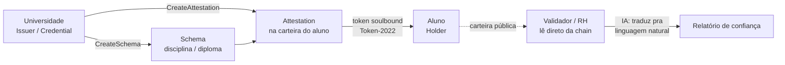

# LattesChain — Passaporte Acadêmico Descentralizado 🎓⛓️

[](https://solana.com)
[](https://attest.solana.com)
[](https://python.org)

> ⚠️ **PIVÔ (2026-08-29)**: este README é o planejamento **atual**, pra um
> hackathon de Solana com <24h e time de Go/Python/IA (não Rust/TS). A
> arquitetura de produção antiga (Go+Fly.io, Anchor `MasterRegistry`
> próprio, Metaplex Core, CloudHSM) descrita em `docs/` foi **substituída**
> pelo plano abaixo. Os docs antigos ficam como referência histórica — a
> análise de LGPD/negócio em `relatorio_ideação.md` ainda vale — mas não são
> o que vamos apresentar.

## 1. O problema (2 frases pro júri)

Credenciais acadêmicas hoje são reféns da instituição: pedir histórico é
lento e burocrático, e RH/outras faculdades não têm como verificar
autenticidade sem ligar pra secretaria. O aluno devia ser dono do seu
histórico — não a instituição.

## 2. A solução

**Passaporte acadêmico do aluno**: cada disciplina concluída e cada diploma
viram uma credencial verificável on-chain, na carteira do próprio aluno.
Três atores, uma demo:



## 3. Por que Solana — e por que isso não é blockchain-por-buzzword

Regra de ouro: só usar blockchain onde propriedade, permanência ou
não-precisar-confiar-num-intermediário importam de verdade. Aqui importa
porque:

- **Propriedade real do aluno**: a credencial vive na carteira dele, não no
  banco de dados de uma instituição que pode sumir, negar acesso ou cobrar
  "segunda via".
- **Verificação sem confiar em ninguém**: RH ou outra faculdade leem
  direto da chain — não existe API da universidade no meio que possa estar
  fora do ar, mentir, ou cobrar.
- **Emissão em massa é barata**: uma IES emite milhares de credenciais por
  semestre. Numa chain cara isso é inviável. Na Solana, fração de centavo
  por atestação (e existe *compressed NFT / state compression* pra escalar
  ainda mais, se formos pra volumes de dezenas de milhares).
- **Não é "banco de dados com blockchain enfiada"**: usamos uma primitiva
  *nativa* da Solana desenhada exatamente pra isso.

## 4. A peça técnica central: Solana Attestation Service (SAS)

Em vez de escrever e auditar nosso próprio smart contract Anchor do zero
(o que a spec antiga em `docs/03_smart_contracts_anchor.md` propunha, e que
tinha issues sérias — ver `docs/00_index.md` §3), usamos o **SAS**: um
protocolo nativo, aberto e permissionless da Solana pra credenciais
verificáveis, lançado em 2025 e já usado em produção (Solana ID, Civic,
Range, SumSub).

Modelo de três componentes — mapeado 1:1 pro nosso caso:

| SAS | LattesChain |
| :--- | :--- |
| **Credential** (emissor confiável) | A universidade |
| **Schema** (template de campos) | `disciplina_concluida_v1` (disciplina, carga_horária, nota, semestre, ementa_hash) e `diploma_v1` (curso, data_conclusão, diploma_hash) |
| **Attestation** (afirmação individual) | Uma disciplina ou diploma emitido pra um aluno específico |

Programa on-chain: `22zoJMtdu4tQc2PzL74ZUT7FrwgB1Udec8DdW4yw4BdG` (mesmo
endereço em devnet e mainnet).

### A pergunta que o júri vai fazer: "o que impede o aluno de vender o diploma?"

Resposta: **Token-2022 non-transferable + permanent delegate**. Quando
tokenizamos uma Attestation (`sas/04_issue_soulbound.py`), o mint nasce com
duas extensões do próprio token program da Solana:

- `NonTransferable` — a transação de transferência é rejeitada pelo token
  program antes mesmo de chegar na chain. Não é regra de aplicação, é
  protocolo.
- `PermanentDelegate` — a universidade pode revogar/queimar o token depois
  (fraude descoberta, erro de emissão) **sem precisar da assinatura do
  aluno**. A Solana até loga um aviso na criação da conta avisando que isso
  é possível — transparência embutida, não escondida em termo de uso.

Isso é soulbound *e* revogável, garantido pelo protocolo — narrativa
redonda, e demonstrável ao vivo (`sas/06_revoke.py`).

### Privacidade: o que fica on-chain vs off-chain

Nenhum PII (nome, CPF, PDF do diploma) vai on-chain. On-chain só vai a
*prova*: `ementa_hash` / `diploma_hash` (SHA-256 do conteúdo real, que fica
fora da chain). Mesmo princípio do `docs/01_architecture_overview.md`
antigo (matriz de separação LGPD), só que aplicado à estrutura de dados do
SAS em vez de contas Anchor customizadas.

## 5. O diferencial: camada de IA em cima da camada on-chain

Poucos times vão ter isso. Dois scripts em `ai/`:

1. **`trust_report.py`** — resolve "RH não sabe ler blockchain": lê as
   atestações on-chain de um aluno, roda as mesmas checagens
   criptográficas do validador (`sas/05_verify.py`), e pede pro Claude
   traduzir isso num resumo de confiança em português, pronto pra um
   painel de RH/ATS.
2. **`equivalence_check.py`** — resolve o problema chato de verdade
   mencionado no brainstorm inicial: créditos que não se transferem entre
   instituições. Recomputa o hash da ementa on-chain (prova de
   integridade) e pede pro Claude um veredito estruturado de equivalência
   contra a ementa de outra instituição.

## 6. Estrutura do repositório

```
LattesChain/
├── README.md            # este arquivo — o planejamento atual
├── sas/                  # esqueleto Python contra o Solana Attestation Service
│   ├── sas_core.py       # constantes, codec, PDAs, decoders (ver comentários = fonte)
│   ├── sas_client.py     # builders de instrução + envio de tx
│   ├── 00..06_*.py       # scripts numerados da demo (ver §7)
│   └── README.md         # setup, status honesto do que foi/não foi testado
├── ai/                   # camada de IA (Claude) em cima dos dados on-chain
│   ├── trust_report.py
│   └── equivalence_check.py
├── demo/
│   └── RUNBOOK.md        # sequência exata de comandos + fala pra apresentação
├── docs/                 # arquitetura de PRODUÇÃO antiga (histórico, não é o plano atual)
├── relatorio_ideação.md  # análise de negócio/LGPD original — ainda útil pra Q&A
├── api/, educore_contracts/, supabase/  # código da arquitetura antiga (Go/Anchor/SQL) — não usado no pivô
└── .agents/               # regras/skills de agente (legado)
```

## 7. Roteiro de demo ao vivo

Sequência completa de comandos + fala está em [`demo/RUNBOOK.md`](demo/RUNBOOK.md). Resumo:

1. Universidade registra Credential + Schema (`sas/00`, `01`, `02`).
2. Universidade emite atestação de disciplina pro aluno (`sas/03`) →
   validador confere na hora (`sas/05 disciplina`) → **PASS**.
3. Universidade emite diploma tokenizado — token aparece na carteira do
   aluno no Explorer/Phantom (`sas/04`).
4. IA gera o relatório de confiança pro RH (`ai/trust_report.py`).
5. Momento de virada: universidade revoga o diploma (`sas/06`) → valida de
   novo (`sas/05 diploma`) → **FAIL**. Prova ao vivo que revogação
   funciona sem a cooperação do aluno.
6. Bônus, se der tempo: `ai/equivalence_check.py` mostrando duas IES
   decidindo equivalência de crédito automaticamente.

## 8. O que é mock e o que é real (falar isso proativamente, não esconder)

| Peça | Status |
| :--- | :--- |
| Programa SAS on-chain, PDAs, transações | **Real** — devnet, programa nativo da Solana Foundation |
| Soulbound + revogação (Token-2022) | **Real** — mesmo mecanismo de produção |
| Hash da ementa/diploma | **Real** (SHA-256), mas o texto fonte é mockado pra demo |
| Sistema acadêmico da IES (LMS) que dispara a emissão | **Mockado** — chamamos os scripts direto |
| Universidade B (equivalência de créditos) | **Mockada** — sem integração real com outra IES |
| Assinatura ICP-Brasil / e-CNPJ | **Fora de escopo desta demo** — ver `docs/06_security_lgpd_icp.md` e ADR-006 antigos pra a versão "produção" caso o júri pergunte sobre validade jurídica formal (RND/MEC) |
| Código Python em `sas/`/`ai/` | Escrito contra o source real do programa, mas **não executado** no ambiente onde foi gerado (sem Python/Solana CLI instalados ali) — testar numa máquina de verdade antes da demo, ver `sas/README.md` |

## 9. Perguntas difíceis — respostas prontas

- **"Por que blockchain e não só um banco de dados?"** → §3 acima:
  propriedade do aluno + verificação sem confiar em ninguém + a IES não
  pode negar acesso.
- **"O que impede vender o diploma?"** → §4: NonTransferable, garantido
  pelo token program, não pela aplicação.
- **"E se a universidade errar ou for fraude?"** → PermanentDelegate:
  revogação on-chain, instantânea, sem precisar do aluno. Demonstrado ao
  vivo em `sas/06_revoke.py`.
- **"Isso substitui o RND do MEC?"** → Não, é uma camada complementar de
  integridade e portabilidade (framing do plano antigo em
  `docs/01_architecture_overview.md` §1 continua válido).
- **"Vocês escreveram o smart contract?"** → Não precisamos: o SAS é uma
  primitiva nativa e auditada da Solana Foundation. Nosso trabalho técnico
  foi integrar com ela sem SDK oficial em Python (não existe), montando as
  instruções à mão a partir do código-fonte — ver `sas/README.md`.

## 10. Setup rápido

```bash
cd sas && pip install -r requirements.txt
cd ../ai && pip install -r requirements.txt
export ANTHROPIC_API_KEY=...     # pra ai/trust_report.py e equivalence_check.py
python sas/00_setup_wallets.py   # gera carteiras devnet + airdrop
# ... seguir demo/RUNBOOK.md
```
