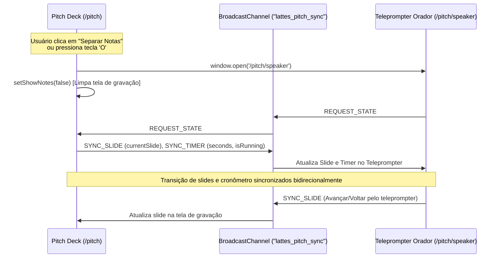

# Modo Gravação & Teleprompter em Janela Separada (Dual-Screen Pitch)

## 1. Visão Geral e Objetivo
O módulo de apresentação do **LattesChain Pitch Deck** (`/pitch`) agora suporta **Separação de Janela (Pop-out)** e **Modo Gravação Limpo (Clean View 16:9)**.
Isso permite ao apresentador gravar o pitch (via OBS Studio, Loom, QuickTime ou gravação de janela) capturando estritamente os slides limpos e profissionais na tela principal, enquanto o script guiado palavra-por-palavra, dicas de oratória, pontos-chave da banca e cronômetro de 5 minutos rodam sincronizados em uma 2ª janela externa independente.

---

## 2. Arquitetura de Sincronização em Tempo Real
A comunicação entre a janela principal de apresentação (`/pitch`) e a janela do orador (`/pitch/speaker`) utiliza a API nativa **`BroadcastChannel`** (`lattes_pitch_sync`), com fallback automático via **`localStorage`**:

---

## 3. Atalhos de Teclado Suportados

| Atalho | Ação | Descrição |
| :--- | :--- | :--- |
| `O` | **Separar Notas (Janela Pop-out)** | Abre `/pitch/speaker` em janela popup e oculta notas da tela principal |
| `G` | **Modo Gravação (Clean View)** | Oculta cabeçalho, barra de progresso e bordas; foca no slide 16:9 |
| `N` | **Notas Embutidas** | Alterna exibição das notas na parte inferior da própria página |
| `F` | **Tela Cheia** | Ativa/desativa Fullscreen nativo da apresentação |
| `Space` / `→` / `PgDn` | **Próximo Slide** | Avança slide e propaga evento em tempo real via BroadcastChannel |
| `Backspace` / `←` / `PgUp` | **Slide Anterior** | Retorna slide e sincroniza janelas |
| `T` | **Play/Pause Cronômetro** | Inicia ou pausa o timer de 5 minutos em ambas as telas |
| `R` | **Zerar Cronômetro** | Reinicia a contagem do cronômetro sincronizadamente |
| `1` a `6` | **Pular para Slide 1-6** | Navegação rápida direta para os tópicos do pitch |

---

## 4. Instruções de Uso para Gravação

1. Acesse `http://localhost:3000/pitch`.
2. Clique no botão **"Separar Notas (Janela Pop-out)"** (ou pressione a tecla `O`).
3. Uma nova janela com o **Teleprompter do Orador** será aberta:
   - Arraste esta janela para o seu segundo monitor ou para a metade lateral do seu display.
   - Ajuste o tamanho da fonte (`A-` / `A+`) e acompanhe o script de fala.
4. Na janela principal, ative o **"Modo Gravação"** (ou pressione a tecla `G` / `F` para tela cheia):
   - A tela exibirá apenas o slide em alta definição 16:9 sem poluição visual.
5. No software de gravação (ex: OBS Studio ou Loom):
   - Selecione para capturar exclusivamente a janela do **Pitch Deck Principal**.
6. Use o teclado (`Espaço`, `→`) na janela do orador ou na janela principal: ambas avançam juntas instantaneamente.
