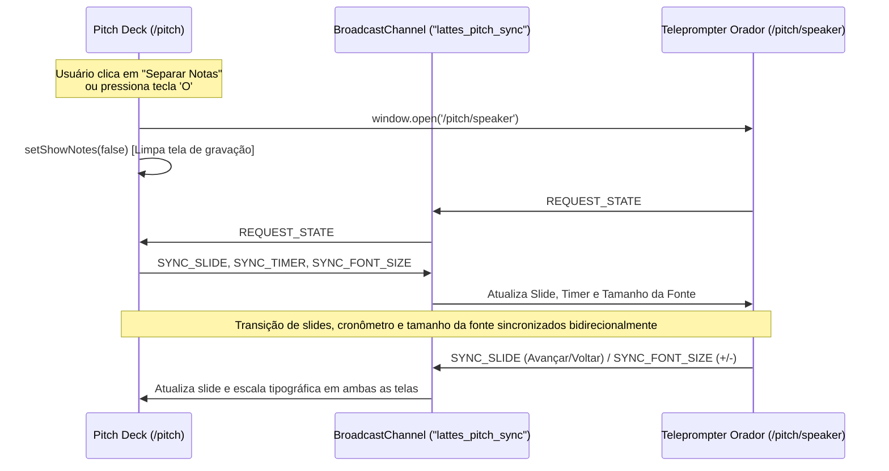

# Modo Gravação & Teleprompter em Janela Separada (Dual-Screen Pitch)

## 1. Visão Geral e Objetivo
O módulo de apresentação do **LattesChain Pitch Deck** (`/pitch`) agora suporta **Separação de Janela (Pop-out)** e **Modo Gravação Limpo (Clean View 16:9)**.
Isso permite ao apresentador gravar o pitch (via OBS Studio, Loom, QuickTime ou gravação de janela) capturando estritamente os slides limpos e profissionais na tela principal, enquanto o script guiado palavra-por-palavra, dicas de oratória, pontos-chave da banca e cronômetro de 5 minutos rodam sincronizados em uma 2ª janela externa independente.

---

## 2. Arquitetura de Sincronização em Tempo Real
A comunicação entre a janela principal de apresentação (`/pitch`) e a janela do orador (`/pitch/speaker`) utiliza a API nativa **`BroadcastChannel`** (`lattes_pitch_sync`), com fallback automático via **`localStorage`** (`lattes_pitch_font_size` e `lattes_pitch_sync`):

---

## 3. Atalhos de Teclado Suportados

| Atalho | Ação | Descrição |
| :--- | :--- | :--- |
| `+` ou `=` | **Aumentar Fonte das Notas** | Eleva a escala tipográfica das notas/teleprompter (`2XS` ➔ `2XL`) |
| `-` ou `_` | **Diminuir Fonte das Notas** | Reduz a escala tipográfica das notas/teleprompter (`2XL` ➔ `2XS`) |
| `O` | **Separar Notas (Janela Pop-out)** | Abre `/pitch/speaker` em janela popup e oculta notas da tela principal |
| `G` | **Modo Gravação (Clean View)** | Oculta cabeçalho, barra de progresso e bordas; foca no slide 16:9 |
| `N` | **Notas Embutidas** | Alterna exibição das notas na parte inferior da própria página |
| `F` | **Tela Cheia** | Ativa/desativa Fullscreen nativo da apresentação |
| `Space` / `→` / `PgDn` | **Próximo Slide** | Avança slide e propaga evento em tempo real via BroadcastChannel |
| `Backspace` / `←` / `PgUp` | **Slide Anterior** | Retorna slide e sincroniza janelas |
| `T` | **Play/Pause Cronômetro** | Inicia ou pausa o timer de 5 minutos em ambas as telas |
| `R` | **Zerar Cronômetro** | Reinicia a contagem do cronômetro sincronizadamente |
| `1` a `6` | **Pular para Slide 1-6** | Navegação rápida direta para os tópicos do pitch |

---

## 4. Níveis de Escala Tipográfica Suportados

Ambas as telas compartilham 7 níveis calibrados para legibilidade em monitores de qualquer distância, resolução ou layout (inclusive split-screen e janelas ultra compactas):

| Nível | Identificador | Indicador Visual | Aplicação Recomendada |
| :---: | :---: | :---: | :--- |
| **Ultra Compacto** | `2xs` | `Aa 2xs` | Janelas divididas (tiling/split), visualização completa sem rolagem |
| **Muito Pequeno** | `xs` | `Aa xs` | Laptops compactos ou teleprompter lateral estreito |
| **Pequeno** | `sm` | `Aa sm` | Telas pequenas, notebooks 13" ou visão próxima |
| **Médio (Padrão)** | `md` | `Aa md` | Resolução padrão 1080p e leitura balanceada |
| **Grande** | `lg` | `Aa lg` | Monitores 2K/4K ou maior facilidade de escaneamento visual |
| **Extra Grande** | `xl` | `Aa xl` | Uso como teleprompter a meia distância (1,5m) |
| **Teleprompter Pro** | `2xl` | `Aa 2xl` | Leitura dinâmica a longa distância ou gravação em pé |

---

## 5. Instruções de Uso para Gravação

1. Acesse `http://localhost:3000/pitch`.
2. Clique no botão **"Separar Notas (Janela Pop-out)"** (ou pressione a tecla `O`).
3. Uma nova janela com o **Teleprompter do Orador** será aberta:
   - Arraste esta janela para o seu segundo monitor ou para a metade lateral do seu display.
   - Ajuste o tamanho da fonte clicando nos botões `A-` / `A+` no topo ou no card do script, ou use as teclas `+` e `-`. A alteração sincroniza instantaneamente com o drawer da tela principal e fica salva no navegador.
4. Na janela principal, ative o **"Modo Gravação"** (ou pressione a tecla `G` / `F` para tela cheia):
   - A tela exibirá apenas o slide em alta definição 16:9 sem poluição visual.
5. No software de gravação (ex: OBS Studio ou Loom):
   - Selecione para capturar exclusivamente a janela do **Pitch Deck Principal**.
6. Use o teclado (`Espaço`, `→`) na janela do orador ou na janela principal: ambas avançam juntas instantaneamente.

---

## 6. Sincronização Bidirecional Contínua (Troca de Fala ➔ Troca de Slide)

### Descrição da Mudança
Implementada navegação síncrona imediata entre o script falado do orador e os slides da apresentação. A troca de fala (seja via seletor numérico, abas de fala, botões "Fala Anterior" / "Próxima Fala" ou avanço no card "A Seguir") altera automaticamente e de forma instantânea o slide correspondente tanto na apresentação principal quanto na janela de teleprompter/drawer.

### Impacto Técnico
- **Canal IPC Estável (`BroadcastChannel`)**: Eliminação do ciclo de teardown/reabertura a cada segundo no `useEffect` causado pelo cronômetro. O canal agora é persistente durante todo o ciclo de vida do componente.
- **Fallback Resiliente por Timestamp (`StorageEvent`)**: Inclusão de chave `lattes_pitch_sync_event` com carimbo temporal (`Date.now()`), assegurando que mensagens entre abas ou telas nunca sejam descartadas mesmo se o valor for reemitido.
- **Seletor de Fala Integrado no Drawer**: Adicionado seletor de 6 falas com botões de navegação no drawer de notas da tela principal (`/pitch`), permitindo trocar a fala e o slide simultaneamente sem precisar fechar o drawer.
- **Controles de Fala no Teleprompter**: Adicionados controles diretos de "Pular para Fala", "Fala Anterior", "Próxima Fala" e indicador de status ao vivo no cabeçalho do script em `/pitch/speaker`.

### Instruções de Uso
1. **Pelo Teleprompter Dedicado (`/pitch/speaker`)**:
   - Clique em qualquer chip de fala na barra superior ou na seção `Pular para Fala:` (ex: `Fala 3: Arquitetura SAS`).
   - O teleprompter muda a fala e a janela de apresentação (`/pitch`) troca imediatamente para o Slide 3.
   - Use os botões `Anterior` ou `Próxima` no bloco de script para passar a fala e o slide juntos.
2. **Pelo Drawer de Notas Embutidas (`/pitch`)**:
   - Pressione `N` para abrir as notas do orador.
   - Clique em qualquer uma das 6 opções da barra `Trocar Fala:` ou use os botões `Fala Anterior` / `Próxima Fala`.
   - O slide da apresentação e a fala em exibição mudarão instantaneamente em sincronia.

---

## 7. Calibração da Narrativa do Orador & Posicionamento Tripartite (JOVIAN TECH)

### Descrição da Mudança
- **Eliminação da Leitura Literal**: As notas do orador foram reescritas para não repetir mecanicamente os títulos, cartões e dados já renderizados visualmente nos slides, focando na síntese conceitual e no valor executivo.
- **Conceito de Ponte Tripartite**: Incorporação expressa do posicionamento da página inicial ("A ponte de confiança universal entre Faculdades, Estudantes e Empresas").
- **Valorização da Infraestrutura Acadêmica**: Eliminação de frases adversárias sobre instabilidade de servidores legados ou faculdades que podem fechar. A narrativa agora posiciona o LattesChain como um potencializador dos sistemas existentes através de tecnologia de ponta, mantendo a faculdade como autoridade emissora e de governança legal.
- **Padronização Institucional**: Vinculação do projeto à **JOVIAN TECH** em todos os metadados, citações e componentes da apresentação.

### Impacto Técnico e Mercadológico
- **Cadência Otimizada**: Contagem total reduzida para 559 palavras (~112 PPM), permitindo apresentação fluida, pausas enfáticas e cumprimento seguro do limite de 5 minutos (300 segundos).
- **Relação Institucional Cooperativa**: Apresenta a solução como aliada e integradora de ERPs acadêmicos, e não como substituta hostil.
- **Paridade com a Home Page**: Alinhamento semântico 1:1 entre a proposta de valor exibida no site e o pitch apresentado à banca.

### Instruções de Uso
1. Ao abrir `/pitch` ou `/pitch/speaker`, o orador dispõe imediatamente dos novos scripts sucintos e objetivos.
2. Cada bloco de fala acompanha a respectiva **Dica de Entrega & Entonação** e o **Objetivo Crucial do Slide (O que a Banca Deve Reter)** no teleprompter.
3. Utilize a cadência guiada (~112 PPM) para assegurar que a apresentação conclua com conforto em até 04:30 a 04:45, reservando tempo para o call-to-action final.

---

## 8. Otimização do Modo Gravação: Ocultação de Contadores, Metadados e Botões de Ação

### Descrição da Mudança
- **Supressão de Metadados Temporais (`timeRange`) no Slide**: Remoção dos badges e textos contadores de ensaio (ex: `00:00 - 00:30`, `00:30 - 01:30 (~1 min)`) da moldura do slide (tanto no Top Meta quanto no Footer Navigation) quando o **Modo Gravação (`isRecordingMode`)** estiver ativado.
- **Supressão de Dicas de Teclado**: Ocultação automática do aviso de navegação técnica (`Use as setas ← → ou clique nos botões`) na tela do slide durante o Modo Gravação.
- **Remoção de Botões de Ação e Links Externos**:
  - **Slide 0**: Ocultação dos botões "Iniciar Apresentação (5 Min)" e "Abrir Validador Ao Vivo" (`/validator`), deixando a capa exclusivamente focada na identidade, missão e nos 3 pilares conceituais.
  - **Slide 4**: Ocultação dos links de acesso externo ("Ver Portal IES", "Ver Passaporte", "Test Drive 1 Clique", "Testar Equivalência" e "Abrir Simulador On-Chain"), garantindo que os cards apresentem estritamente a arquitetura do fluxo tripartite.
  - **Rodapé do Slide**: Ocultação do link "Testar Validador Ao Vivo" e esmaecimento com opacidade zero nos botões "Anterior" / "Próximo" (revelados apenas no hover do mouse).
- **Foco Estrito no Conteúdo**: A área do slide preserva apenas o badge categórico temático e o conteúdo visual e institucional limpo em proporção 16:9, eliminando quaisquer elementos de interface web da gravação.
- **Preservação no Teleprompter**: O orador continua com acesso total ao cronômetro, metas de tempo por slide, minutagem recomendada e controles de navegação na janela desacoplada `/pitch/speaker` ou no modo de ensaio normal.

### Impacto Técnico
- Condicionamento booleano `!isRecordingMode` aplicado nos botões do Slide 0, links do Slide 4, Top Meta e Footer Navigation de `src/app/pitch/page.tsx`.
- Botões de navegação no rodapé recebem classe dinâmica `opacity-0 hover:opacity-100 transition-opacity` durante o modo gravação, prevenindo cliques acidentais e poluição visual em capturas de tela.
- Zero quebra de layout ou deslocamento cumulativo de layout (CLS).
- A gravação via OBS, Loom ou captura de janela exibe exclusivamente o conteúdo temático da apresentação em formato profissional de alta definição.

### Instruções de Uso
1. Acesse `/pitch`.
2. Pressione a tecla `G` (ou clique em "Modo Gravação").
3. Os botões de ação ("Iniciar Apresentação", "Abrir Validador Ao Vivo", links de portais), contadores de minutagem (`00:00 - 00:30`, etc.) e instruções de setas desaparecem instantaneamente da área do slide, mantendo apenas o conteúdo puro.
4. Para navegar entre os slides durante a gravação, utilize as teclas de direção (`←` / `→`), barra de espaço, ou a janela desacoplada do teleprompter (tecla `O`). Caso precise usar o cursor, os botões de navegação reaparecem discretamente ao passar o mouse sobre o rodapé.
5. Para restaurar os painéis e botões interativos na tela do slide, pressione `G` novamente.
