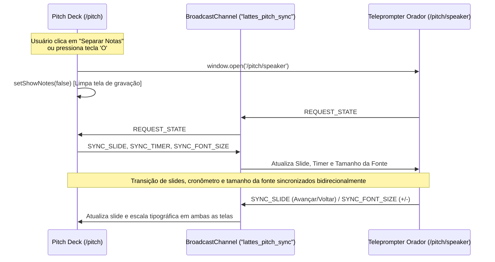

# Modo Gravação & Teleprompter em Janela Separada (Dual-Screen Pitch)

## 1. Visão Geral e Objetivo
O módulo de apresentação do **LattesChain Pitch Deck** (`/pitch`) agora suporta **Separação de Janela (Pop-out)** e **Modo Gravação Limpo (Clean View 16:9)**.
Isso permite ao apresentador gravar o pitch (via OBS Studio, Loom, QuickTime ou gravação de janela) capturando estritamente os slides limpos e profissionais na tela principal, enquanto o script guiado palavra-por-palavra, dicas de oratória, pontos-chave da banca e cronômetro de 5 minutos rodam sincronizados em uma 2ª janela externa independente.

---

## 2. Arquitetura de Sincronização em Tempo Real
A comunicação entre a janela principal de apresentação (`/pitch`) e a janela do orador (`/pitch/speaker`) utiliza a API nativa **`BroadcastChannel`** (`lattes_pitch_sync`), com fallback automático via **`localStorage`** (`lattes_pitch_font_size` e `lattes_pitch_sync`):

---

## 3. Atalhos de Teclado Suportados

| Atalho | Ação | Descrição |
| :--- | :--- | :--- |
| `+` ou `=` | **Aumentar Fonte das Notas** | Eleva a escala tipográfica das notas/teleprompter (`2XS` ➔ `2XL`) |
| `-` ou `_` | **Diminuir Fonte das Notas** | Reduz a escala tipográfica das notas/teleprompter (`2XL` ➔ `2XS`) |
| `O` | **Separar Notas (Janela Pop-out)** | Abre `/pitch/speaker` em janela popup e oculta notas da tela principal |
| `G` | **Modo Gravação (Clean View)** | Oculta cabeçalho, barra de progresso e bordas; foca no slide 16:9 |
| `N` | **Notas Embutidas** | Alterna exibição das notas na parte inferior da própria página |
| `F` | **Tela Cheia** | Ativa/desativa Fullscreen nativo da apresentação |
| `Space` / `→` / `PgDn` | **Próximo Slide** | Avança slide e propaga evento em tempo real via BroadcastChannel |
| `Backspace` / `←` / `PgUp` | **Slide Anterior** | Retorna slide e sincroniza janelas |
| `T` | **Play/Pause Cronômetro** | Inicia ou pausa o timer de 5 minutos em ambas as telas |
| `R` | **Zerar Cronômetro** | Reinicia a contagem do cronômetro sincronizadamente |
| `1` a `6` | **Pular para Slide 1-6** | Navegação rápida direta para os tópicos do pitch |

---

## 4. Níveis de Escala Tipográfica Suportados

Ambas as telas compartilham 7 níveis calibrados para legibilidade em monitores de qualquer distância, resolução ou layout (inclusive split-screen e janelas ultra compactas):

| Nível | Identificador | Indicador Visual | Aplicação Recomendada |
| :---: | :---: | :---: | :--- |
| **Ultra Compacto** | `2xs` | `Aa 2xs` | Janelas divididas (tiling/split), visualização completa sem rolagem |
| **Muito Pequeno** | `xs` | `Aa xs` | Laptops compactos ou teleprompter lateral estreito |
| **Pequeno** | `sm` | `Aa sm` | Telas pequenas, notebooks 13" ou visão próxima |
| **Médio (Padrão)** | `md` | `Aa md` | Resolução padrão 1080p e leitura balanceada |
| **Grande** | `lg` | `Aa lg` | Monitores 2K/4K ou maior facilidade de escaneamento visual |
| **Extra Grande** | `xl` | `Aa xl` | Uso como teleprompter a meia distância (1,5m) |
| **Teleprompter Pro** | `2xl` | `Aa 2xl` | Leitura dinâmica a longa distância ou gravação em pé |

---

## 5. Instruções de Uso para Gravação

1. Acesse `http://localhost:3000/pitch`.
2. Clique no botão **"Separar Notas (Janela Pop-out)"** (ou pressione a tecla `O`).
3. Uma nova janela com o **Teleprompter do Orador** será aberta:
   - Arraste esta janela para o seu segundo monitor ou para a metade lateral do seu display.
   - Ajuste o tamanho da fonte clicando nos botões `A-` / `A+` no topo ou no card do script, ou use as teclas `+` e `-`. A alteração sincroniza instantaneamente com o drawer da tela principal e fica salva no navegador.
4. Na janela principal, ative o **"Modo Gravação"** (ou pressione a tecla `G` / `F` para tela cheia):
   - A tela exibirá apenas o slide em alta definição 16:9 sem poluição visual.
5. No software de gravação (ex: OBS Studio ou Loom):
   - Selecione para capturar exclusivamente a janela do **Pitch Deck Principal**.
6. Use o teclado (`Espaço`, `→`) na janela do orador ou na janela principal: ambas avançam juntas instantaneamente.

---

## 6. Sincronização Bidirecional Contínua (Troca de Fala ➔ Troca de Slide)

### Descrição da Mudança
Implementada navegação síncrona imediata entre o script falado do orador e os slides da apresentação. A troca de fala (seja via seletor numérico, abas de fala, botões "Fala Anterior" / "Próxima Fala" ou avanço no card "A Seguir") altera automaticamente e de forma instantânea o slide correspondente tanto na apresentação principal quanto na janela de teleprompter/drawer.

### Impacto Técnico
- **Canal IPC Estável (`BroadcastChannel`)**: Eliminação do ciclo de teardown/reabertura a cada segundo no `useEffect` causado pelo cronômetro. O canal agora é persistente durante todo o ciclo de vida do componente.
- **Fallback Resiliente por Timestamp (`StorageEvent`)**: Inclusão de chave `lattes_pitch_sync_event` com carimbo temporal (`Date.now()`), assegurando que mensagens entre abas ou telas nunca sejam descartadas mesmo se o valor for reemitido.
- **Seletor de Fala Integrado no Drawer**: Adicionado seletor de 6 falas com botões de navegação no drawer de notas da tela principal (`/pitch`), permitindo trocar a fala e o slide simultaneamente sem precisar fechar o drawer.
- **Controles de Fala no Teleprompter**: Adicionados controles diretos de "Pular para Fala", "Fala Anterior", "Próxima Fala" e indicador de status ao vivo no cabeçalho do script em `/pitch/speaker`.

### Instruções de Uso
1. **Pelo Teleprompter Dedicado (`/pitch/speaker`)**:
   - Clique em qualquer chip de fala na barra superior ou na seção `Pular para Fala:` (ex: `Fala 3: Arquitetura SAS`).
   - O teleprompter muda a fala e a janela de apresentação (`/pitch`) troca imediatamente para o Slide 3.
   - Use os botões `Anterior` ou `Próxima` no bloco de script para passar a fala e o slide juntos.
2. **Pelo Drawer de Notas Embutidas (`/pitch`)**:
   - Pressione `N` para abrir as notas do orador.
   - Clique em qualquer uma das 6 opções da barra `Trocar Fala:` ou use os botões `Fala Anterior` / `Próxima Fala`.
   - O slide da apresentação e a fala em exibição mudarão instantaneamente em sincronia.

---

## 7. Calibração da Narrativa do Orador & Posicionamento Tripartite (JOVIAN TECH)

### Descrição da Mudança
- **Eliminação da Leitura Literal**: As notas do orador foram reescritas para não repetir mecanicamente os títulos, cartões e dados já renderizados visualmente nos slides, focando na síntese conceitual e no valor executivo.
- **Conceito de Ponte Tripartite**: Incorporação expressa do posicionamento da página inicial ("A ponte de confiança universal entre Faculdades, Estudantes e Empresas").
- **Valorização da Infraestrutura Acadêmica**: Eliminação de frases adversárias sobre instabilidade de servidores legados ou faculdades que podem fechar. A narrativa agora posiciona o LattesChain como um potencializador dos sistemas existentes através de tecnologia de ponta, mantendo a faculdade como autoridade emissora e de governança legal.
- **Padronização Institucional**: Vinculação do projeto à **JOVIAN TECH** em todos os metadados, citações e componentes da apresentação.

### Impacto Técnico e Mercadológico
- **Cadência Otimizada**: Contagem total reduzida para 559 palavras (~112 PPM), permitindo apresentação fluida, pausas enfáticas e cumprimento seguro do limite de 5 minutos (300 segundos).
- **Relação Institucional Cooperativa**: Apresenta a solução como aliada e integradora de ERPs acadêmicos, e não como substituta hostil.
- **Paridade com a Home Page**: Alinhamento semântico 1:1 entre a proposta de valor exibida no site e o pitch apresentado à banca.

### Instruções de Uso
1. Ao abrir `/pitch` ou `/pitch/speaker`, o orador dispõe imediatamente dos novos scripts sucintos e objetivos.
2. Cada bloco de fala acompanha a respectiva **Dica de Entrega & Entonação** e o **Objetivo Crucial do Slide (O que a Banca Deve Reter)** no teleprompter.
3. Utilize a cadência guiada (~112 PPM) para assegurar que a apresentação conclua com conforto em até 04:30 a 04:45, reservando tempo para o call-to-action final.

---

## 8. Otimização do Modo Gravação: Ocultação de Contadores, Metadados e Botões de Ação

### Descrição da Mudança
- **Supressão de Metadados Temporais (`timeRange`) no Slide**: Remoção dos badges e textos contadores de ensaio (ex: `00:00 - 00:30`, `00:30 - 01:30 (~1 min)`) da moldura do slide (tanto no Top Meta quanto no Footer Navigation) quando o **Modo Gravação (`isRecordingMode`)** estiver ativado.
- **Supressão de Dicas de Teclado**: Ocultação automática do aviso de navegação técnica (`Use as setas ← → ou clique nos botões`) na tela do slide durante o Modo Gravação.
- **Remoção de Botões de Ação e Links Externos**:
  - **Slide 0**: Ocultação dos botões "Iniciar Apresentação (5 Min)" e "Abrir Validador Ao Vivo" (`/validator`), deixando a capa exclusivamente focada na identidade, missão e nos 3 pilares conceituais.
  - **Slide 4**: Ocultação dos links de acesso externo ("Ver Portal IES", "Ver Passaporte", "Test Drive 1 Clique", "Testar Equivalência" e "Abrir Simulador On-Chain"), garantindo que os cards apresentem estritamente a arquitetura do fluxo tripartite.
  - **Rodapé do Slide**: Ocultação do link "Testar Validador Ao Vivo" e esmaecimento com opacidade zero nos botões "Anterior" / "Próximo" (revelados apenas no hover do mouse).
- **Foco Estrito no Conteúdo**: A área do slide preserva apenas o badge categórico temático e o conteúdo visual e institucional limpo em proporção 16:9, eliminando quaisquer elementos de interface web da gravação.
- **Preservação no Teleprompter**: O orador continua com acesso total ao cronômetro, metas de tempo por slide, minutagem recomendada e controles de navegação na janela desacoplada `/pitch/speaker` ou no modo de ensaio normal.

### Impacto Técnico
- Condicionamento booleano `!isRecordingMode` aplicado nos botões do Slide 0, links do Slide 4, Top Meta e Footer Navigation de `src/app/pitch/page.tsx`.
- Botões de navegação no rodapé recebem classe dinâmica `opacity-0 hover:opacity-100 transition-opacity` durante o modo gravação, prevenindo cliques acidentais e poluição visual em capturas de tela.
- Zero quebra de layout ou deslocamento cumulativo de layout (CLS).
- A gravação via OBS, Loom ou captura de janela exibe exclusivamente o conteúdo temático da apresentação em formato profissional de alta definição.

### Instruções de Uso
1. Acesse `/pitch`.
2. Pressione a tecla `G` (ou clique em "Modo Gravação").
3. Os botões de ação ("Iniciar Apresentação", "Abrir Validador Ao Vivo", links de portais), contadores de minutagem (`00:00 - 00:30`, etc.) e instruções de setas desaparecem instantaneamente da área do slide, mantendo apenas o conteúdo puro.
4. Para navegar entre os slides durante a gravação, utilize as teclas de direção (`←` / `→`), barra de espaço, ou a janela desacoplada do teleprompter (tecla `O`). Caso precise usar o cursor, os botões de navegação reaparecem discretamente ao passar o mouse sobre o rodapé.
5. Para restaurar os painéis e botões interativos na tela do slide, pressione `G` novamente.

---

## 9. Aprofundamento do Bloco 1: Métricas de Mercado, HireRight Benchmark & Impacto Tripartite

### Descrição da Mudança
- **Narrativa do Problema e Fontes Oficiais**: O roteiro falado (`speakerScript`) e o slide visual do Bloco 1 (*O Problema & Quem Sofre*) foram aprofundados para evidenciar a dor real de cada ponta com respaldo em dados empíricos de mercado e convenções internacionais:
  - **HireRight Global Employment Screening Benchmark Report**: Citação direta demonstrando que adulterações e discrepâncias em histórico educacional e diplomas constituem a **inconsistência número #1** detectada em triagens corporativas em todo o mundo, com até **85% dos empregadores** flagrando mentiras curriculares.
  - **UNESCO Global Convention on the Recognition of Qualifications**: Citação da convenção internacional que mapeia mais de **6,3 milhões de estudantes transfronteiriços** paralisados por falta de padronização interoperável e lentidão burocrática.
  - **EHEA / Processo de Bolonha (ECTS Users' Guide)**: Reconhecimento da perda média de 1 a 2 semestres letivos em transferências acadêmicas por falta de trilho comum de equivalência.
  - **W3C Verifiable Credentials Data Model v2.0**: Referência técnica ao padrão internacional aberto para credenciais digitais soberanas e à prova de adulteração.
- **Detalhamento do Impacto na Vida dos 3 Envolvidos**:
  1. **Estudantes**: Perdem prazos inegociáveis de bolsas de pesquisa internacionais, intercâmbios e contratações de trabalho devido a semanas de espera, apostilamento e taxas consulares. Suas conquistas permanecem trancadas em silos analógicos.
  2. **Secretarias Acadêmicas (IES)**: Consomem até 30% a 40% da jornada operacional respondendo chamados repetitivos de terceiros por e-mail e telefone, enquanto veem a reputação e o prestígio da instituição reféns de diplomas falsificados em PDF editável que circulam livremente.
  3. **RHs, Empresas e Universidades**: Enfrentam de 10 a 20 dias de incerteza operacional e custos elevados com auditorias manuais de background check, vulneráveis ao risco crítico de admitir pessoas com títulos adulterados.
- **Enriquecimento Visual no Slide 1 (`src/app/pitch/page.tsx`)**:
  - Grid de 3 cards estatísticos com badges de autoridade (`HireRight Benchmark`, `Dado Global UNESCO` e `Custo & Lentidão Crônica`).
  - Cards detalhados com marcadores coloridos para os 3 envolvidos.
  - Banner inferior com links diretos para as 4 fontes citadas (`hireright.com`, `unesco.org`, `ehea.info` e `w3.org`).

### Impacto Técnico
- Sincronização automática entre a visualização de apresentação (`/pitch`), a gaveta de notas (tecla `N`), o teleprompter desacoplado (`/pitch/speaker`) e o roteiro canônico em `docs/PITCH_DECK.md`.
- Paridade semântica 1:1 com a Seção 1 do `README.md`.
- Validação completa de compilação sem warnings adicionais ou regressões de tipagem.

### Instruções de Uso
1. Acesse `/pitch` e navegue até o Slide 2 (Bloco 1 • O Problema).
2. Observe os 3 cards estatísticos com os dados da HireRight, UNESCO e EHEA.
3. Pressione a tecla `O` para abrir o teleprompter ou `N` para exibir a gaveta de notas: o script falado guiará a locução enfatizando a dor humana dos estudantes, o risco institucional das faculdades e a vulnerabilidade das empresas, citando as fontes canônicas com precisão.

---

## 10. Slide 5: Apresentação Nominal da Equipe JOVIAN TECH & Frase de Efeito Canônica

### Descrição da Mudança
- **Citação Nominal dos Integrantes no Roteiro do Orador (`speakerScript`)**:
  - **Alex Miqueias**: Liderança de arquitetura Web3, smart contracts Solana (Token-2022/SAS) e governança on-chain.
  - **Rogério Alencar Filho**: Engenharia de dados, backend (Go/Python), DevSecOps e integrações corporativas.
  - **Caio Vila Nova**: Suporte e operações de sistemas, automação de processos e fluxos de dados.
  - Vínculo institucional sob o ecossistema da **JOVIAN TECH**.
- **Frase de Efeito Marcante de Encerramento (Punchline)**:
  - Inserção do lema canônico: **"LattesChain: a soberania educacional na velocidade da Solana!"**.
  - Roteiro do orador finaliza com essa declaração de posicionamento.
  - No slide visual (`src/app/pitch/page.tsx` - Slide 5), inclusão de banner com degradê temático e tipografia com alto peso visual renderizando a frase de efeito e a menção nominal da equipe.
  - Na janela pop-out do teleprompter (`src/app/pitch/speaker/page.tsx`), inclusão de card com a frase de efeito em destaque no fechamento da fala 6.
- **Sincronização Textual em `docs/PITCH_DECK.md`**: Bloco 5 atualizado para manter paridade absoluta entre a fala do orador e o documento mestre do pitch.

### Impacto Técnico e Executivo
- Eliminação de qualquer ambiguidade sobre os membros e competências técnicas do time perante a banca avaliadora.
- Fechamento memorável do pitch cumprindo a meta de tempo (30 segundos para o Bloco 5) sem estourar o limite de 5 minutos da Superteam.
- Garantia de que a gravação (tanto com teleprompter pop-out quanto com slide limpo) ofereça visual e oratória 100% alinhados.

### Instruções de Uso
1. Acesse `/pitch` e vá para o último slide (Slide 6 / Bloco 5).
2. Verifique o banner de fechamento com a frase de efeito `"LattesChain: a soberania educacional na velocidade da Solana!"` e os nomes dos 3 integrantes.
3. Abra a janela de notas (`N` ou `O`): a leitura guiada conduzirá a citação nominal fluida e a finalização com a frase de efeito.

---

## 11. Adoção Web3 Gradual: Carteira Phantom no MVP e Transações Reais Futuras

### Descrição da Mudança
- **Narrativa de Onboarding e Usabilidade Híbrida**: O pitch agora explicita que os envolvidos (estudantes, universidades e empresas/RHs) têm a opção de conectar carteiras padrão do ecossistema Solana — destacando a **Phantom** — para testar o MVP na Devnet hoje e, futuramente, realizar transações reais de emissão, liquidação e custódia soberana com essa mesma chave pública no ecossistema LattesChain.
- **Integração Visual nos Slides (`src/app/pitch/page.tsx`)**:
  - **Slide 3 (Diferencial Tecnológico Solana)**:
    - Card 6 atualizado com o badge `Adoção Web3 Gradual` e título `6. Carteira Phantom & Gasless`.
    - Adicionado banner degradê inferior: *"Adoção Web3 Gradual: Devnet MVP ➔ Transações Reais: Qualquer participante pode conectar sua carteira Phantom diretamente no navegador para testar o MVP na Devnet hoje e, futuramente, assinar e liquidar transações reais com essa mesma carteira em nosso ecossistema — com suporte a relayer corporativo gasless para eliminação de fricção."*
  - **Slide 4 (Na Prática / Demo)**:
    - Card 2 (*"Meu Passaporte"*) atualizado destacando que o estudante conecta sua carteira Phantom, mantendo a custódia soberana dos seus certificados e credenciais Token-2022.
- **Sincronização dos Scripts do Orador (`src/app/pitch/slides-data.ts` & `docs/PITCH_DECK.md`)**:
  - **Bloco 3 (`id: 3`)**: O `speakerScript` declara explicitamente que todos os envolvidos podem usar a carteira Phantom para testar o MVP na Devnet e realizar transações reais no futuro.
  - **Bloco 4 (`id: 4`)**: O `speakerScript` reforça que o aluno conecta sua Phantom e acompanha seu passaporte acadêmico em tempo real.
  - O `deliveryTip` instrui o orador a transmitir firmeza técnica sobre essa ponte entre usabilidade Web2 e custódia Web3.

### Impacto Técnico e Estratégico
- **Redução de Fricção de Onboarding**: Mostra para a banca e investidores que o LattesChain não exige compra imediata de criptoativos (graças ao relayer gasless), mas é 100% nativo de Web3, permitindo que usuários da Phantom interajam com suas chaves criptográficas diretamente.
- **Migração Transparente Devnet ➔ Mainnet**: A mesma carteira Phantom que testa a emissão e validação no MVP será o canal para atestações oficiais de diplomas e micro-pagamentos de equivalência internacional na Mainnet.
- **Conformidade de Padrões**: Alinhamento com a infraestrutura do ecossistema Solana (Phantom, Solflare, Backpack) e com o Solana Attestation Service (SAS).

### Instruções de Uso
1. Acesse `/pitch` e navegue até o Slide 4 (Bloco 3) e Slide 5 (Bloco 4).
2. Verifique o Card 6 e o banner degradê no Slide 4, e o card de passaporte no Slide 5.
3. Abra a gaveta de notas (`N`) ou o teleprompter (`O`) para conferir as instruções de locução sincronizadas.

---

## 12. Desacoplamento Semântico: Bloco 2 (A Solução Conceitual) vs Bloco 4 (Na Prática / Demo)

### Descrição da Mudança
- **Eliminação de Redundância Operacional**: O Bloco 2 (*A Solução*) anteriormente antecipava o passo a passo da demonstração prática (mencionando arrastar PDFs no validador, clique em botões e geração de Trust Report pela IA), duplicando a narrativa do Bloco 4 (*Na Prática / Demo & Camada de IA*).
- **Redefinição dos Escopos**:
  - **Bloco 2 (`id: 2`) — A Solução (Conceito, Proposta de Valor e Pilares Estruturais)**:
    - Foco exclusivo na **proposta de valor** e na **mudança de paradigma**: substituição de PDFs editáveis vulneráveis a falsificações por um **Protocolo Unificado de Integridade Acadêmica**.
    - Apresentação dos 4 Pilares Arquiteturais:
      1. *Fonte Única da Verdade*: Atestações canônicas imutáveis sem silos analógicos.
      2. *Custódia Soberana do Aluno*: Portabilidade vitalícia de credenciais na carteira digital.
      3. *Auditoria Zero-Trust*: Prova matemática irrefutável sem dependência de conferências manuais.
      4. *Privacidade & Conformidade Estrita*: Zero-PII on-chain, alinhado à LGPD e ao padrão internacional W3C Verifiable Credentials v2.0.
  - **Bloco 4 (`id: 4`) — Na Prática (Walkthrough dos 3 Portais e Motor Gemini 1.5 Pro)**:
    - Concentra 100% da **demonstração prática**:
      1. Emissão no Portal IES (`/university`) em 2 segundos com metadados do MEC.
      2. Conexão do Passaporte do Aluno (`/student`) com carteira Phantom e QR Code soberano.
      3. Auditoria do Recrutador (`/validator`) com upload de PDF e conferência on-chain em <400ms.
      4. Camada de IA Gemini 1.5 Pro analisando ementas e calculando equivalência curricular semântica.
- **Sincronização Visual e Documental**:
  - `src/app/pitch/page.tsx`: Slide 2 atualizado com os 4 pilares estruturais e banner conceitual W3C VC v2.0.
  - `src/app/pitch/slides-data.ts`: Roteiros do orador (`speakerScript`) e dicas de entrega (`deliveryTip`) atualizados.
  - `docs/PITCH_DECK.md`: Narração do Bloco 2 sincronizada, eliminando redundâncias.

### Impacto Técnico e de Apresentação
- Estrutura narrativa sem repetições para a banca do hackathon: o Bloco 2 vende a tese e a arquitetura de confiança, o Bloco 3 explica por que só a Solana resolve, e o Bloco 4 comprova a execução com o produto operando ao vivo.
- Adequação rigorosa à meta de 1 minuto por bloco dentro do teto global de 5 minutos.

### Instruções de Uso
1. Acesse `/pitch` e navegue do Slide 3 (Bloco 2) para o Slide 5 (Bloco 4).
2. Note a transição semântica límpida: o Slide 3 aborda os pilares da arquitetura de integridade e o Slide 5 apresenta os 4 módulos práticos em ação com links diretos para teste.
