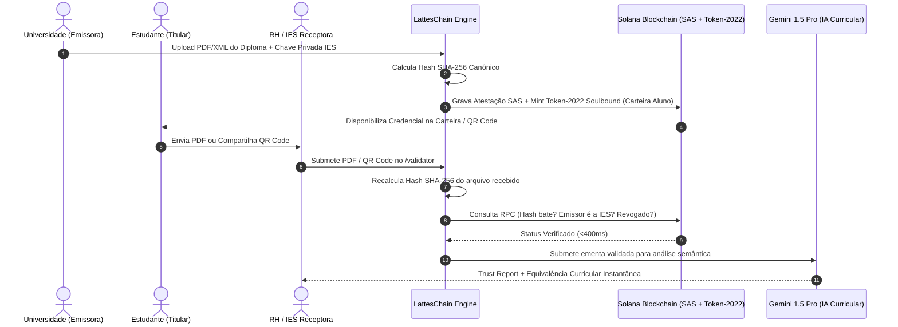

  

# Validação Criptográfica de Documentos Acadêmicos — LattesChain

## 1. Descrição da Solução
O LattesChain resolve o gargalo crítico de autenticidade, adulteração em PDF e lentidão burocrática em documentos acadêmicos (diplomas, históricos escolares, certificados de extensão e ementas curriculares).

A solução substitui carimbos físicos, cartórios e verificações manuais por um pipeline criptográfico determinístico ancorado na rede pública **Solana**, em conformidade com as diretrizes do **MEC**, padrão **W3C Verifiable Credentials v2.0** e **LGPD/GDPR**.

---

## 2. O Que Fazemos (Escopo Funcional)
1. **Diplomas e Certificados Digitais**: Garantia de emissão por IES autorizada, inviolabilidade de conteúdo e impossibilidade de transferência a terceiros (Soulbound).
2. **Históricos Escolares & Horas Complementares**: Registro modular de disciplinas cursadas, notas e carga horária.
3. **Ementas Curriculares**: Validação da integridade do programa acadêmico para fins de transferência externa e intercâmbio.
4. **Equivalência Curricular por IA**: Análise semântica automatizada para dispensas de matérias e convalidamento internacional (MEC / ECTS - Processo de Bolonha).

---

## 3. Como Fazemos (Pipeline Técnico em 4 Etapas)

### Etapa 1: Hashing Criptográfico e Privacidade (LGPD)
- O documento canônico (PDF ou XML RVDD do MEC) tem seu conteúdo processado via algoritmo **SHA-256** (FIPS 180-4).
- Gera-se um digest único de 256 bits (`canonical_hash`).
- **Data Privacy**: Nenhum dado sensível pessoal (CPF, nome, endereço) é gravado on-chain. Apenas o hash criptográfico e metadados públicos da IES são ancorados.

### Etapa 2: Assinatura Institucional On-Chain (Solana SAS & Token-2022)
- A instituição credenciada assina a atestação através do **Solana Attestation Service (SAS)**.
- É instanciado um token sob o padrão **Token-2022** com duas extensões nativas:
  - `NonTransferable`: impede alienação, venda ou transferência da credencial para outra carteira (Soulbound).
  - `PermanentDelegate`: autoridade exclusiva da IES emissora para revogar a credencial on-chain em caso de anulação de matrícula ou fraude administrativa.

  
   
  <em>Selo Heráldico Soulbound Token-2022 (Padrão v4)</em>

### Etapa 3: Auditoria Instantânea pelo Validador (< 400ms)
- O validador (empresa de recrutamento ou faculdade receptora) acessa `/validator` e arrasta o arquivo PDF (ou insere a chave pública da atestação).
- O motor recalcula o SHA-256 do arquivo localmente no navegador e consulta a RPC da Solana:
  1. O hash existe no estado global da rede?
  2. O emissor da transação corresponde à chave pública credenciada da IES?
  3. O estado do token está ativo ou foi revogado?
- Retorno booleano com veredito determinístico em menos de 400 milissegundos. Qualquer byte alterado no PDF invalida a correspondência do hash.

### Etapa 4: Camada de Inteligência Artificial Curricular (Gemini Pro)
- Aprovada a autenticidade criptográfica, o conteúdo acadêmico (ementa, carga horária e bibliografia) é processado via LLM.
- **Trust Report**: Resumo executivo de integridade, histórico da IES emissora e aderência às diretrizes curriculares nacionais.
- **Cálculo de Equivalência**: Mapeamento probabilístico e semântico com a grade curricular de destino, dispensando processos manuais de comissões acadêmicas que levam meses.

---

## 4. Impacto
- **Tempo de Auditoria**: Redução de 15 a 30 dias para < 1 segundo.
- **Taxa de Fraude**: 0% de risco em documentos auditados pelo protocolo.
- **Custo Operacional**: < R$ 0,01 por atestação on-chain (contra R$ 30 a R$ 250 de cartórios e despachantes).

  
   
  <em>Medalhão Criptográfico 3D de Credencial Imutável Auditada</em>

