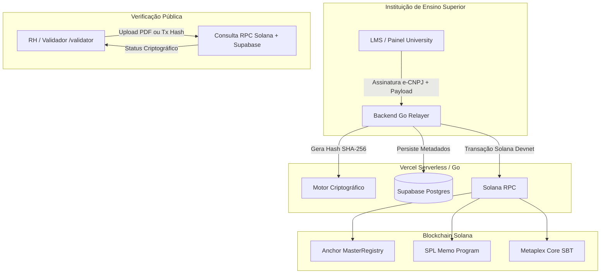

# EduCore Protocol (LattesChain) — Visão Geral de Arquitetura

## 1. Contexto e Proposta de Valor
O **EduCore Protocol (LattesChain)** é uma plataforma B2B/B2C SaaS projetada para mitigar fraudes na emissão de certificados acadêmicos, horas complementares e diplomas EAD no Brasil. 

A solução unifica a validade jurídica governamental (**ICP-Brasil / e-CNPJ**) com a imutabilidade pública descentralizada da blockchain **Solana**.

---

## 2. Topologia do Sistema

---

## 3. Componentes Estruturais

| Camada | Tecnologia | Responsabilidade |
| :--- | :--- | :--- |
| **Frontend** | Next.js 14+ (App Router), Tailwind CSS | Interfaces `/admin-protocol`, `/university`, `/student`, `/validator`. |
| **Backend** | Go (Golang) Vercel Serverless | Motor SHA-256, empacotamento ICP-Brasil e Relayer de transações Solana. |
| **Persistência** | Supabase (PostgreSQL + RLS + Auth) | Armazenamento off-chain de PII (LGPD compliance) e autenticação de alunos/IES. |
| **Smart Contracts** | Rust / Anchor (Solana) | Master Registry (whitelist institucional), SPL Memo e Metaplex SBTs. |
| **Validação Externa** | zkTLS / Reclaim Protocol *(Fase 2)* | Provas de conhecimento zero para cursos externos (Coursera/Udemy). |

---

## 4. Matriz de Separação de Dados (LGPD Compliance)

| Dado | Armazenamento | Justificativa |
| :--- | :--- | :--- |
| Nome, CPF, E-mail, PDF original | **Off-Chain (Supabase)** | Dados pessoais sensíveis. Permite direito ao esquecimento e exclusão. |
| `solana_pubkey`, `document_hash`, `icp_sig`, `tx_signature` | **On-Chain (Solana)** | Dados imutáveis, anonimizados e verificáveis publicamente. |
