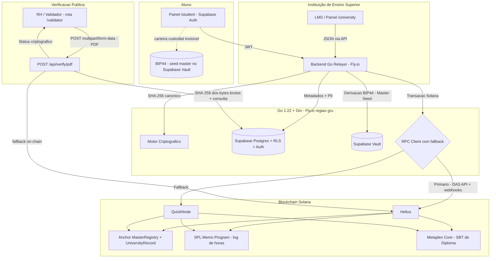

# EduCore Protocol (LattesChain) — Visão Geral de Arquitetura

> **Status deste documento**: Atualizado para a arquitetura pós-decisões (Fly.io, Helius/QuickNode, Vault+BIP44, Metaplex Core, canonicalização backend).
> Data da última revisão: 2026-08-29.

## 1. Contexto e Proposta de Valor

O **EduCore Protocol (LattesChain)** é uma plataforma B2B/B2C SaaS projetada para mitigar fraudes na emissão de certificados acadêmicos, horas complementares e diplomas EAD no Brasil.

A solução unifica a validade jurídica governamental (**ICP-Brasil / e-CNPJ**) com a imutabilidade pública descentralizada da blockchain **Solana**.

**Posicionamento regulatório importante**: o protocolo é uma *camada de integridade e portabilidade* — ele **não substitui** o Registro Nacional de Diplomas (RND/MEC, Portarias 330/2018 e 554/2019). Diplomas emitidos via LattesChain continuam sujeitos ao registro oficial no RND; o protocolo agrega prova criptográfica pública, portabilidade para o aluno e verificação instantânea por terceiros (RH, ATS).

---

## 2. Topologia do Sistema

---

## 3. Componentes Estruturais

| Camada | Tecnologia | Responsabilidade | Status |
| :--- | :--- | :--- | :--- |
| **Frontend** | Next.js 14+ (App Router), Tailwind CSS | Interfaces `/admin-protocol`, `/university`, `/student`, `/validator`. **Não computa hashes** — delega ao backend. | 🟡 Especificado (ver `docs/05_frontend_spec.md`) |
| **Backend** | Go 1.22 + Gin, hospedado no **Fly.io** (região `gru`) | Motor SHA-256 canônico, derivação BIP44, relayer de transações Solana, assinatura ICP-Brasil (mock no MVP), `/api/verify/pdf`. | 🟡 Esqueleto implementado (`api/`) |
| **Persistência** | Supabase (PostgreSQL 15 + RLS + Auth + **Vault**) | PII off-chain (LGPD), metadados, logs de auditoria, custódia da master seed BIP39. | 🟡 Migrations escritas (`supabase/`) |
| **Smart Contracts** | Rust / Anchor 0.29 / solana-program 1.18 | MasterRegistry (whitelist institucional + pause + rotação de authority), eventos acadêmicos, batch. | 🟡 `educore_contracts/` escrito, sem testes |
| **Tokens** | SPL Memo (horas/log) + **Metaplex Core SBT** (diplomas) | Ver ADR-007 (dual-track) e ADR-003. | 🔴 Integração Go pendente |
| **RPC** | **Helius** (primário, DAS API) + **QuickNode** (fallback) | `ExecuteWithFallback` no cliente Go. | 🟡 Implementado no service |
| **Assinatura jurídica** | MVP: RSA mock local. Produção: **AWS CloudHSM + Lambda** | Ver `docs/08_key_management.md` e ADR-006. | 🔴 MVP mock apenas |
| **Validação externa** | zkTLS / Reclaim Protocol *(Fase 2)* | Tabela `external_courses` já provisionada no schema. | ⚪ Fase 2 |

---

## 4. Decisões de Arquitetura (ADRs)

As decisões estruturais estão formalizadas em **Architecture Decision Records**:

| ADR | Decisão | Arquivo |
| :--- | :--- | :--- |
| ADR-001 | Solana como blockchain alvo | `docs/adr/001-why-solana.md` |
| ADR-002 | Backend Go no Fly.io (não Vercel) | `docs/adr/002-backend-hosting-flyio.md` |
| ADR-003 | Metaplex Core para SBTs de diploma | `docs/adr/003-metaplex-core-sbt.md` |
| ADR-004 | Custódia própria: Supabase Vault + BIP44 | `docs/adr/004-custodial-wallets-vault-bip44.md` |
| ADR-005 | Canonicalização de PDF no backend | `docs/adr/005-backend-pdf-canonicalization.md` |
| ADR-006 | Assinatura ICP-Brasil: mock MVP → CloudHSM produção | `docs/adr/006-icp-brasil-signing.md` |
| ADR-007 | Dual-track: SPL Memo (horas) + Metaplex Core (diplomas) | `docs/adr/007-dual-track-memo-sbt.md` |

---

## 5. Matriz de Separação de Dados (LGPD Compliance)

| Dado | Armazenamento | Justificativa |
| :--- | :--- | :--- |
| Nome, CPF, E-mail, PDF original | **Off-Chain (Supabase)** | Dados pessoais. Permitem direito ao esquecimento (Art. 18, VI LGPD). |
| `solana_pubkey` (instituição e aluno) | **On-Chain (Solana)** | Pubkeys são identificadores pseudônimos, necessários para verificação pública. |
| `document_hash` (SHA-256 canônico) | **On-Chain + Off-Chain** | Âncora de integridade. Irreversível sem o payload original. |
| `icp_brasil_signature` | **On-Chain (evento Memo/Anchor) + Off-Chain** | Ver ADR-006 e `docs/09_threat_model.md` §6 para o trade-off de custo (recomendação futura: on-chain apenas o *hash da assinatura*). |
| `solana_tx_signature`, `metaplex_asset_id` | **Off-Chain** (indexação) + recuperável on-chain | Índice para lookup rápido do validador. |
| Master seed BIP39 das carteiras alunos | **Supabase Vault** (encriptada) | Ver `docs/08_key_management.md`. Jamais on-chain, jamais em código. |

**Regra inviolável**: nenhuma PII (CPF, nome, e-mail, RG) em instruções on-chain, contas Anchor, SPL Memo ou metadados de tokens (política reforcada em `.agents/rules/educore_standards.md`).

---

## 6. Ambientes

| Ambiente | Blockchain | RPC | Backend | Observações |
| :--- | :--- | :--- | :--- | :--- |
| `development` | Solana **Devnet** | Helius devnet | Local (`go run ./cmd`) | `app.mock_icp_signing = true` |
| `staging` | Solana **Devnet** | Helius devnet + QuickNode | Fly.io app `educore-relayer-staging` | Mesmos secrets de dev (chaves throwaway) |
| `production` | Solana **Mainnet-Beta** | Helius mainnet + QuickNode | Fly.io app `educore-relayer` | CloudHSM obrigatório; `mock_icp_signing = false` |

O arquivo `api/fly.toml` configura: região `gru` (São Paulo), porta interna 8080, `force_https`, health check em `/health` (30s/5s), auto stop/start machines (scale-to-zero), VM shared 1 vCPU/512MB, metrics Prometheus em `:9091`.

---

## 7. Custos Estimados por Emissão

> **Disclaimer**: valores estimados em agosto/2026 com SOL ≈ R$ 600. Revalidar antes do pricing. Fontes: Solana fee 5.000 lamports/assinatura; rent-exempt 6,96 SOL/MiB (rent ~6,9 lamports/byte/epoch, exenção ≈ 2 anos).

| Operação | Custo SOL | Custo BRL (estimado) | Nota |
| :--- | :--- | :--- | :--- |
| Tx SPL Memo (horas complementares) | ~0.000005 | ~R$ 0,003 | 1 assinatura, sem conta nova |
| Tx `log_academic_event` (Anchor, sem Memo) | ~0.000005 | ~R$ 0,003 | Emite evento; incrementa contadores |
| Mint Metaplex Core SBT (diploma) | ~0.001–0.0015 | ~R$ 0,60–0,90 | Rent da conta Asset (~136+ bytes) + fee |
| Batch de 10 eventos | ~0.000005 | ~R$ 0,003 | Custo amortizado por evento |

**Custo por diploma ≈ R$ 0,90** (dominado pelo rent do SBT — o SBT permanece propriedade do aluno, ou seja, é um custo de custódia transferido ao protocolo até a "graduação" para self-custody).

---

## 8. Operação em Produção

### 8.1 Resiliência
- **RPC redundante**: Helius primário + QuickNode fallback via `SolanaService.ExecuteWithFallback` (implementado). Falha de um provedor ≠ parada de emissões.
- **Health checks**: Fly.io probeia `GET /health` a cada 30s. O handler atual responde estático — ver issue conhecida (deveria fazer ping real no Supabase e RPC).
- **Scale-to-zero**: machines param sem tráfego (economia); cold start ~1-3s.

### 8.2 Disaster Recovery
- **Backend**: Fly.io apps são stateless; redeploy via `fly deploy` (< 5 min). Config versionada em `api/fly.toml`.
- **Banco**: Supabase PITR (Point-in-Time Recovery) + backups diários. RPO ≤ 5 min (WAL), RTO ≤ 30 min.
- **On-chain**: a blockchain é o DR por definição; o índice off-chain pode ser reconstruído a partir dos eventos `AcademicEventLogged` via Helius webhooks/indexer.
- **Master seed**: procedimento de backup em `docs/08_key_management.md` §4 (cerimônia + 2 localizações).

### 8.3 Conformidade em produção (Definition of Ready)
Ver checklist completo em `docs/00_index.md` §6. Itens bloqueantes para Mainnet: CloudHSM ativo, threat model assinado, MOU com IES piloto, auditoria dos contratos.

---

## 9. Referências Cruzadas

- Modelagem de dados: `docs/02_data_models.md`
- Smart contracts: `docs/03_smart_contracts_anchor.md`
- Backend: `docs/04_backend_relayer_go.md` • OpenAPI: `docs/07_api_openapi.yaml`
- Frontend: `docs/05_frontend_spec.md`
- Segurança/LGPD: `docs/06_security_lgpd_icp.md` • Threat model: `docs/09_threat_model.md` • Chaves: `docs/08_key_management.md`
- Runbooks de incidente: `docs/10_runbooks.md`
