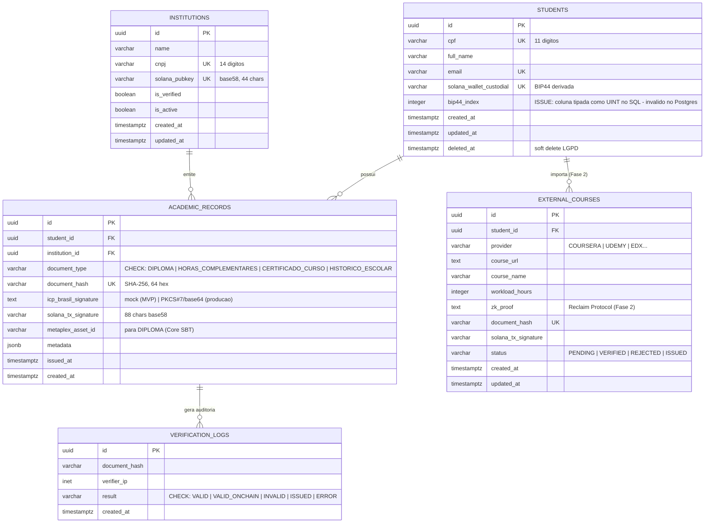

# EduCore Protocol — Modelagem de Dados

> Fonte da verdade: `supabase/migrations/001_initial_schema.sql` e `supabase/migrations/002_rls_policies.sql`.
> Contratos: `educore_contracts/programs/educore_contracts/src/lib.rs` (Anchor 0.29).
> Este documento reflete o schema **como escrito** e sinaliza correções pendentes (§5).

## 1. Diagrama Entidade-Relacionamento (off-chain)



### 1.1 Tabelas auxiliares planejadas (não criadas ainda)

| Tabela | Função | Prioridade |
| :--- | :--- | :--- |
| `wallet_nonces` | Replay protection para export/self-custody flows | 🟡 Média |
| `protocol_config` | Fee switch, feature flags, `mock_icp_signing` runtime | 🟡 Média |
| `idempotency_keys` | Deduplicação explícita de requests de emissão (além do dedup por hash) | 🟡 Média |
| `user_roles` | Papéis Supabase Auth (super_admin/institution/student) para custom claims | 🔴 Crítica (ver `docs/05_frontend_spec.md` §3) |
| `pdf_file_hash` (coluna em `academic_records`) | Hash SHA-256 dos bytes brutos do PDF — ver §5.3 e ADR-005 | 🔴 Crítica |

---

## 2. View de Agregação

```sql
-- student_academic_summary (já criada na migration 001)
-- Retorna por aluno: total de registros, diplomas, certificados,
-- soma de horas complementares (metadata->>'workload_hours') e última emissão.
```

Utilizada pelo painel `/student` e por relatórios da IES. Já filtra `deleted_at IS NULL` (soft delete LGPD).

---

## 3. Contas On-Chain (Solana / Anchor 0.29)

### 3.1 `MasterRegistry` — PDA global

- **Seeds**: `["master_registry"]`
- **Space**: 8 (discriminator) + 66 = **74 bytes** → rent-exempt ≈ 0.00059 SOL

| Offset | Campo | Tipo | Bytes |
| :--- | :--- | :--- | :--- |
| 0 | discriminator | u64 LE | 8 |
| 8 | `authority` | Pubkey | 32 |
| 40 | `bump` | u8 | 1 |
| 41 | `is_paused` | bool | 1 |
| 42 | `total_institutions` | u64 | 8 |
| 50 | `total_events_logged` | u64 | 8 |
| 58 | `created_at` | i64 | 8 |
| 66 | `updated_at` | i64 | 8 |

### 3.2 `UniversityRecord` — PDA por instituição

- **Seeds**: `["university_record", institution_pubkey]`
- **Space**: 8 (disc) + 32 + (4+14) + (4+100) + 1 + 1 + 8 + 8 + 8 + 8 = **204 bytes** → rent-exempt ≈ 0.0016 SOL

> **Atenção (desserialização no Go)**: `cnpj` é `Vec<u8>` e `name` é `String` — Borsh prefixa ambos com **4 bytes de comprimento (u32 LE)**. Os offsets corretos são:

| Offset | Campo | Tipo | Bytes |
| :--- | :--- | :--- | :--- |
| 0 | discriminator | u64 LE | 8 |
| 8 | `institution_pubkey` | Pubkey | 32 |
| 40 | `cnpj_len` | u32 LE | 4 |
| 44 | `cnpj` | [u8; 14] | 14 |
| 58 | `name_len` | u32 LE | 4 |
| 62 | `name` | utf8 (≤100) | variável |
| 8+32+18+4+len(name) | `is_active` | bool | 1 |
| +1 | `bump` | u8 | 1 |
| +2 | `registered_at` | i64 | 8 |
| +10 | `updated_at` | i64 | 8 |
| +18 | `total_emissions` | u64 | 8 |
| +26 | `last_emission_at` | i64 | 8 |

> 🔴 **Issue conhecida**: `api/internal/services/solana.go::GetUniversityRecord` lê `data[40:54]` como CNPJ e `data[54]/[55]` como is_active/bump — **offsets incorretos** (ignoram o length prefix). Corrigir antes de qualquer integração real. Ver `docs/00_index.md`.

### 3.3 Evento `AcademicEventLogged`

```rust
#[event]
pub struct AcademicEventLogged {
    pub institution: Pubkey,
    pub document_hash: String,   // 64 hex
    pub icp_signature: String,   // ver ADR-006 (trade-off de tamanho)
    pub document_type: u8,        // 0=Diploma 1=HorasComplementares 2=CertificadoCurso 3=HistoricoEscolar
    pub metadata_uri: String,    // opcional (uri de metadados externos)
    pub timestamp: i64,
}
```

Eventos Anchor são gravados nos **transaction logs** (não em contas) — a reconstrução do índice off-chain depende de indexer/webhooks (Helius). Alternativa estruturada: contas `AcademicRecord` PDA por hash (custo de rent por emissão; decidir em ADR futuro se necessário).

### 3.4 Mapeamento `DocumentType` (Rust ↔ Go ↔ SQL)

| Valor | Rust enum | Go const | SQL CHECK |
| :--- | :--- | :--- | :--- |
| 0 | `Diploma` | `DocumentTypeDiploma` | `'DIPLOMA'` |
| 1 | `HorasComplementares` | `DocumentTypeHorasComplementares` | `'HORAS_COMPLEMENTARES'` |
| 2 | `CertificadoCurso` | `DocumentTypeCertificadoCurso` | `'CERTIFICADO_CURSO'` |
| 3 | `HistoricoEscolar` | `DocumentTypeHistoricoEscolar` | `'HISTORICO_ESCOLAR'` |

**Atenção**: o Go envia a *string* (ex.: `"DIPLOMA"`) no Memo e no campo `document_type` do banco; o enum u8 só existe na instrução Anchor. Manter as duas representações sincronizadas é responsabilidade do relayer (ver `docs/04_backend_relayer_go.md` §6).

---

## 4. RLS Policies (resumo)

Fonte: `supabase/migrations/002_rls_policies.sql`. RLS habilitado em todas as 5 tabelas.

| Tabela | Policy | Papel | Regra |
| :--- | :--- | :--- | :--- |
| institutions | Public read active | `anon` | `is_active = true` |
| institutions | University admin read own | `authenticated` | `solana_pubkey = JWT->>'wallet_address'` |
| institutions | Super admin manage | `authenticated` | `is_super_admin()` (claim `role = 'super_admin'`) |
| students | Student read own | `authenticated` | `id = auth.uid()` |
| students | Student update own | `authenticated` | `id = auth.uid()` — ⚠️ sem restrição de colunas, ver §5.4 |
| academic_records | Student read own | `authenticated` | `student_id = auth.uid()` |
| academic_records | Institution read issued | `authenticated` | `institution_id IN (instituições da wallet do JWT)` |
| academic_records | Public verify by hash | `anon` | ⚠️ inócua — ver §5.5 |
| verification_logs | Service role only | `service_role` | escrita de auditoria pelo backend |
| external_courses | Student CRUD own | `authenticated` | `student_id = auth.uid()` (insert + select) |
| todas | Service role full access | `service_role` | backend Go usa service role key |

Funções auxiliares: `get_current_user_wallet()` e `is_super_admin()` (ambas `SECURITY DEFINER`).

**Setup necessário para funcionar**: os claims `wallet_address` e `role` precisam ser injetados no JWT via **Supabase custom_access_token_hook** + tabela `user_roles` — ainda não implementado (ver `docs/05_frontend_spec.md` §3).

---

## 5. Issues Conhecidas do Schema (correções pendentes)

### 5.1 🔴 `bip44_index UINT` — tipo inválido no PostgreSQL
`001_initial_schema.sql` declara `bip44_index UINT DEFAULT 0`. `UINT` **não existe** em Postgres; a migration falha. Correção: `bip44_index INTEGER NOT NULL DEFAULT 0`.

### 5.2 🔴 Falta `pdf_file_hash` em `academic_records`
`issue_certificate` computa `SHA-256(JSON canônico dos metadados)`; `/api/verify/pdf` computa `SHA-256(bytes brutos do PDF)`. **Os hashes nunca coincidem** — o validador por PDF não valida nada emitido hoje. Correção proposta (ADR-005): emissão aceita o PDF (multipart) ou seu hash; gravar ambos (`document_hash` canônico + `pdf_file_hash`); `/verify/pdf` consulta por `pdf_file_hash`.

### 5.3 🟡 `verification_logs.verifier_ip` (INET)
Guardar IP bruto é dado pessoal sob LGPD. Recomendação: truncar/retenção curta (ex.: 90 dias) ou hashear. Ver `docs/09_threat_model.md` §7.

### 5.4 🟡 Policy `Student update own record` sem restrição de colunas
O aluno autenticado pode `UPDATE` qualquer campo, inclusive `cpf`, `email`, `solana_wallet_custodial` (sequestro da própria carteira custodial). RLS não restringe colunas — mitigação: revoke de colunas sensíveis + trigger de guard, ou remover a policy e forçar tudo via backend (service role).

### 5.5 🟡 Policy `Public verify by hash` é inócua
Compara `document_hash` com `request.jwt.claims->>'document_hash'` — um `anon` não possui esse claim. A verificação pública real acontece **via backend Go** (service role), no fluxo `/api/verify/pdf`. Manter a policy apenas como documentação ou remover.

### 5.6 🟢 `get_current_user_wallet` / `is_super_admin` sem `SET search_path`
Funções `SECURITY DEFINER` devem declarar `SET search_path = public, extensions` (hardening padrão Supabase).

---

## 6. Convenções

- **Chaves primárias**: UUID (`gen_random_uuid()`); `students.id` = `auth.uid()` na integração com Supabase Auth.
- **Timestamps**: sempre `TIMESTAMPTZ`; `updated_at` via trigger `update_updated_at_column()`.
- **Soft delete**: apenas `students.deleted_at` (LGPD). Instituições usam `is_active`; registros acadêmicos são imutáveis (append-only) — retificações viram novo registro com `metadata->>'rectifies'`.
- **Hashes**: sempre SHA-256 em hex minúsculo (64 chars).
