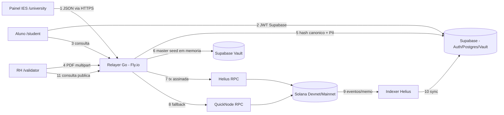

# EduCore Protocol — Threat Model (STRIDE)

> Escopo: EduCore Protocol (LattesChain) MVP Devnet + caminho para produção.
> Metodologia: STRIDE por componente, com DFD, ranking de risco (Probabilidade × Impacto) e mitigação.
> Este documento alimenta a DPIA LGPD (§9) e os runbooks (`docs/10_runbooks.md`).

## 1. Superfície de Ataque (resumo)

| Superfície | Entrada |
| :--- | :--- |
| API Go (Fly.io) | HTTP público: `/health`, `/api/issue_certificate`, `/api/verify/pdf`, rotas de leitura |
| Supabase | PostgREST (anon/authenticated/service_role) + Auth + Vault |
| Solana | Program EduCore (Anchor), SPL Memo, Metaplex Core |
| Frontend Next.js | Rotas públicas `/`, `/validator` + protegidas |
| Pessoas/Processos | Cerimônia de seed, e-CNPJ da IES, runbooks |

## 2. Data Flow Diagram (DFD)

## 3. Matriz STRIDE por Componente

### 3.1 Relayer Go (Fly.io)

| ID | Ameaça | Categoria | Prob. | Impacto | Mitigação (atual → alvo) |
| :--- | :--- | :--- | :--- | :--- | :--- |
| T1 | Falsificar emissão chamando `/issue_certificate` sem auth | Spoofing | **Alta** (MVP) | Catastrófico | Nenhuma hoje → JWT institucional + rate limit (docs/04 §5) |
| T2 | Corromper a API key do relayer | Elevation | Média | Alto | env var → rotação + limite por IES + signer dedicado |
| T3 | Relayer assina "em nome" da IES (trust centralizado) | Elevation | Estrutural | Alto | Aceito no MVP; alvo: IES assina com própria chave (programa já suporta) |
| T4 | Replay de request de emissão | Repudiation/Spoofing | Média | Alto | Idempotência por hash (409) ✓; alvo: `Idempotency-Key` header |
| T5 | Vazamento master seed via log/memória | Info Disclosure | Média | **Catastrófico** | Redact em logs; alvo KMS/HSM + circuit breaker (docs/08 §2) |
| T6 | DoS em `/verify/pdf` (upload gigante) | DoS | Alta | Médio | Limite de tamanho no Gin (pendente) + rate limit (pendente) |
| T7 | Tx on-chain OK + persistência falha (registro órfão) | Tampering | Média | Médio | Comentário no código; alvo: outbox pattern + webhook reconcile |

### 3.2 Supabase (Postgres/Auth/Vault)

| ID | Ameaça | Categoria | Prob. | Impacto | Mitigação |
| :--- | :--- | :--- | :--- | :--- | :--- |
| T8 | `service_role` key vazada (GitHub/frontend) | Spoofing | Média | Catastrófico | Só fly secrets; scanner de secrets no CI; rotação 90d |
| T9 | Policy RLS falha (aluno lê registro de outro) | Info Disclosure | Média | Alto | RLS escrito; **testes de política pendentes** (docs/02 §4) |
| T10 | Aluno altera `solana_wallet_custodial` via UPDATE próprio | Tampering | Média | Alto | Policy atual permite (docs/02 §5.4) → restringir colunas/remover policy |
| T11 | PII exposta via PostgREST anon | Info Disclosure | Baixa | Catastrófico | RLS habilitado; sem policies anônimas em students; revisar exposure |
| T12 | Vault acessível via SQL de usuário comum | Elevation | Baixa | Catastrófico | Vault exige service_role; auditar roles; testes |

### 3.3 Smart Contracts (Solana)

| ID | Ameaça | Categoria | Prob. | Impacto | Mitigação |
| :--- | :--- | :--- | :--- | :--- | :--- |
| T13 | IES não autorizada emite (pubkey não registrada) | Spoofing | Baixa | Alto | Constraint `institution_signer == UniversityRecord.institution_pubkey` ✓ |
| T14 | `is_paused` ignorado → pause inoperante | Tampering | **Alta** (gap) | Alto | **Bug real**: corrigir require (docs/03 §8.1) |
| T14b | Exclusão lógica de IES no Supabase mas ativa on-chain (dessincronia) | Tampering | Média | Médio | Verificação on-chain no issue flow (pendente no Go) |
| T15 | `rotate_authority` para chave errada → lockout | DoS | Baixa | Catastrófico | Multisig + conferência dupla (docs/08 §3) |
| T16 | Account spam (PDAs de IES falsas) | DoS | Baixa | Baixo | Apenas authority registra; custo rent do atacante |
| T17 | Falta de DV no CNPJ → registro de IES "matematicamente inválida" | Repudiation | Média | Médio | Validar DV no programa (docs/03 §8.2) |
| T18 | `icp_signature` gigante quebra limite de tx | DoS | Média | Médio | Gravar hash da assinatura on-chain (ADR-006, docs/03 §8.3) |

### 3.4 Frontend

| ID | Ameaça | Categoria | Prob. | Impacto | Mitigação |
| :--- | :--- | :--- | :--- | :--- | :--- |
| T19 | XSS exfiltra JWT/session do aluno | Spoofing/Info | Média | Alto | Next.js + React escaping; CSP; sem `dangerouslySetInnerHTML` |
| T20 | Aluno induzido a exportar chave e repassá-la (social eng.) | Repudiation | Média | Médio | Confirm dialogs + cooldown 24h (docs/05 §6); educação UX |
| T21 | QR com deep link falsificado (`/validator?tx=falso`) | Spoofing | Média | Médio | Validador resolve tx na blockchain, não no link — estado é on-chain |

### 3.5 ICP-Brasil / Assinatura jurídica

| ID | Ameaça | Categoria | Prob. | Impacto | Mitigação |
| :--- | :--- | :--- | :--- | :--- | :--- |
| T22 | Assinatura mock em produção (jurídico nulo) | Repudiation | **Bloqueante** | Alto | Flag `mock_icp_signing=false` obrigatória em Mainnet; checklist deploy |
| T23 | e-CNPJ comprometido (A1 vazado / A3 clonado) | Spoofing | Média | **Catastrófico** | CloudHSM + certificado dedicado + revogação AC (docs/08 §4) |
| T24 | Falsificação de cadeia ICP no validador | Tampering | Baixa | Alto | Validar cadeia + CRL/OCSP server-side (cache) |

### 3.6 Infra (Fly.io / RPC)

| ID | Ameaça | Categoria | Prob. | Impacto | Mitigação |
| :--- | :--- | :--- | :--- | :--- | :--- |
| T25 | Vazamento de `fly secrets` | Info Disclosure | Baixa | Catastrófico | Acesso IAM restrito; auditoria de quem rodou `fly secrets` |
| T26 | RPC mentiroso/comprometido (Helius/QuickNode) | Tampering | Baixa | Alto | Fallback duplo ✓; commitment `finalized` em verificação crítica |
| T27 | Congestion/outage Solana | DoS | Média | Médio | Fallback RPC ✓; circuit breaker on-chain ✓ (pós-fix T14); queue local (pendente) |
| T28 | Idempotência falha em retry de rede → dupla emissão | Tampering | Média | Médio | Dedup por hash ✓ (409); tx única por hash na prática |

## 4. Trust Boundaries

1. **Browser → API Go**: front é untrusted; toda validação server-side (inclui JWT futuro).
2. **API Go → Supabase**: service_role é privilegiado; nunca exposto ao browser.
3. **API Go → Solana**: chave relayer assina; alvo é assinatura da própria IES.
4. **Vault → memória**: seed transita só em RAM do relayer; banir logs e dumps.
5. **Solana → mundo**: eventos são públicos por design — só dados pseudônimos on-chain (LGPD §1).

## 5. Top Riscos (rank geral)

| Rank | Risco | Score | Mitigação prioritária |
| :--- | :--- | :--- | :--- |
| 1 | T5 vazamento master seed | Alta×Catastrófico | Vault + KMS + cerimônia + breaker |
| 2 | T23 e-CNPJ comprometido | Média×Catastrófico | CloudHSM + cert dedicado + revogação |
| 3 | T1 emissão sem auth | Alta×Catastrófico | Auth institucional + rate limit (bloqueia Mainnet) |
| 4 | T14 pause inoperante | Alta(gap)×Alto | Fix no contrato (1 linha require) |
| 5 | T8/T25 secrets vazados | Média×Catastrófico | Scanner CI + rotação + IAM |
| 6 | T9/T10 RLS gaps | Média×Alto | Testes de policy + fix colunas |
| 7 | T15 lockout authority | Baixa×Catastrófico | Multisig Squads 3/5 |

## 6. Decisões de Segurança Pendentes (aprovação necessária)

1. **On-chain**: gravar assinatura completa vs. hash da assinatura (docs/03 §8.3) — recomendado hash.
2. **Validador**: cache de cadeia ICP-Brasil (qual AC confiar?) e checagem CRL/OCSP.
3. **Frontend**: CSP strict + SRI, ou relajar por CDN?
4. **Export self-custody**: seed direta ao aluno vs. burn+re-mint do SBT.

## 7. Privacidade (condensado)

- `verification_logs.verifier_ip` é dado pessoal (LGPD): truncar ou reter ≤90d.
- Minimização: hash do **documento** (não do aluno); sem PII on-chain.
- Reidentificação via pubkey do aluno é teoricamente possível com o índice — DPIA cobre (§9).
- Base legal: execução de contrato + legítimo interesse (auditoria); detalhes em `docs/06` §1.3.

## 8. Account Takeover do Aluno (fluxo específico)

Conta Supabase do aluno comprometida → atacante vê registros e pode iniciar export de chave (se implementado). Mitigações: re-auth forte no export, cooldown 24h, notificação por e-mail, marcação `exported` no perfil; SBTs não são transferíveis (Metaplex Core non-transferable) → o atacante não "leva" os diplomas, apenas os vê.

## 9. DPIA LGPD (esqueleto para submissão à ANPD/jurídico)

- **Titular**: aluno (dados: nome, CPF, e-mail, registros acadêmicos, IP de verificação).
- **Finalidade**: emissão/verificação criptográfica de registros acadêmicos (Art. 7º V; legítimo interesse p/ auditoria).
- **Risco avaliado**: reidentificação via hash+pubkey (Art. 5º XI); decisão de manter dados pseudonimizados on-chain com garantias de irreversibilidade prática.
- **Medidas**: sem PII on-chain; soft delete; RLS; retenção IP curta; criptografia at rest (Supabase) e in transit; DPIA versionada; DPO/responsável a designar.
- **Trilha**: este doc (§1-8) + `docs/06` §1.2 + parecer jurídico (pendente).
- **Status**: ⚠️ esqueleto — completar com jurídico antes de qualquer dado real de aluno (bloqueante Mainnet).
