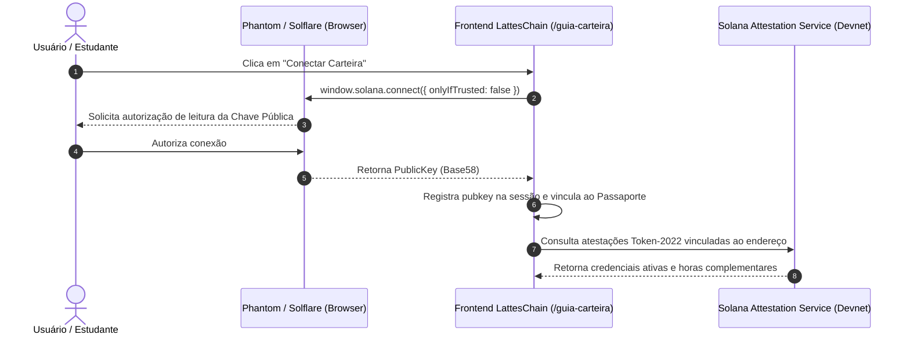

# 14. Arquitetura de Conexão com Carteira Solana & Medidas de Segurança

Este documento detalha o funcionamento da conexão com carteiras Web3 na rede **Solana (Devnet/Mainnet)** e os mecanismos de segurança de interface e proteção de código implementados no **LattesChain / EduCore Protocol**.

---

## 1. Conexão com Carteira Solana (Wallet Connection)

### 1.1 Filosofia Zero-Friction (Account Abstraction)
O protocolo LattesChain foi concebido para atender a três perfis distintos com diferentes níveis de familiaridade com Web3:
1. **Estudantes**: Possuem acesso soberano às suas credenciais. Podem conectar carteiras populares como **Phantom**, **Solflare** ou **Backpack**, ou utilizar a conta gerenciada via CPF/e-mail no Supabase com derivação de chave pública.
2. **Faculdades (IES)**: Operam com carteiras institucionais dedicadas (Keypairs autorizados pela reitoria), cadastradas no `MasterRegistry` do protocolo para emissão on-chain no **Solana Attestation Service (SAS)**.
3. **Empresas & RHs**: Não necessitam de carteira ou saldo em SOL para auditar documentos. O acesso ao `/validator` é 100% público e gratuito.

### 1.2 Fluxo Técnico de Conexão

### 1.3 Detecção e Fallbacks
- O frontend detecta a presença do objeto `window.solana` injetado pela extensão do navegador.
- Caso o usuário ainda não possua uma carteira instalada, a página interativa [`/guia-carteira`](src/app/guia-carteira/page.tsx) fornece links diretos e orientações passo a passo para instalação em desktop e mobile.

---

## 2. Medidas de Segurança do Site (Anti-Scraping & Proteção de Código)

Para mitigar a clonagem indevida de interface, scraping automatizado de atestações e extração de códigos internos, foram implementadas três camadas defensivas:

### 2.1 Camada 1: Proteção em Runtime do Navegador (`SecurityGuard.tsx`)
O componente [`SecurityGuard`](src/components/SecurityGuard.tsx) é carregado globalmente no layout da aplicação e intercepta comportamentos comuns de inspeção:
- **Bloqueio de Menu de Contexto (Clique Direito)**: Previne cópia direta de elementos protegidos em áreas não-editáveis, exibindo um toast informativo.
- **Bloqueio de Atalhos de DevTools**:
  - `F12`
  - `Ctrl + Shift + I` / `Cmd + Option + I` (Inspecionar Elemento)
  - `Ctrl + Shift + J` / `Cmd + Option + J` (Console)
  - `Ctrl + Shift + C` (Seletor de Nós)
  - `Ctrl + U` / `Cmd + Option + U` (Exibir Código Fonte HTML)
  - `Ctrl + S` / `Cmd + S` (Download de página estática)
- **Desabilitação de Arrasto (`dragstart`)**: Impede que imagens e certificados sejam arrastados para áreas de transferência externas.

### 2.2 Camada 2: Cabeçalhos HTTP de Segurança (`next.config.mjs`)
Configurados globalmente para todas as rotas da aplicação:
- `X-Frame-Options: DENY`: Previne ataques de *Clickjacking* impedindo a incorporação do sistema em iframes maliciosos.
- `X-Content-Type-Options: nosniff`: Impede que navegadores executem arquivos interpretando tipos MIME diferentes do declarado.
- `Referrer-Policy: strict-origin-when-cross-origin`: Oculta parâmetros sensíveis de URL ao navegar para domínios externos.
- `Permissions-Policy: camera=(), microphone=(), geolocation=()`: Desabilita APIs nativas desnecessárias no navegador.
- `poweredByHeader: false`: Remove a assinatura `X-Powered-By: Next.js` para dificultar o fingerprinting da infraestrutura.

### 2.3 Camada 3: Privacidade Criptográfica (Zero PII On-Chain)
- Nenhum dado pessoal identificável (nome completo, CPF, e-mail) é persistido na blockchain Solana.
- Apenas o hash SHA-256 canônico do documento e o carimbo de autoridade da universidade são gravados publicamente, garantindo conformidade irrestrita com a **LGPD (Lei nº 13.709/2018)**.

---

## 3. Autoria & Créditos Institucionais

- **Desenvolvedor Líder & Arquiteto**: Alex Miqueias
  - LinkedIn: [https://www.linkedin.com/in/alexmiqueias/](https://www.linkedin.com/in/alexmiqueias/)
  - Instagram: [https://www.instagram.com/alexmsza/](https://www.instagram.com/alexmsza/)
- **Venture Builder & GovTech Incubadora**: Jovian Tech
  - Website Oficial: [https://jovian.foo/](https://jovian.foo/)
  - LinkedIn Institucional: [https://www.linkedin.com/company/jovian-tech-foo/](https://www.linkedin.com/company/jovian-tech-foo/)
