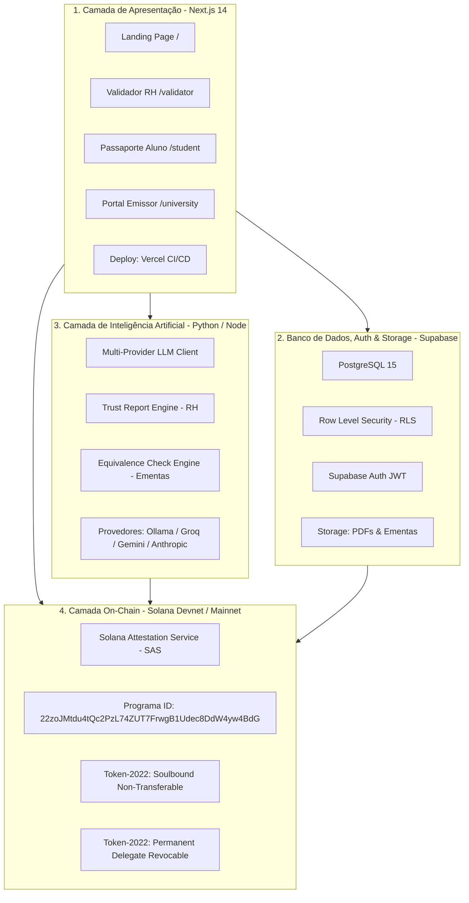
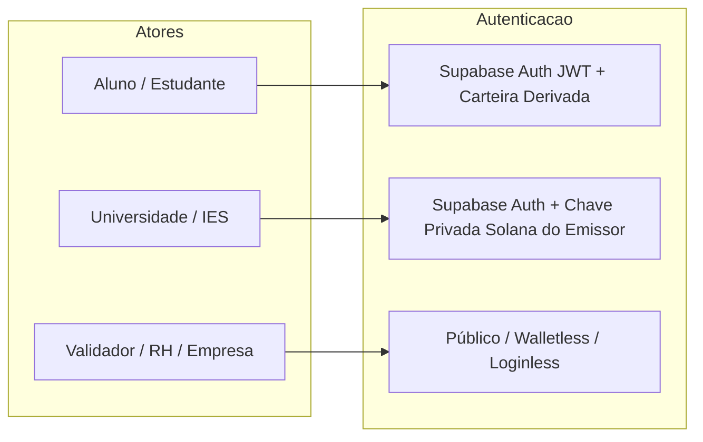
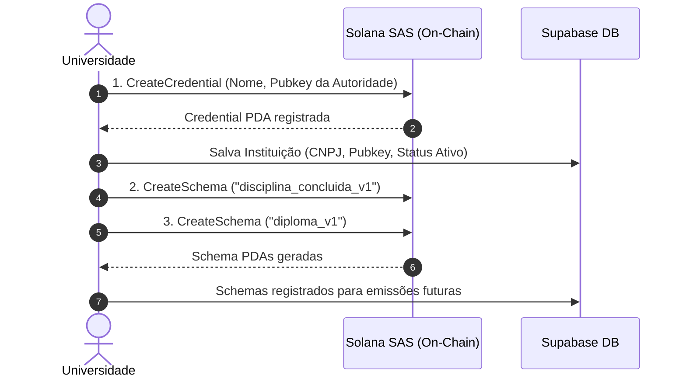
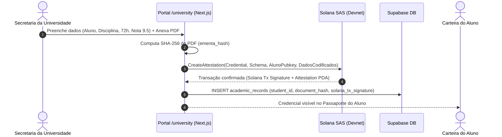
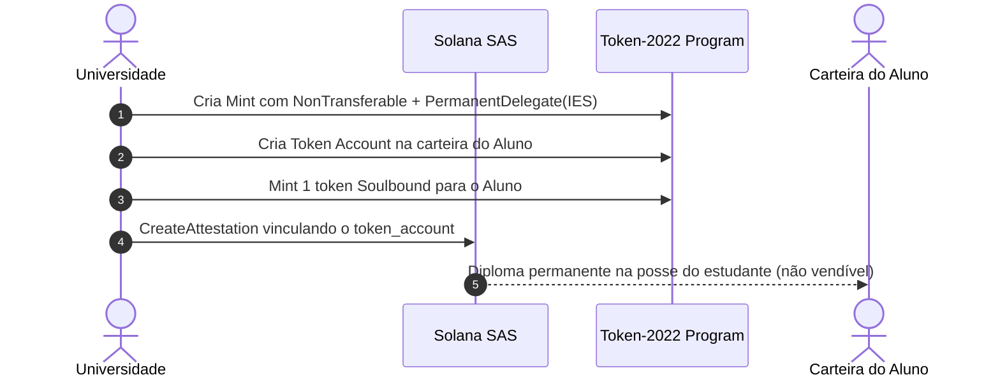
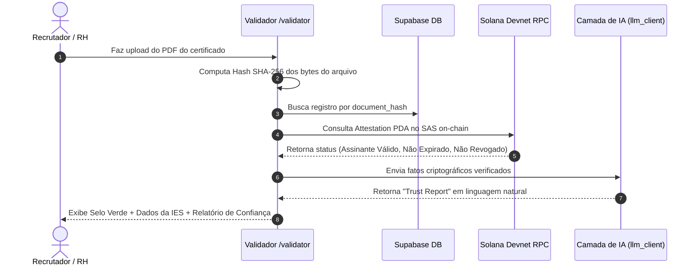
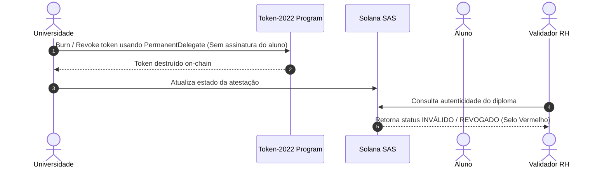
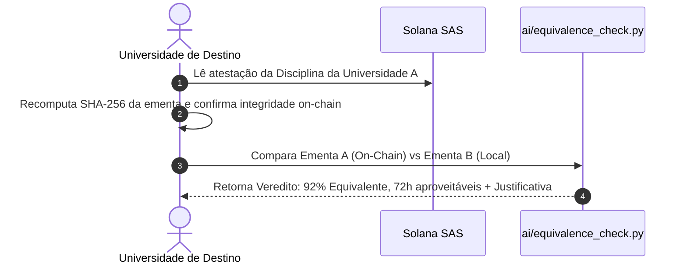

# LattesChain — Manual Completo de Arquitetura, Tecnologias e Fluxos 🎓⛓️

> **Documento Oficial de Arquitetura e Operação do Sistema**  
> **Versão**: 2.0 (Consolidada com Solana SAS, Token-2022, Supabase, Next.js na Vercel e Camada de IA)

---

## 1. Visão Geral e Propósito do Projeto

O **LattesChain** (EduCore Protocol) é um protocolo e plataforma descentralizada de **passaporte acadêmico soberano**.

### 1.1 O Problema Central
- O histórico acadêmico do estudante é hoje refém da universidade emissora.
- Solicitar certidões, transferências ou validações de horas complementares exige processos burocráticos lentos (15 a 30 dias).
- Recrutadores de RH e outras universidades sofrem com fraudes documentais em PDFs e precisam ligar ou enviar e-mails para secretarias acadêmicas.

### 1.2 A Solução
- Cada disciplina cursada, hora de extensão e diploma emitido torna-se uma **atestação imutável** gravada na blockchain **Solana**, na carteira do próprio estudante.
- A validação de autenticidade é **instantânea (< 1 segundo)** e pública, sem intermediários.
- Uma **camada de IA** traduz dados técnicos on-chain em relatórios de confiança para RHs e calcula automaticamente a equivalência curricular entre diferentes universidades.

---

## 2. Stack Tecnológica Completa (Camada por Camada)



### Detalhamento dos Componentes

| Camada | Tecnologia | Função | Por que foi escolhida? |
| :--- | :--- | :--- | :--- |
| **Blockchain** | **Solana** (L1) | Rede de registro imutável | Custo de fração de centavo por transação (&lt; R$ 0,01), finalidade em ~400ms e alto throughput. |
| **Protocolo de Atestações** | **Solana Attestation Service (SAS)** | Padrão aberto de atestações | Primitiva nativa da Solana (`22zoJM...`), dispensando smart contracts proprietários e garantindo interoperabilidade global. |
| **Padrão de Tokens** | **Token-2022 Extensions** | Emissão de diplomas Soulbound | Extensão `NonTransferable` (impede venda/transferência) + `PermanentDelegate` (revogação nativa pela IES em caso de fraude). |
| **Frontend** | **Next.js 14 (App Router)** | Interface Web responsiva | Server Components, rotas de API integradas, otimização de imagens e deploy contínuo na **Vercel**. |
| **Design System** | **Tailwind CSS + Lucide Icons** | Interface visual | Glassmorphism, paleta institucional escura (#080C14) com acentos Solana (#14F195 e #9945FF). |
| **Banco de Dados** | **Supabase (PostgreSQL)** | Dados estruturados off-chain | PostgreSQL gerenciado, migrações SQL versionadas, triggers e views agregadas de horas. |
| **Segurança & Políticas** | **Row Level Security (RLS)** | Isolamento de dados | Garante que alunos só vejam seus dados e instituições apenas seus registros emitidos. |
| **Autenticação** | **Supabase Auth** | Gestão de identidades | Emissão de tokens JWT com suporte a OAuth, Magic Link e e-mail. |
| **Camada de IA** | **Python + `llm_client.py`** | Semântica e relatórios | Motor flexível que roda com Ollama local, Groq Free, Gemini API, Anthropic ou fallback determinístico a custo zero. |

---

## 3. Matriz de Autenticação e Acesso

O sistema opera com 3 papéis principais com modelos de autenticação distintos:



### 1. Estudante (Aluno)
- **Como autentica**: Via Supabase Auth (E-mail/Senha, Google ou Magic Link).
- **Gerenciamento de Carteira (Account Abstraction)**: O estudante não precisa instalar extensões cripto ou gerenciar seed phrases. O sistema provisiona ou associa uma chave pública Solana derivada.
- **Permissões**: Visualizar suas credenciais, emitir QR Code público e solicitar equivalência curricular.

### 2. Universidade (Emissor Autorizado)
- **Como autentica**: Login institucional no Supabase Auth + posse do Keypair da autoridade emissora da Solana.
- **Registro On-Chain**: A universidade registra previamente uma conta `Credential` no SAS on-chain.
- **Permissões**: Criar Schemas de disciplinas/diplomas, emitir atestações para carteiras de alunos e revogar certificados em caso de fraude.

### 3. Validador Público (Recrutadores, Empresas, RH e Universidades Parceiras)
- **Como autentica**: **Zero autenticação** (Público, sem login e sem carteira).
- **Como funciona**: Acessa `/validator`, faz upload do PDF ou digita o hash/assinatura. O frontend/backend computa o SHA-256 e consulta o estado on-chain na Solana e no Supabase.

---

## 4. Fluxos Operacionais Detalhados

### Fluxo 1: Registro da Instituição e Criação de Schemas (Setup 1x)


---

### Fluxo 2: Emissão de Atestação de Disciplina / Horas Complementares


---

### Fluxo 3: Emissão de Diploma Tokenizado (Token-2022 Soulbound)


---

### Fluxo 4: Validação Pública por RH com Relatório de IA


---

### Fluxo 5: Revogação Nativa por Fraude Detectada


---

### Fluxo 6: Equivalência Curricular Automatizada por IA


---

## 5. Privacidade e Conformidade LGPD por Design

O protocolo implementa a separação estrita entre dados públicos on-chain e dados privados off-chain:

```
┌──────────────────────────────────────────────────────────┐
│              DADOS PRIVADOS (OFF-CHAIN)                  │
│  - Nome completo do estudante                            │
│  - CPF / RG / E-mail                                     │
│  - Arquivo PDF original do diploma/ementa               │
│  - Armazenamento: Supabase Storage + PostgreSQL com RLS   │
└────────────────────────────┬─────────────────────────────┘
                             │  SHA-256 Canonical Hash
                             ▼
┌──────────────────────────────────────────────────────────┐
│              PROVA PÚBLICA (ON-CHAIN SOLANA)             │
│  - Hash SHA-256 do documento (sem PII)                   │
│  - Pubkey da Universidade (Emissor Credenciado)          │
│  - Pubkey da Carteira do Aluno (Holder Anônimo)          │
│  - Timestamp, Carga Horária e Schema ID                  │
└──────────────────────────────────────────────────────────┘
```

---

## 6. Estrutura de Diretórios e Arquivos do Projeto

```
LattesChain/
├── README.md                 # Visão geral do projeto e alinhamento Superteam
├── vercel.json               # Configuração de build do Next.js na Vercel
├── .vercelignore             # Ignora backend Go e scripts Python no build Vercel
├── .env.local                # Variáveis de ambiente locais (Supabase e Solana)
├── package.json              # Dependências Node.js (Next.js, Supabase, Solana)
├── tsconfig.json             # Configuração TypeScript
├── tailwind.config.ts        # Design tokens e temas
├── src/                      # APLICAÇÃO NEXT.JS 14 (APP ROUTER)
│   ├── app/
│   │   ├── layout.tsx        # Layout raiz com Navbar e Footer
│   │   ├── page.tsx          # Landing page institucional
│   │   ├── globals.css       # Estilos globais e glassmorphism
│   │   ├── validator/page.tsx # Validador público de certificados com IA
│   │   ├── student/page.tsx   # Passaporte do aluno com horas e QR Code
│   │   ├── university/page.tsx # Portal de emissão da universidade
│   │   └── api/ai/trust-report/route.ts # Rota de API para Trust Report
│   ├── components/
│   │   ├── Navbar.tsx        # Navegação responsiva
│   │   └── Footer.tsx        # Rodapé institucional
│   └── lib/
│       └── supabaseClient.ts # Instância configurada do Supabase
├── sas/                      # PIPELINE SOLANA ATTESTATION SERVICE (PYTHON)
│   ├── sas_core.py           # Codecs, PDAs e discriminants SAS
│   ├── sas_client.py         # Envio de transações na Solana Devnet
│   ├── 00_setup_wallets.py   # Setup de carteiras
│   ├── 01_create_credential.py # Registro da universidade emissora
│   ├── 02_create_schema.py   # Registro dos schemas (disciplina e diploma)
│   ├── 03_issue_attestation.py # Emissão de atestação simples
│   ├── 04_issue_soulbound.py # Emissão de Token-2022 Soulbound
│   ├── 05_verify.py          # Verificação direta on-chain
│   ├── 06_revoke.py          # Demonstração de revogação nativa
│   └── README.md             # Guia de execução do SAS
├── ai/                       # CAMADA DE INTELIGÊNCIA ARTIFICIAL (PYTHON)
│   ├── llm_client.py         # Cliente multi-provedor (Ollama, Groq, Gemini, Anthropic)
│   ├── trust_report.py       # Geração de relatório de confiança para RH
│   ├── equivalence_check.py  # Análise semântica de equivalência curricular
│   └── requirements.txt      # Dependências Python
├── supabase/                 # BANCO DE DADOS E POLÍTICAS DE SEGURANÇA
│   └── migrations/
│       ├── 001_initial_schema.sql # Tabelas: institutions, students, records, logs
│       └── 002_rls_policies.sql   # Políticas de isolamento RLS
├── demo/
│   └── RUNBOOK.md            # Roteiro passo a passo para apresentação do vídeo
└── docs/                     # DOCUMENTAÇÃO TÉCNICA E ESTRATÉGICA
    ├── 00_index.md           # Índice de documentação técnica
    ├── ARQUITETURA_E_FLUXOS_GERAL.md # Este documento de arquitetura completa
    ├── PITCH_DECK.md         # Roteiro de pitch de 5 minutos
    └── BUSINESS_PLAN.md      # Modelo de negócios B2B2C e GTM
```

---

## 7. Como Executar Todo o Projeto Localmente

### 7.1 Executar a Aplicação Web (Next.js)
```bash
# 1. Instalar dependências
npm install

# 2. Iniciar servidor de desenvolvimento
npm run dev
# Acesse http://localhost:3000
```

### 7.2 Executar o Pipeline On-Chain (Solana SAS)
```bash
# 1. Ativar o ambiente virtual Python
.venv\Scripts\activate

# 2. Executar o ciclo completo
python sas/00_setup_wallets.py
python sas/01_create_credential.py
python sas/02_create_schema.py
python sas/03_issue_attestation.py
python sas/04_issue_soulbound.py
python sas/05_verify.py disciplina
python sas/06_revoke.py
```

### 7.3 Executar a Camada de IA
```bash
# Gerar Trust Report para RH
python ai/trust_report.py

# Avaliar equivalência curricular de ementas
python ai/equivalence_check.py
```
