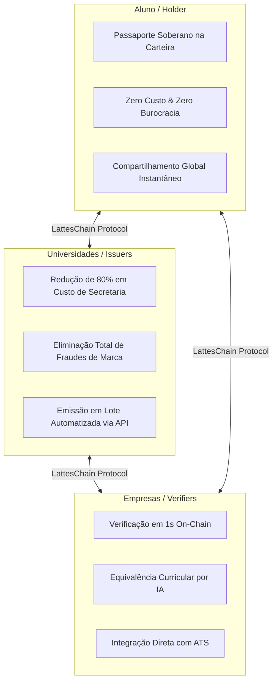

<div align="center">
  
  <br /><br />
  
</div>

# LattesChain — Plano de Negócios & Go-to-Market 📊

> **Visão**: Tornar-se o protocolo padrão global de atestações e passaporte acadêmico soberano sobre a Solana.

---

## 1. O Problema de Mercado & Oportunidade

### 1.1 Dores e Ineficiências no Mercado Tradicional
- **Burocracia de Transferência e Horas Complementares**: No Brasil e no mundo, a validação de disciplinas cursadas e certificados extracurriculares consome entre 15 e 45 dias úteis por solicitação de estudante.
- **Custos Invisíveis para Universidades**: Secretarias acadêmicas gastam até 30% do seu tempo respondendo a pedidos de segunda via, validação de ementas e confirmações de autenticidade para terceiros.
- **Fraude Endêmica de Diplomas e Cursos**: Segundo estimativas do setor de RH, de 10% a 15% dos currículos apresentam certificações adulteradas, cursos inexistentes ou diplomas forjados em PDF.
- **Perda de Dados por Falência Institucional**: Quando uma faculdade encerra suas atividades ou é descredenciada, os estudantes enfrentam um vácuo documental para comprovar suas matérias cursadas.

### 1.2 Oportunidade TAM / SAM / SOM
- **TAM (Total Addressable Market)**: Mercado global de gerenciamento de credenciais e verificação educacional estimado em **US$ 4.2 bilhões** até 2028.
- **SAM (Serviceable Addressable Market)**: Mercado de ensino superior na América Latina (~25 milhões de estudantes universitários ativos; 9 milhões apenas no Brasil).
- **SOM (Serviceable Obtainable Market)**: 200 mil estudantes e 20 IES parceiras nos primeiros 24 meses de operação.

---

## 2. Proposta de Valor por Stakeholder



---

## 3. Modelo de Negócio (B2B2C Freemium)

### 3.1 Camada B2C (Estudante) — 100% Gratuito
- **Acesso Gratuito Perpétuo**: Visualização do passaporte, download de atestados públicos, exportação de links e QR Codes de validação.
- **Zero Fricção Web3**: Provisionamento de carteira invisível e patrocínio das taxas de gás on-chain pela camada relayer.

### 3.2 Camada B2B SaaS (Universidades & Emissores)
| Plano | Público-Alvo | Preço Estimado | Recursos Incluídos |
| :--- | :--- | :--- | :--- |
| **Community / Free** | Centros Acadêmicos, Ligas, Cursos Livres | **R$ 0 / mês** | Até 500 emissões/mês, schemas padrão SAS, dashboard web básico. |
| **Pro IES** | Faculdades de pequeno/médio porte | **R$ 499 / mês** | Até 5.000 emissões/mês, schemas customizados, suporte a revogação em lote, webhook de status. |
| **Enterprise** | Universidades e Redes Educacionais | **R$ 1.990 / mês** | Emissões ilimitadas, integração nativa via API com ERPs (Totvs, Moodle, SIGA), SLA 99.9%. |

### 3.3 Camada B2B Data & API (Recrutadores & ATS)
- **Consulta Web Pública**: Gratuita para qualquer pessoa checar um hash ou carteira.
- **API Enterprise para ATS (Gupy, Kenoby, Workday, LinkedIn)**: Cobrança por pacote de validações automatizadas com **Trust Report via IA** (R$ 0,50 a R$ 1,20 por relatório analítico de equivalência curricular).

---

## 4. Análise Competitiva

| Recurso / Solução | LattesChain (Solana SAS) | Diploma Digital MEC | DocuSign / Clicksign | Blockcerts (Bitcoin/Ethereum) |
| :--- | :---: | :---: | :---: | :---: |
| **Custo por Emissão** | **< R$ 0,01** | Gratuito (Governo) | R$ 3,00 - R$ 8,00 | R$ 15,00 - R$ 50,00 |
| **Soberania do Aluno** | **Sim (Carteira Própria)** | Não (Preso ao MEC) | Não (Centralizado) | Sim (Wallet) |
| **Horas Complementares & Cursos Livres** | **Sim** | Não (Só graduação) | Não (Só assinatura) | Sim |
| **Equivalência Curricular via IA** | **Sim (Nativo)** | Não | Não | Não |
| **Revogação Nativa por Fraude** | **Sim (Token-2022)** | Complexo | Manual | Complexo |
| **Compatibilidade Global** | **Sim (SAS Standard)** | Não (Só Brasil) | Não | Sim |

---

## 5. Estratégia de Go-to-Market (GTM)

```mermaid
journey
    title Estratégia de GTM por Fases
    section Fase 1: Beachhead
      Horas Complementares & Extensão: 5: Diretórios Acadêmicos & Hackathons
      Validação com 500 alunos: 4: Feedback de usabilidade
    section Fase 2: Expansão IES
      Parcerias com 3 Faculdades Piloto: 4: Integração com Secretarias
      Emissão de Diplomas e Certificados: 5: Reconhecimento institucional
    section Fase 3: Escala Global
      Integração com ATS (Gupy/LinkedIn): 5: Verificação automática de RH
      Mobilidade Internacional Solana: 5: Equivalência global
```

### 5.1 Beachhead (Adoção Rápida e Fricção Mínima)
- **Foco inicial**: **Horas Complementares, Certificados de Monitoria e Cursos de Extensão**.
- **Por que esse nicho?**:
  1. Não depende de aprovação burocrática de conselhos universitários ou portarias ministeriais complexas.
  2. É a dor mais frequente do aluno durante os 4 a 5 anos de graduação.
  3. Pode ser adotado diretamente por Centros Acadêmicos, Empresas Juniores e organizadores de eventos acadêmicos.

---

## 6. Stack Tecnológica de Custo Zero (Bootstrapping)

Para a fase de validação e primeiros 50.000 usuários, a arquitetura opera com **custo de infraestrutura R$ 0,00**:
- **Solana Devnet / Mainnet**: Transações de frações de centavo pagas por fundos de bounty/grants da Superteam.
- **Relayer API**: Go compilado em binário estático rodando em free-tier (Fly.io / Render) consumindo <20MB de RAM.
- **Database & Auth**: Supabase Free Tier (PostgreSQL + RLS + 500MB de armazenamento).
- **Frontend**: Next.js hospedado gratuitamente no Vercel Hobby ou Cloudflare Pages (largura de banda ilimitada).
- **Camada de IA**: Python + Ollama local ou Gemini API Free Tier / Groq Free Tier (tempo de inferência em ms a custo zero).
