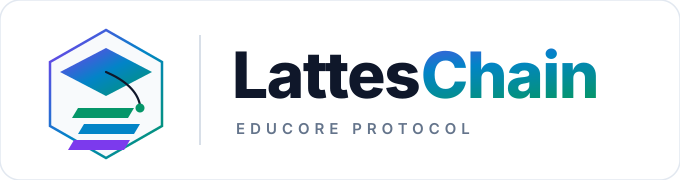
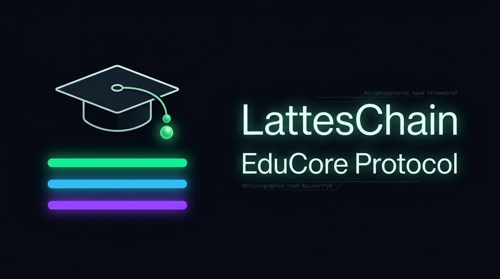
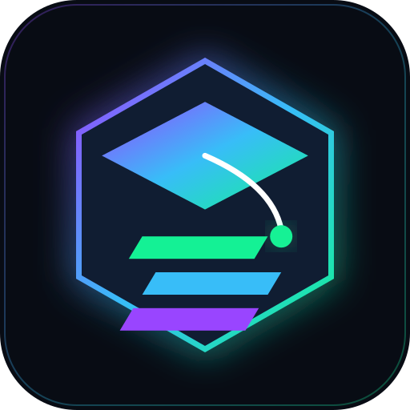
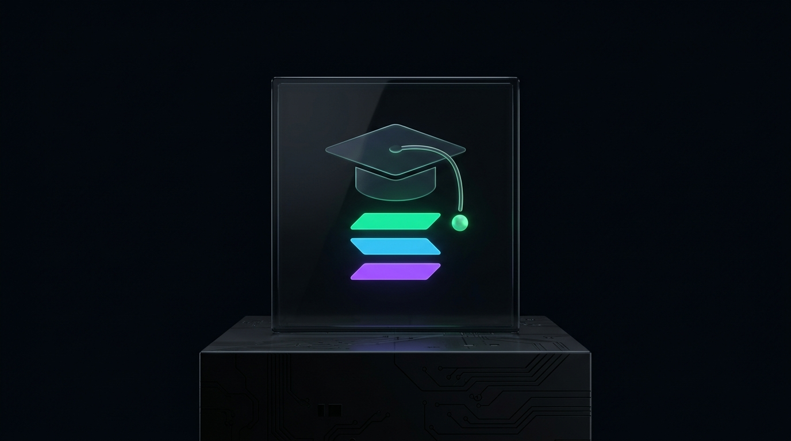
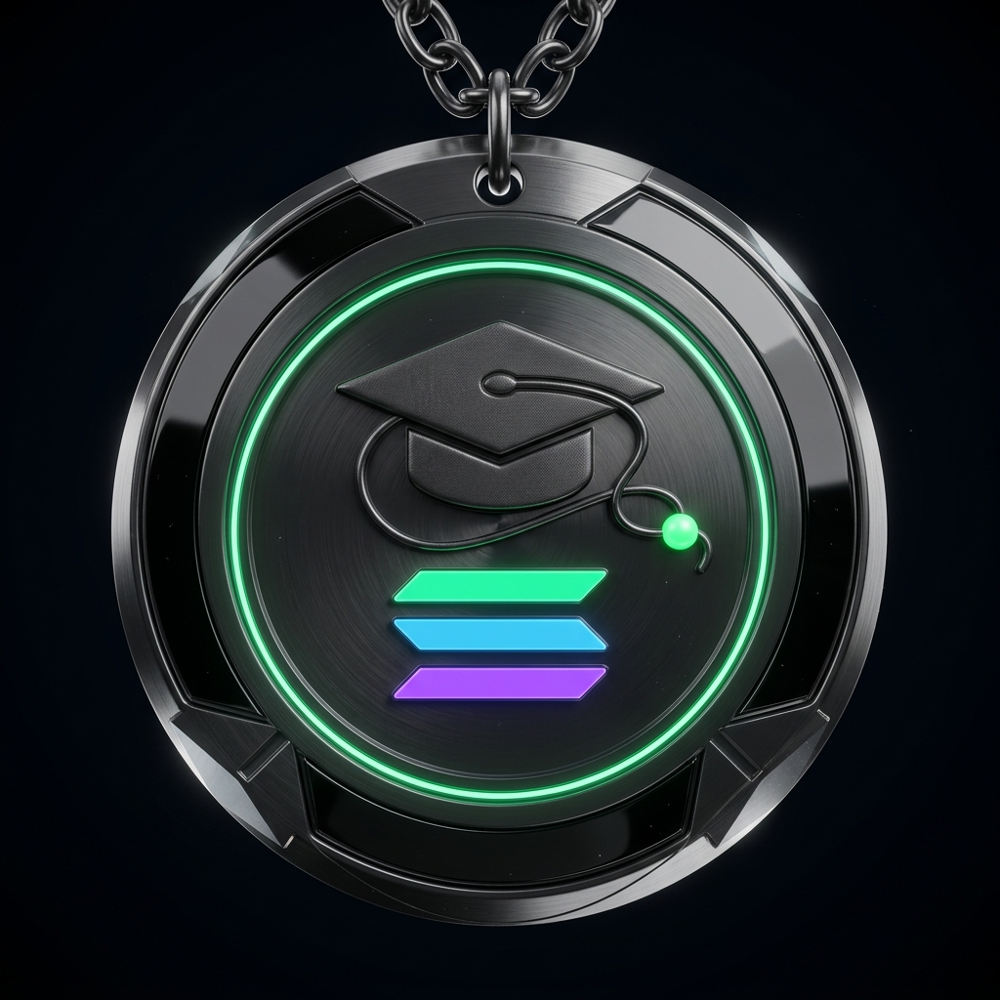
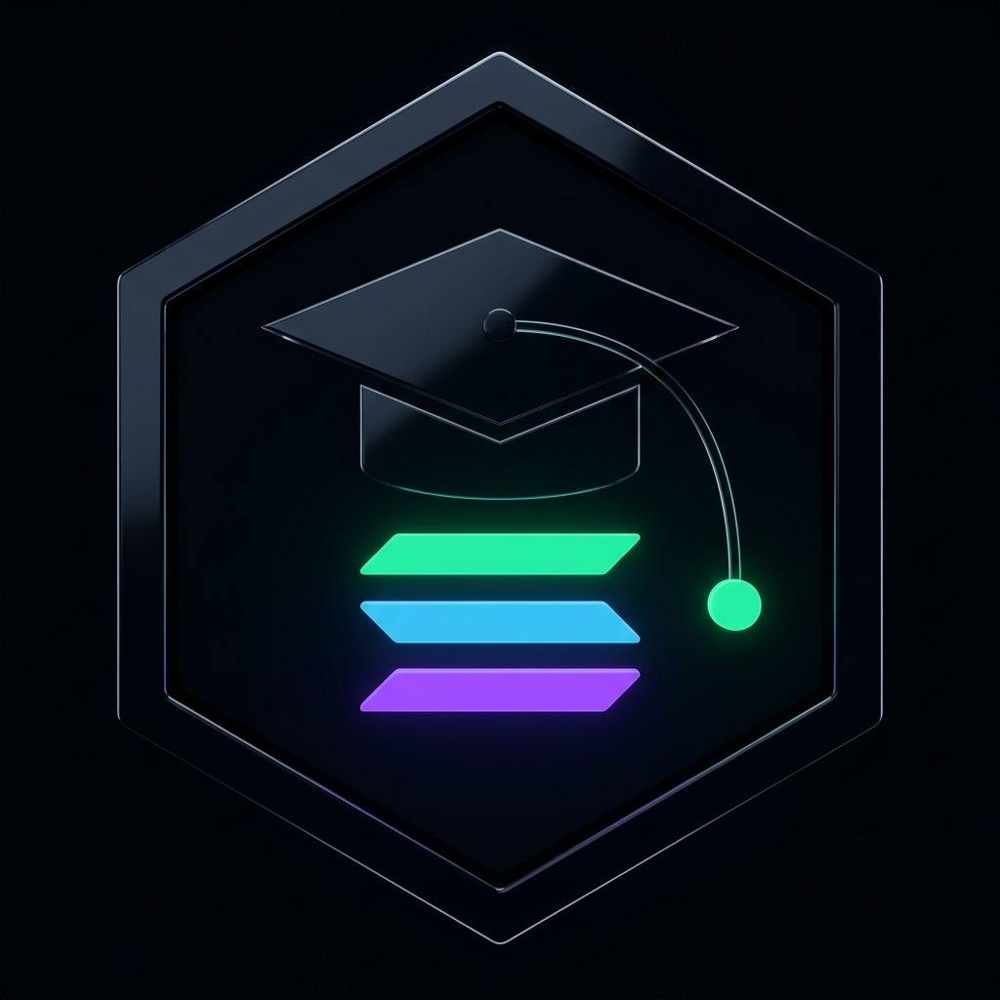

  
    
  
    
  
   

# LattesChain — Roteiro de Pitch (5 Minutos) 🎙️

> **Desafio**: Hackathon Universitário Superteam Brasil (Superteam Earn)  
> **Duração máxima do vídeo**: 05:00 minutos (1 minuto por bloco temático)  
> **Apresentador Interativo Web**: Disponível em [`/pitch`](http://localhost:3000/pitch) com modo apresentação, teclado interativo, cronômetro e notas do orador.  
> **Formato de entrega**: Vídeo de tela/slides com voz (YouTube não listado / Loom / Drive aberto)  
> **Idioma**: Português (Legendas em inglês recomendadas como diferencial)

---

## ⏱️ Minutagem e Estrutura dos 5 Blocos

| Tempo | Bloco | Objetivo Principal | Métricas & Fontes | Slide Web |
| :---: | :--- | :--- | :--- | :---: |
| **00:00 - 01:00** | **1. O Problema & Quem Sofre** | Dor real: burocracia de PDFs/papel, lentidão crônica e fraudes educacionais | UNESCO (6M+ alunos travados), HireRight Benchmark | [Slide 2](/pitch) |
| **01:00 - 02:00** | **2. A Solução em Linguagem Simples** | Passaporte Acadêmico Soberano, carteira do aluno e validação &lt;1s | W3C Verifiable Credentials Data Model v2.0 | [Slide 3](/pitch) |
| **02:00 - 03:00** | **3. Por que Solana** | SAS nativo, Token-2022 Soulbound revogável, custo sub-centavo (&lt; R$0,01) e LGPD | Solana Labs SAS, SPL Token-2022 Extensions | [Slide 4](/pitch) |
| **03:00 - 04:00** | **4. Na Prática (Demo & IA)** | Emissão em 2s, Passaporte com QR Code, Validador instantâneo e Motor Gemini 1.5 Pro | Demo funcional /validator, /student, /university | [Slide 5](/pitch) |
| **04:00 - 05:00** | **5. Time, Stack & Roadmap** | Jovian Tech, stack MVP 100% open-source custo zero e expansão ECTS / Mainnet | EHEA Bologna Process & ECTS Users' Guide | [Slide 6](/pitch) |

---

## 🎬 Script de Apresentação (Fala Guiada de 5 Minutos)

### [00:00 - 01:00] Bloco 1: O Problema, Quem Sofre e Evidências Concretas
*(Slide 2 no app `/pitch`: Burocracia Paralisante & Epidemia de Fraudes)*

> **Narrador**:  
> "O modelo tradicional de validação acadêmica opera sob um abismo de comunicação: documentos em papel ou PDFs editáveis custam semanas de espera, paralisam carreiras e expõem a reputação das próprias faculdades a fraudes.
> 
> Como comprova o **HireRight Global Employment Screening Benchmark Report**, a discrepância e adulteração em históricos acadêmicos e diplomas é a **inconsistência número um** detectada em triagens corporativas em todo o mundo — com até **85% dos empregadores** já tendo flagrado currículos ou diplomas forjados.
> 
> Na ponta dos estudantes, a **UNESCO** alerta que mais de **6,3 milhões de alunos internacionais** enfrentam barreiras severas de mobilidade e equivalência de créditos, perdendo bolsas de pesquisa, intercâmbios e contratações urgentes por causa de semanas de espera e custos consulares abusivos.
> 
> Ao mesmo tempo, as **secretarias acadêmicas** gastam até **30% da sua jornada de trabalho** respondendo chamados manuais para atestar papéis, enquanto o prestígio da instituição fica refém de falsificações digitais que circulam livremente. E as **empresas** gastam de 10 a 20 dias em auditorias lentas e inconclusivas.
> 
> O problema não é a competência das universidades, mas a ausência de um trilho digital comum e soberano que una estudante, faculdade e mercado com prova criptográfica instantânea."

**Fontes Consultáveis**:
- **HireRight**: *Global Employment Screening Benchmark Report* ([hireright.com](https://hireright.com)) — Inconsistências educacionais lideram o ranking global #1 de discrepâncias em triagens corporativas.
- **UNESCO**: *Global Convention on the Recognition of Qualifications concerning Higher Education* ([unesco.org](https://unesco.org)) — 6.3M+ estudantes internacionais com entraves de mobilidade e convalidação.
- **EHEA / Processo de Bolonha**: *ECTS Users' Guide & Recognition of Qualifications* ([ehea.info](https://ehea.info)) — Burocracia na equivalência de créditos e perda média de semestres letivos em transferências.
- **W3C**: *Verifiable Credentials Data Model v2.0* ([w3.org/TR/vc-data-model-2.0](https://www.w3.org/TR/vc-data-model-2.0/)) — Padrão internacional aberto para atestações digitais soberanas e à prova de adulteração.

---

### [01:00 - 02:00] Bloco 2: A Solução em Linguagem Simples
*(Slide 3 no app `/pitch`: Protocolo Unificado de Integridade Acadêmica)*

  

> **Narrador**:  
> "O que o **LattesChain** propõe como solução definitiva? Nós criamos o **Protocolo Unificado de Integridade Acadêmica**: uma infraestrutura descentralizada que transforma documentos educacionais vulneráveis — como diplomas, históricos, certificados de extensão e ementas — em credenciais digitais soberanas e matematicamente invioláveis.  
> 
> Em vez de depender de papéis carimbados ou PDFs editáveis que qualquer pessoa altera no Photoshop, estabelecemos uma fonte única e compartilhada da verdade entre faculdade, estudante e mercado. A solução ancora-se em 4 pilares estruturais:  
> 1. **Fonte Única da Verdade**: Eliminação de silos analógicos e semanas de espera em secretarias através de dados canônicos imutáveis.  
> 2. **Custódia Soberana do Aluno**: O estudante é o legítimo dono do seu passaporte de qualificações em sua carteira digital, com portabilidade global para trabalho ou pós-graduação.  
> 3. **Auditoria Zero-Trust**: A autenticidade deixa de exigir confiança cega ou chamados telefônicos e passa a ser uma propriedade matemática comprovável instantaneamente.  
> 4. **Privacidade & Conformidade Estrita**: Arquitetura Zero-PII on-chain, 100% alinhada à LGPD, GDPR e às Portarias 330/554 do MEC.  
> 
> Nós não apenas digitalizamos documentos; nós criamos uma nova arquitetura de confiança fundamentada no padrão internacional **W3C Verifiable Credentials**."

**Fontes Consultáveis**:
- **W3C**: *Verifiable Credentials Data Model v2.0* ([w3.org/TR/vc-data-model-2.0](https://www.w3.org/TR/vc-data-model-2.0/))
- **Solana Labs**: *Solana Attestation Service Architecture* ([docs.solanalabs.com](https://docs.solanalabs.com))
- **NIST**: *SHA-256 Standard FIPS 180-4* ([csrc.nist.gov](https://csrc.nist.gov/publications/detail/fips/180-4/final))

---

### [02:00 - 03:00] Bloco 3: Por que Solana? O que só ela resolve
*(Slide 4 no app `/pitch`: Primitivas Nativas da Solana)*

  

> **Narrador**:  
> "Por que a Solana é indispensável nessa solução e o que a blockchain resolve aqui que outra tecnologia não resolveria?
> 
> Nós não criamos contratos mirabolantes e frágeis; usamos as primitivas nativas e consolidadas da Solana:
> 
> 1. **Solana Attestation Service (SAS)**: O padrão oficial de credenciais verificáveis da rede, garantindo interoperabilidade nativa com serviços globais de identidade como Civic e Solana ID.  
> 2. **Token-2022 (NonTransferable)**: O certificado nasce como um Soulbound Token que cola na carteira do aluno, impedindo que o título seja vendido ou transferido para terceiros.  
> 3. **PermanentDelegate**: Recurso nativo que permite à instituição emissora revogar o título on-chain em caso de fraude administrativa comprovada ou cancelamento judicial.  
> 4. **Custo Sub-Centavo (< R$ 0,01)**: Permite emitir centenas de milhares de matérias e certificados por frações de centavos de real — algo economicamente inviável no Ethereum ou Bitcoin.  
> 5. **Privacidade por Design (LGPD/GDPR)**: Nenhum dado pessoal sensível como CPF ou nome vai para a blockchain; apenas o hash criptográfico SHA-256 do documento canônico é ancorado on-chain.  
> 6. **Carteira Phantom & Transações Reais Futuras**: Todos os envolvidos — alunos, faculdades e recrutadores — podem utilizar, por exemplo, a carteira Phantom diretamente no navegador para testar o MVP na Devnet e, futuramente, assinar e liquidar transações reais com essa mesma carteira em nosso ecossistema, viabilizado por relayer corporativo gasless."

**Fontes Consultáveis**:
- **Solana Labs**: *Solana Attestation Service Architecture* ([docs.solanalabs.com](https://docs.solanalabs.com))
- **SPL Docs**: *Token-2022 Extensions: NonTransferable & PermanentDelegate* ([spl.solana.com/token-2022/extensions](https://spl.solana.com/token-2022/extensions))

---

### [03:00 - 04:00] Bloco 4: Na Prática (Demo & Camada de IA)
*(Slide 5 no app `/pitch`: O Fluxo Tripartite em Ação & Motor Gemini 1.5 Pro)*

> **Narrador**:  
> "Vejamos isso funcionando na prática na nossa plataforma:
> 
> 1. **Emissão (/university)**: A universidade insere os dados curriculares com metadados do MEC, assina a transação na devnet da Solana via SAS e o token intransferível chega à carteira do aluno em apenas 2 segundos.  
> 2. **Custódia (/student)**: O estudante conecta sua carteira Phantom, visualiza seus certificados na interface com a barra de horas complementares do MEC e gera um link ou QR Code instantâneo com custódia soberana.  
> 3. **Validação Instantânea (/validator)**: O recrutador acessa o link, arrasta o PDF ou clica nos nossos botões de test drive, e a assinatura pública da universidade é auditada on-chain em menos de 400 milissegundos.  
> 4. **Camada de IA Curricular (Gemini 1.5 Pro)**: Em paralelo, nossa IA analisa as ementas e gera um **Trust Report** estruturado em linguagem natural, além de calcular a **equivalência curricular** automática entre as grades da instituição de origem e a de destino."

**Fontes Consultáveis**:
- **Demonstração Funcional On-Chain**: [`/validator`](/validator) (Com 4 presets de teste em 1 clique)
- **Repositório Oficial**: [github.com/alexmsza/LattesChain](https://github.com/alexmsza/LattesChain)

---

### [04:00 - 05:00] Bloco 5: Time, Stack MVP & Próximos Passos
*(Slide 6 no app `/pitch`: Execução Focada & Escalabilidade Global)*

  

> **Narrador**:  
> "Por trás do LattesChain está a **JOVIAN TECH**, formada por **Alex Miqueias** na liderança de arquitetura Web3 e contratos Solana, **Rogério Alencar Filho** em engenharia de dados, backend e DevSecOps, e **Caio Vila Nova** em suporte e operações de sistemas.
> 
> Desenvolvemos uma **stack 100% open-source de custo zero no MVP**: Go ultraleve, Python com IA, Supabase (PostgreSQL + RLS) e SDKs Solana.
> 
> Nosso plano de entrada possui 3 passos claros:  
> 1. **Piloto Beachhead**: Focado na emissão de horas complementares e certificados de extensão com Diretórios e Centros Acadêmicos parceiros (sem amarras regulatórias).  
> 2. **Expansão Internacional de IA**: Calibração dos modelos de IA para mapeamento de equivalência curricular nos padrões do **Processo de Bolonha (ECTS - Europa)** e universidades dos Estados Unidos.  
> 3. **Mainnet & Integração com ERPs**: Deploy na Solana Mainnet com State Compression e integração via API REST direta aos sistemas legados (TOTVS RM, Sophia) e plataformas de RH (Gupy).
> 
> **LattesChain: a soberania educacional na velocidade da Solana!**"

**Fontes Consultáveis**:
- **European Higher Education Area (EHEA)**: *Bologna Process & ECTS Users' Guide* ([ehea.info](https://ehea.info))
- **Jovian Tech Venture Builder**: [jovian.foo](https://jovian.foo)

---

## 🖥️ Como Utilizar a Apresentação Web (`/pitch`)

Acesse [`http://localhost:3000/pitch`](/pitch) no navegador:
- **Setas `←` e `→` ou Barra de Espaço**: Avançar e retroceder slides.
- **Tecla `N`**: Abrir/fechar gaveta de Notas do Orador com o roteiro falado palavra por palavra.
- **Tecla `T`**: Iniciar/pausar o cronômetro oficial de 5 minutos.
- **Tecla `R`**: Reiniciar o cronômetro para zero.
- **Tecla `F`**: Alternar para o modo Tela Cheia (Fullscreen).
- **Teclas `1` a `6`**: Pular diretamente para qualquer um dos 6 slides.
